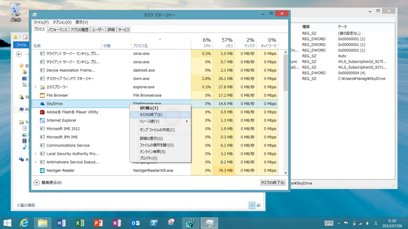
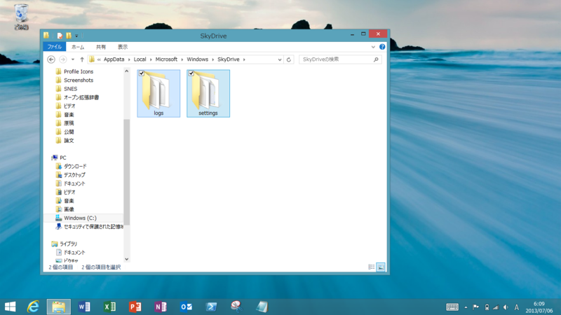
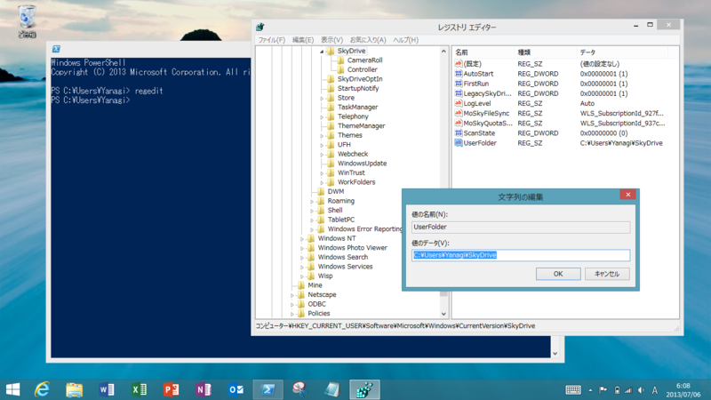
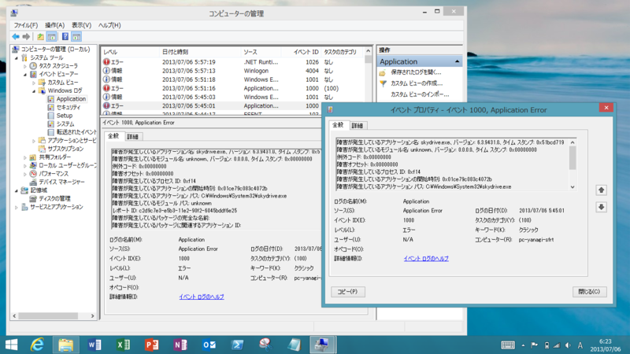

絶対に手順を間違えないように。

<h3>1. SkyDrive 関連のアプリ・プロセスをすべて終了させる</h3>

以下の 3 つのアプリやプロセスをタスクマネージャーで切る（<a href="https://blog.daruyanagi.jp/entry/2013/07/05/202824">Windows 8.1 RT: &#x65B0;&#x3057;&#x3044; SkyDrive &#x306F;&#x65B0;&#x3057;&#x304B;&#x3063;&#x305F; - &#x3060;&#x308B;&#x308D;&#x3050;</a>）。

<ul>
<li>Windows ストア アプリ「SkyDrive」</li>
<li>SkyDrive.exe</li>
<li>FileManager.exe</li>
</ul>
FileManager.exe を切るのを忘れたところ、3. の処理が再起動後に正しく反映されなかった……（死

<h3>2. ログや設定ファイルをすべて削除する</h3>

<code>C:\Users\%***%\AppData\Local\Microsoft\Windows\SkyDrive\</code> を開いてフォルダをすべて削除する。設定フォルダだけでもいいみたい。

<h3>3. レジストリエディターでルートフォルダを変更する</h3>

<code>HKEY_CURRENT_USER\Software\Microsoft\Windows\CurrentVersion\SkyDrive</code> にある“UserFolder”というキーを編集し、新しいルートフォルダのパスを入力する。

完了したらシステムを再起動。起動後に自動で同期プロセスが開始される。古いルートフォルダの内容は削除しても構わない。

<h3>で、実際に試してみた。</h3>

――というのを、以下のサイトで見つけたんだ（受け売りでした、ごめんなさい）。

<ul>
<li><a href="http://superuser.com/questions/612868/there-is-a-way-to-change-the-skydrive-default-path-in-windows-8-1">onedrive - Changing the SkyDrive default path in Windows 8.1 - Super User</a></li>
</ul>
うちの SkyDrive は 25GB あるから、Surface RT の空き領域より大きい。全部同期（オフライン利用）してしまうとストレージが枯渇するので、できれば SD カードに移したいんだよね。

けれど、結果的には失敗した。

SkyDrive.exe が Application Error（イベント ID: 1000）で起動しない。少なくとも SD カードに SkyDrive のルートフォルダを移すことはできないようだ<a href="#f-e72ac028" name="fn-e72ac028" title="ストア アプリって SD カードへの書き込みが禁止されていた気がするし（知らんけど）、いろいろ制限があるのかもしれない">*1</a>。1 ～ 3 の手順をしっかり守れば、再び復旧させることは可能。

<a href="#fn-e72ac028" name="f-e72ac028" class="footnote-number">*1</a>:ストア アプリって SD カードへの書き込みが禁止されていた気がするし（知らんけど）、いろいろ制限があるのかもしれない

