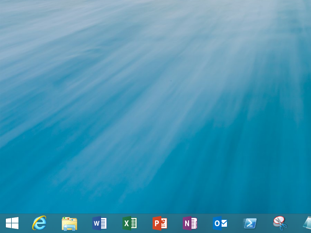
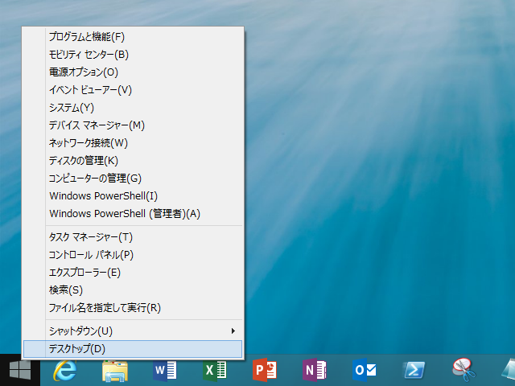

Windows 8.1 では（世間的には）待望のスタートボタンが復活した。けれど、これまで自分はこのことに対して否定的だった。いまどき［Windows］キーのないデバイスなんか考えられないし<a href="#f1" name="fn1" title="HHK 使いはキーコンビネーションがんばれ">*1</a>、あれだけの反対を押し切って一度消したものを、すぐにまた復活させるだなんてどうかしている。

けれど、一つだけこいつのいいところを発見した。

タッチ操作でも［Windows］＋［X］メニューが出しやすい！<a href="#f2" name="fn2" title="ホールドすればよい">*2</a>

プレビューリリースを試していると、イベントビューワーだのコンピューターの管理だのには割かしアクセスすると思うんだけど、キーボードがあればともかく、タッチ操作だけではなかなかめんどくさかった<a href="#f3" name="fn3" title="ピン留しとけよっていう話なのだけど、初手でタッチ限定だとなかなかつらい">*3</a>。

まぁ、なんにでも取り柄はあるものだな。

<blockquote cite="http://internet.watch.impress.co.jp/docs/yajiuma/20130703_606161.html">

Windows 8で省かれたものの、多くのユーザーからの要望でWindows 8.1で復活することになったスタートボタン。従来とはやや機能が異なる点も指摘されているが、ひとまず見慣れた位置にボタンがあることに安堵している人も多いだろう。ところがこのスタートボタン、こんどは非表示にしたくてもできないことが明らかになり、あちこちでツッコミが入れられている。

<cite><a href="http://internet.watch.impress.co.jp/docs/yajiuma/20130703_606161.html">&#x3010;&#x3084;&#x3058;&#x3046;&#x307E;Watch&#x3011;Windows 8.1&#x3067;&#x5FA9;&#x6D3B;&#x306E;&#x30B9;&#x30BF;&#x30FC;&#x30C8;&#x30DC;&#x30BF;&#x30F3;&#x3001;&#x4ECA;&#x5EA6;&#x306F;&#x300C;&#x6D88;&#x305B;&#x306A;&#x3044;&#x300D;&#x3068;&#x306E;&#x82E6;&#x60C5; -INTERNET Watch</a></cite>
</blockquote>

<a href="#fn1" name="f1" class="footnote-number">*1</a>:HHK 使いはキーコンビネーションがんばれ

<a href="#fn2" name="f2" class="footnote-number">*2</a>:ホールドすればよい

<a href="#fn3" name="f3" class="footnote-number">*3</a>:ピン留しとけよっていう話なのだけど、初手でタッチ限定だとなかなかつらい

