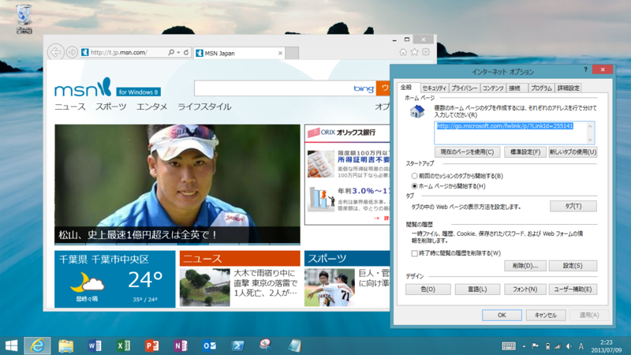
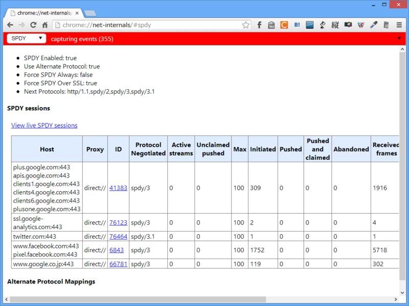
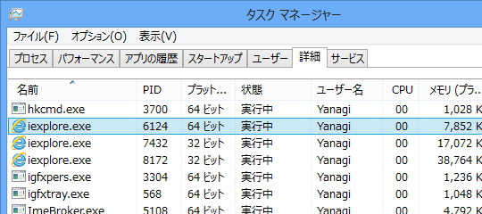
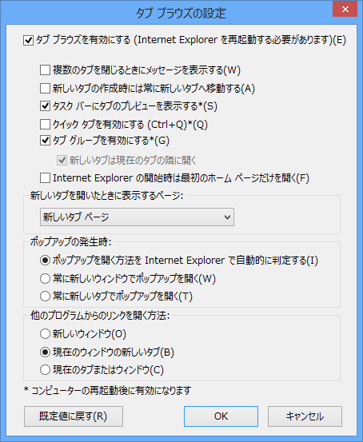
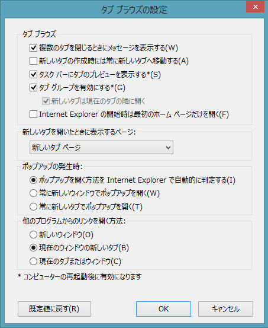
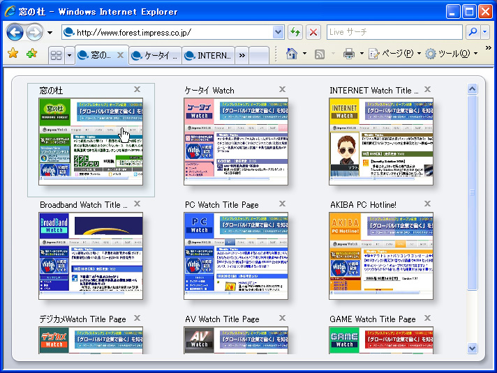

「Internet Explorer 10」（Windows 8 Pro）と「Internet Explorer 11」（Windows 8.1 RT）の［インターネット オプション］を比較してみた。

「再」に * 印が付いているのは、設定の反映にシステムの再起動が必要であることを示す。× 印は項目がないこと、✔ 印は初期設定で有効であること（設定のローミング機能もあり、これにはあまり自信がない。あくまでも自分の環境での話で参考程度に）、空欄は初期設定で無効であることを示す。

なお、オプションの有無がかならずしも機能の有無を示すわけではないので注意。

<h3>HTTP 1.1 設定</h3>

<table>
<tr>
<td>再</td>
<td></td>
<td>IE10</td>
<td>IE11</td>
</tr>
<tr>
<td></td>
<td>HTTP 1.1 を使用する</td>
<td>✔</td>
<td>✔</td>
</tr>
<tr>
<td></td>
<td>SPDY/3 の使用</td>
<td>×</td>
<td>✔</td>
</tr>
<tr>
<td></td>
<td>プロキシ接続で HTTP 1.1 を利用する</td>
<td>✔</td>
<td>✔</td>
</tr>
</table>
SPDY/3 のオプションが追加されたことが目につく。そのほかに SPDY/3 をサポートするブラウザーは「Google Chrome 19」「Firefox 15」など。現在は SPDY/3.1 がテスト中で、「Google Chrome」（要起動オプション --enable-spdy31）と Twitter の組み合わせなんかで利用できるみたい。

<h3>アクセラレーターによるグラフィック</h3>

<table>
<tr>
<td>要再起動</td>
<td></td>
<td>IE10</td>
<td>IE11</td>
</tr>
<tr>
<td> * </td>
<td>CPU レンダリングではなく、ソフトウェアレンダリングを利用する</td>
<td> </td>
<td> </td>
</tr>
</table>
確か「Internet Explorer 9」で追加されたオプション。万が一表示が乱れる場合はチェックボックスを ON にしましょう。

<h3>インターナショナル</h3>

<table>
<tr>
<td>再</td>
<td></td>
<td>IE10</td>
<td>IE11</td>
</tr>
<tr>
<td> * </td>
<td>DNS サーバ名を送信する</td>
<td>✔</td>
<td>✔</td>
</tr>
<tr>
<td> * </td>
<td>UTF-8 の URL を送信する</td>
<td>✔</td>
<td>×</td>
</tr>
<tr>
<td> * </td>
<td>URL パスを UTF-8 として送信する</td>
<td>×</td>
<td>✔</td>
</tr>
<tr>
<td> * </td>
<td>イントラネット URL の UTF-8  クエリ文字列を送信する</td>
<td>×</td>
<td>✔</td>
</tr>
<tr>
<td> * </td>
<td>イントラネットのアドレスには IDN サーバー名を送信する</td>
<td> </td>
<td>✔</td>
</tr>
<tr>
<td> * </td>
<td>エンコードされたアドレスについて通知バーを表示する</td>
<td>✔</td>
<td>✔</td>
</tr>
<tr>
<td> * </td>
<td>エンコードされたアドレスを常に表示する</td>
<td> </td>
<td> </td>
</tr>
<tr>
<td> * </td>
<td>すべての URL の UTF-8  クエリ文字列を送信する</td>
<td>×</td>
<td>✔</td>
</tr>
</table>
詳しい人、教えて。

<h3>セキュリティ</h3>

<table>
<tr>
<td>再</td>
<td></td>
<td>IE10</td>
<td>IE11</td>
</tr>
<tr>
<td> </td>
<td>DOM ストレージを有効にする</td>
<td>✔</td>
<td>✔</td>
</tr>
<tr>
<td> * </td>
<td>Internet Explorer でアクセスしたサイトに Do Not Track 要求を送信する</td>
<td>×</td>
<td>✔</td>
</tr>
<tr>
<td> </td>
<td>POS の送信が POST を許可しないゾーンにリダイレクトされた場合に警告する</td>
<td>✔</td>
<td>✔</td>
</tr>
<tr>
<td> </td>
<td>SmartScreen フィルター機能を有効にする</td>
<td>✔</td>
<td>✔</td>
</tr>
<tr>
<td> </td>
<td>SSL 2.0 を使用する</td>
<td> </td>
<td> </td>
</tr>
<tr>
<td> </td>
<td>SSL 3.0 を使用する</td>
<td>✔</td>
<td>✔</td>
</tr>
<tr>
<td> </td>
<td>TSL 1.0 を使用する</td>
<td>✔</td>
<td>✔</td>
</tr>
<tr>
<td> </td>
<td>TSL 1.1 を使用する</td>
<td> </td>
<td>✔</td>
</tr>
<tr>
<td> </td>
<td>TSL 1.2 を使用する</td>
<td> </td>
<td>✔</td>
</tr>
<tr>
<td> * </td>
<td>サーバーの証明書失効を確認する</td>
<td>✔</td>
<td>✔</td>
</tr>
<tr>
<td> </td>
<td>ダウンロードしたプログラムの署名を確認する</td>
<td>✔</td>
<td>✔</td>
</tr>
<tr>
<td> </td>
<td>ネイティブ XMLHTTP サポートを有効にする</td>
<td>✔</td>
<td>✔</td>
</tr>
<tr>
<td> </td>
<td>ブラウザーを閉じたとき、［Temporary Internet Files］フォルダーを空にする</td>
<td> </td>
<td> </td>
</tr>
<tr>
<td> * </td>
<td>マイ コンピューターでの、CD のアクティブ コンテンツの実行を許可する</td>
<td> </td>
<td> </td>
</tr>
<tr>
<td> * </td>
<td>マイ コンピューターのファイルでのアクティブ コンテンツの実行を許可する</td>
<td> </td>
<td> </td>
</tr>
<tr>
<td> </td>
<td>暗号化されたページをディスクに保存しない</td>
<td> </td>
<td> </td>
</tr>
<tr>
<td> * </td>
<td>拡張保護モードを有効にする</td>
<td> </td>
<td>✔</td>
</tr>
<tr>
<td> * </td>
<td>厳密な P3P 検証を有効にする</td>
<td> </td>
<td> </td>
</tr>
<tr>
<td> </td>
<td>署名が無効な場合でもソフトウェアの実行またはインストールを許可する</td>
<td> </td>
<td> </td>
</tr>
<tr>
<td> * </td>
<td>証明書のアドレスの不一致について警告する</td>
<td>✔</td>
<td>✔</td>
</tr>
<tr>
<td> * </td>
<td>常に Do Not Track ヘッダーを送信する</td>
<td>✔</td>
<td>×</td>
</tr>
<tr>
<td> </td>
<td>他の混在したコンテンツを持つセキュリティで保護されていないイメージをブロックする</td>
<td> </td>
<td> </td>
</tr>
<tr>
<td> * </td>
<td>統合 Windows 認証を使用する</td>
<td>✔</td>
<td>✔</td>
</tr>
<tr>
<td> </td>
<td>発行元証明書の取り消しを確認する</td>
<td>✔</td>
<td>✔</td>
</tr>
<tr>
<td> </td>
<td>保護付き/保護なしのサイト間を移動する場合に警告する</td>
<td> </td>
<td> </td>
</tr>
</table>
「拡張保護モードを有効にする」がデフォルトで ON になったのが特筆すべき変更点。もともと Immersive IE（いわゆる Metro IE）では拡張保護モード（Enhanced Process Mode）が常に利用されているが、これが（無効化できるとはいえ）デスクトップにも持ち込まれた。

<blockquote cite="http://technet.microsoft.com/ja-jp/library/jj128101.aspx">

<h5>拡張保護モード</h5>

拡張保護モードは、Internet Explorer 10 の新機能です。拡張保護モードは既存の保護モード機能が拡張されたもので、攻撃者によるソフトウェアのインストール、個人情報へのアクセス、企業イントラネット上の情報へのアクセス、およびシステム設定の変更を防ぐのに役立ちます。そのためには、次のようにして、Internet Explorer で使用できる一部の機能を拡張保護モードによって減らす必要があります。 
個人の資産へのアクセスを制限する。アクセス許可を付与するまで、Internet Explorer から個人情報を含む場所にアクセスできないようにします。これは、個人情報への承認されていないアクセスを防ぐのに役立ちます。

企業の資産へのアクセスを制限する。次のようなタブ プロセスを介してアクセスを制御することで、企業ネットワーク リソース上にある重要な情報へのアクセスを制限します。

<ul>
<li>インターネット タブ プロセスがユーザーのドメイン資格情報へアクセスすることを許可しない。</li>
<li>インターネット タブ プロセスがローカルの Web サーバーとして動作することを許可しない。</li>
<li>インターネット タブ プロセスがイントラネット サーバーに接続することを許可しない。</li>
</ul>
管理者は、グループ ポリシー設定の [拡張保護モードを有効にする] を使用して、組織内で拡張保護モードを使用する方法を制御できます。

<cite><a href="http://technet.microsoft.com/ja-jp/library/jj128101.aspx">Internet Explorer 10 &#x306E;&#x6A5F;&#x80FD;&#x3068;&#x30C4;&#x30FC;&#x30EB;</a></cite>
</blockquote>

64bit Windows で拡張保護モードを有効にすると、コンテナプロセスに加え、コンテンツプロセスが 64bit で動作するようになる（スクリーンショットは Windows 8 で拡張保護モードが有効化されていない場合）。メモリアドレス空間が広がれば ASLR といった既存のメモリ保護機能の効果も向上するし、Heap Spray 攻撃などの脅威も緩和される。でも、Windows 8.1 RT は 32bit だから、この点あまり意味がないような。まぁ、それ以外にもプロセスへの制限がいっぱい追加されているみたいだけど。

ちなみに、プライバシーポリシーにもこれに関する文言が追加されている。

<blockquote cite="http://windows.microsoft.com/ja-jp/internet-explorer/ie11-preview-privacy-statement">

<h5>拡張保護モード</h5>

拡張保護モードは、Internet Explorer での悪意のあるソフトウェアの実行を難しくすることによって、Internet Explorer のセキュリティを強化します。拡張保護モードは、Internet Explorer では<b>既定で有効になっています</b>。

Internet Explorer の拡張保護モードで動作するように更新されていない以前のアドオンは、拡張保護モードが有効になっている Internet Explorer では機能しない場合があります。拡張保護モードに対応していないアドオンが使用されている Web サイトにアクセスした場合、そのサイトについて拡張保護モードを無効にしアドオンの実行を許可するか、今後そのアドオンについてのプロンプトを無視するかを選択できるプロンプトが表示されます。拡張保護モードを無効にするか、今後のプロンプトを無視するかの選択を行った Web サイトについては、そのアドレスが、Internet Explorer によって保存されます。このデータは、閲覧履歴の削除機能を使用していつでも削除できます。

<cite><a href="http://windows.microsoft.com/ja-jp/internet-explorer/ie11-preview-privacy-statement">Windows&nbsp;8 &#x306E; Internet Explorer 11 Preview &#x306E;&#x30D7;&#x30E9;&#x30A4;&#x30D0;&#x30B7;&#x30FC;&#x306B;&#x95A2;&#x3059;&#x308B;&#x58F0;&#x660E; - Microsoft Windows</a></cite>
</blockquote>

あとは TSL 1.1/1.2 のデフォルト有効化や、DNT 関連のオプションの微修正が目につくぐらい。

<h3>ブラウズ</h3>

<table>
<tr>
<td>再</td>
<td></td>
<td>IE10</td>
<td>IE11</td>
</tr>
<tr>
<td>   </td>
<td>Ctrl + Tab でタブを切り替えるときに、最新のページの順で切り替える</td>
<td> </td>
<td> </td>
</tr>
<tr>
<td>   </td>
<td>FTP フォルダー ビューを有効にする（Internet Explorer 外）</td>
<td>✔</td>
<td>✔</td>
</tr>
<tr>
<td>   </td>
<td>HTTP エラー メッセージを簡易表示にする</td>
<td>✔</td>
<td>✔</td>
</tr>
<tr>
<td>   </td>
<td>Intenret Explorer アドレス バーと［ファイルを開く］ダイアログでインライン オートコンプリート を使用する</td>
<td>✔</td>
<td>✔</td>
</tr>
<tr>
<td>   </td>
<td>Internet Explorer が既定の Web ブラウザーでない場合に通知する</td>
<td>✔</td>
<td>✔</td>
</tr>
<tr>
<td> * </td>
<td>Web サイトでの検索ウィンドウの使用を有効にする</td>
<td> </td>
<td>×</td>
</tr>
<tr>
<td>   </td>
<td>Web ページのボタンとコントロールで視覚スタイルを有効にする</td>
<td> </td>
<td>✔</td>
</tr>
<tr>
<td>   </td>
<td>アドレス バーへの１単語の入力でイントラネット サイトに移動する</td>
<td> </td>
<td> </td>
</tr>
<tr>
<td>   </td>
<td>エクスプローラーのインライン オートコンプリートを使用してダイアログを実行する</td>
<td> </td>
<td> </td>
</tr>
<tr>
<td>   </td>
<td>おすすめサイトを有効にする</td>
<td> </td>
<td> </td>
</tr>
<tr>
<td> * </td>
<td>サードパーティ製のブラウザー拡張を有効にする</td>
<td>✔</td>
<td>✔</td>
</tr>
<tr>
<td>   </td>
<td>ショートカットの起動時にウィンドウを再使用する（タブ ブラウズが無効である場合）</td>
<td>✔</td>
<td>×</td>
</tr>
<tr>
<td>   </td>
<td>スクリプトエラーごとに通知を表示する</td>
<td>✔</td>
<td> </td>
</tr>
<tr>
<td>   </td>
<td>スクリプトのデバッグを使用しない（Internet Explorer）</td>
<td>✔</td>
<td>✔</td>
</tr>
<tr>
<td>   </td>
<td>スクリプトのデバッグを使用しない（その他）</td>
<td>✔</td>
<td>✔</td>
</tr>
<tr>
<td>   </td>
<td>スムーズスクロールを使用する</td>
<td>✔</td>
<td>✔</td>
</tr>
<tr>
<td>   </td>
<td>ダウンロードの完了時に通知する</td>
<td>✔</td>
<td>✔</td>
</tr>
<tr>
<td>   </td>
<td>パフォーマンスを最適化するためにサイトとコンテンツをバックグラウンドアプリで読み込む</td>
<td>×</td>
<td>✔</td>
</tr>
<tr>
<td>   </td>
<td>パッシブ FTP（ファイヤーウォールおよび DSL モデム互換用）を使用する</td>
<td>✔</td>
<td>✔</td>
</tr>
<tr>
<td>   </td>
<td>ページ フリップを有効にする</td>
<td>✔</td>
<td>×</td>
</tr>
<tr>
<td>   </td>
<td>ページ予測によるページ フリップを有効にする</td>
<td>×</td>
<td>✔</td>
</tr>
<tr>
<td>   </td>
<td>ページ レイアウト エラーから互換表示で自動的に回復</td>
<td>✔</td>
<td>×</td>
</tr>
<tr>
<td>   </td>
<td>リンクの下線（ポイントしたときに表示する）</td>
<td> </td>
<td> </td>
</tr>
<tr>
<td>   </td>
<td>リンクの下線（常に表示する）</td>
<td>✔</td>
<td>✔</td>
</tr>
<tr>
<td>   </td>
<td>リンクの下線（表示しない）</td>
<td> </td>
<td> </td>
</tr>
<tr>
<td> * </td>
<td>自動クラッシュ回復機能を有効にする</td>
<td>✔</td>
<td>✔</td>
</tr>
<tr>
<td> * </td>
<td>選択時に［アクセラレータ］ボタンを表示する</td>
<td>✔</td>
<td>✔</td>
</tr>
<tr>
<td> * </td>
<td>履歴およびお気に入りの使用しないフォルダーを閉じる</td>
<td> </td>
<td> </td>
</tr>
</table>
<b>「Web サイトでの検索ウィンドウの使用を有効にする」</b>というのは「Internet Explorer 7」以降、セキュリティ上の理由で obsolete になった機能のようだ。

<b>「ショートカットの起動時にウィンドウを再使用する」</b>は懐かしい機能だな。

今でこそタブを開きまくるのは当たり前になっているけれど、システムのリソースもそれほど潤沢ではなく、「Internet Explorer」がまだタブブラウザーですらない時代、URL のショートカットを起動しても新規ウィンドウ（やタブ）で開かず、既存ウィンドウの更新で済ますのが当たり前だった。この動作はいつの間にか変更されたけど、それについていけないレガシーな人たちのため、互換性オプションだけが残された。今日日覚えている人すらあまりいないのではないか。

そもそもこれは SDI でのみ意味を持つオプションだったが、「Internet Explorer 11」ではタブブラウズ（TDI<a href="#f1" name="fn1" title="Tabbed Document Interface。そもそもこの言葉あまり流行らなかったような">*1</a>）を無効化し、SDI 化すること自体ができなくなっている。

 

あ、ついでにクイック タブ機能もなくなってるのか。

<ul>
<li><a href="http://www.forest.impress.co.jp/article/2006/11/02/ie7.html">&#x7A93;&#x306E;&#x675C; - &#x3010;&#x7279;&#x5225;&#x4F01;&#x753B;&#x3011;&#x300C;Internet Explorer 7&#x300D;&#x304C;&#x3064;&#x3044;&#x306B;&#x767B;&#x5834;&#x3001;&#x65B0;&#x6A5F;&#x80FD;&#x3084;&#x4F7F;&#x3044;&#x52DD;&#x624B;&#x3092;&#x63A2;&#x308B;</a></li>
</ul>
<b>「パフォーマンスを最適化するためにサイトとコンテンツをバックグラウンドアプリで読み込む」</b>は、いわゆるコンテンツプリロード機能で、おそらく今回で新設。今までなかったのか、って感じだ。プライバシーポリシーも改訂されており、以下のような文言が追加されている。

<blockquote cite="http://windows.microsoft.com/ja-jp/internet-explorer/ie11-preview-privacy-statement">

<h5>バックグラウンドでサイトを読み込む</h5>

サイトによっては、参照パターンが多くのユーザーで一般的なパターンとなっています。たとえば、検索結果のページでは最初の結果がクリックされる傾向があります。ニュース Web サイトでは、最初のニュース記事がクリックされる場合が多くあります。記事が複数のページにわたる場合、その記事の次のページへ移動するリンクをクリックする傾向があります。

サイト上にあるどのリンクが次にクリックされる可能性が最も高いかを理解し、それらのリンクをクリックされる可能性が高いリンクとして特定するには、Web サイト開発者が適任です。Internet Explorer はバックグラウンドで次のページを読み込んでいるので、次のページへのリンクをクリックした場合、そのページはほぼ瞬時に読み込まれます。Internet Explorer がバックグラウンドで次のページを読み込むとき、Cookie ファイルを含んでいるページ リソースがダウンロードされます。Internet Explorer がバックグラウンドで読み込むページへのリンクをクリックしなかった場合でも、Internet Explorer がバックグラウンドでダウンロードしたそのページのすべてのリソースは PC 上に残ります。これらのリソースは、閲覧履歴を削除するように選択することで削除できます。

<cite><a href="http://windows.microsoft.com/ja-jp/internet-explorer/ie11-preview-privacy-statement">Windows&nbsp;8 &#x306E; Internet Explorer 11 Preview &#x306E;&#x30D7;&#x30E9;&#x30A4;&#x30D0;&#x30B7;&#x30FC;&#x306B;&#x95A2;&#x3059;&#x308B;&#x58F0;&#x660E; - Microsoft Windows</a></cite>
</blockquote>

これは <a href="http://windows.microsoft.com/ja-jp/internet-explorer/ie10-win7-privacy-statement">Windows 7 &#x306E; Internet Explorer 10 &#x306E;&#x30D7;&#x30E9;&#x30A4;&#x30D0;&#x30B7;&#x30FC;&#x306B;&#x95A2;&#x3059;&#x308B;&#x58F0;&#x660E; - Microsoft Windows</a> にはない。

<b>「ページ レイアウト エラーから互換表示で自動的に回復」</b>が削除されたのは、だいぶ興味深い。これまでは互換性重視で古い Web サイトの面倒も見てきたけれど、これからはしませんよ、という意思表示とも取れる。ユーザーエージェント文字列の変更の件も併せ考えると、「Internet Explorer 11」の狙いが見えてくる気がしますね。

<h3>マルチメディア、ユーザー補助</h3>

追加項目・デフォルト値の変更などはとくになかった。

<a href="#fn1" name="f1" class="footnote-number">*1</a>:Tabbed Document Interface。そもそもこの言葉あまり流行らなかったような

