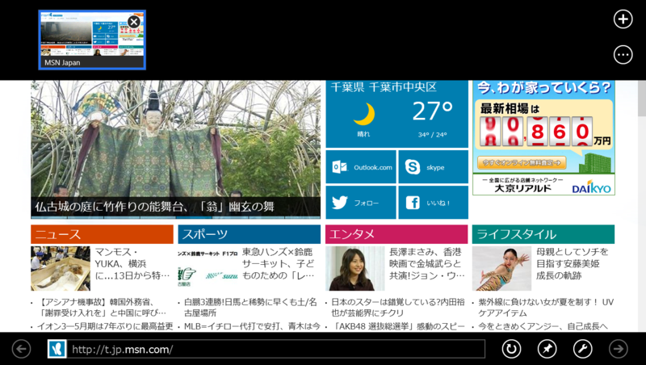
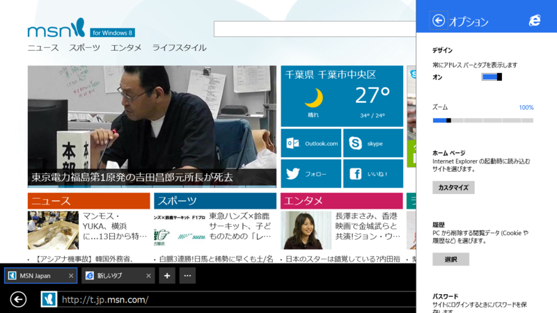
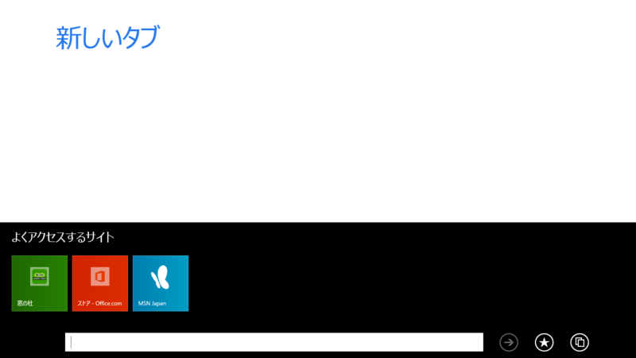
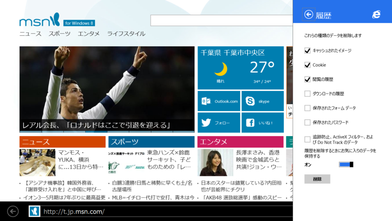

<h3>Desktop IE</h3>

Desktop IE 11 にはほとんど変更はないみたい（ただし、タブ関連の機能に若干の差異がある。参照: <a href="https://blog.daruyanagi.jp/entry/2013/07/09/060303">IE10 &#x3068; IE11 &#x306E;&#xFF3B;&#x30A4;&#x30F3;&#x30BF;&#x30FC;&#x30CD;&#x30C3;&#x30C8; &#x30AA;&#x30D7;&#x30B7;&#x30E7;&#x30F3;&#xFF3D;&#x3092;&#x6BD4;&#x8F03; - &#x3060;&#x308B;&#x308D;&#x3050;</a>）。本題には関係ないけれど、スクリーンショットでは Office の IE アドインが拡張保護モードによってブロックされているのがわかる。ちゃんと拡張保護モードが動いているのだな、と安心するとともに、自社アプリなんだから対応しておこうよ……と思わないでもない。

<h3>Immersive IE</h3>

Immersive IE 11（要するにデスクトップじゃない、メトロな IE 11）には変更が多い。

<h4>タブ</h4>

まず、タブバーの位置が上から下へと変更された。IE 10 の場合はタブが上にあった。

IE 10 のタブバー。これに慣れちゃったので、新しい IE は少しめんどくさい。好意的に解釈すれば、アプリバーでブラウザー領域の上部が隠れなくなった、とは言える。けれど、これは必要な変更だったのかどうか。

ただ、［常にタブとアドレスバーを表示します］というオプションが追加されたのはとてもよいと思う。Windows Phone 版の「Sleipnir Mobile」をちょっと彷彿とさせるデザイン。タブバーの位置が変更されたのも、この機能との兼ね合いがあったのかもしれない。

話は変わるが、タブはともかく、アドレスバーは常に表示しておきたいと個人的に思うのだけれど、そういうオプションはつかないのだろうか。アドレスバーを確認する癖をつけることは、セキュリティ的にも望ましいのと思うだけれど。

また、タブツール（タブバー右端にある［…］ボタン）に［閉じたタブを再度開く］が追加されたのもナイス。

また、タブにコンテキストメニューが追加されて（IE 10 にはなかったんだよ！！）、ほかのタブを閉じたり、タブが複製できるようになった。このように、タブ関連の機能はかなりアップグレードされている。まぁ、“自称上級者”を満足させるほどではないと思う<a href="#f-59f607d6" name="fn-59f607d6" title="たとえば、タブの並び替えはできない">*1</a>が、IE 10 で「なんでできないんだよーくそがー」と思うことはだいたい潰されているような気がする。

さて、このコンテキストメニューで気になるのは［タブを新しいウィンドウで開く］だよね。Immersive（全画面）なのに“ウィンドウ”だって？

試してみるとこんな感じになる。なるほど。画面が分割され、二画面でブラウザーが表示される。横解像度が十分に高ければ、3つとか4つとか広げられるのだろうか。

（常にタブバーを表示しない場合）

（常にタブバーを表示する場合）

スナップ（ってもう言わないんだっけ？　画面分割？）をやめると、タブバーがこんな感じに。ほかのウィンドウのタブがグループ化され、一般のタブと並べた表示される。これはたまにバグって表示されないのだけど（再現条件がわかればフィードバックしたいのだが）、ウィンドウを“消し”ても、そのタブへ再びアクセスできなくなるわけではないということで。

<h4>お気に入りとよくアクセスするサイト</h4>

IE 11 で新規タブを開いた場合。

同じことを IE 10 で行った場合。なぜか“お気に入り”が削除されている。これは機能退化であるように感じられる。“お気に入り”のサイトは新規タブボタンではなく、“お気に入り”からアクセスすればいいじゃない、ってことなのかな。

それ以外はおおむね好感触。

IE 11 では“お気に入り”の管理が改善された。Immersive IE で“お気に入り”のフォルダ分けがサポートされたので、“お気に入りバー”が Desktop IE と Immersive IE で共有できるようになる。なんで今までできへんかってん。

Immersive IE の“お気に入り”に表示しておけるフォルダ階層を“お気に入りバー”にしておくといいかも。それにしても名前が混乱しているというか、最初はここらへんのユーザーインターフェイスがちょっとよくわからなかった。プルダウンを示す“＾”の下向きのマーク、相変わらずわかりにくいし。

<h3>［設定］チャーム</h3>

［設定］チャームの内容はかなり充実した。IE 10 はよく言えばシンプル、ぶっちゃけて言えば貧弱だったけれど、これでだいぶマシになった。全部あげてもキリがないので、重要そうなものだけピックアップする。

<h4>履歴の削除</h4>

削除できる項目がコントロールできるようになった（これまでは全削除のみだったのかな）。とくにパスワードやフォームのオートコンプリートは、勝手に消されても困るし、消せなくても困る。

<h4>Do Not Track の設定</h4>

個人的に Do Not Track がデフォルトで ON であることは、ユーザーのためによいことだと思う。デフォルトで有効化したら、サーバー側で DNT が無視されてしまうじゃないか、という意見もあると思うけれど、それは DNT という仕組みがクソだからだ。ユーザーが DNT を知れば、ほとんどの人は ON にしたいと思うし、ON にしておいてくれよと思うだろう（統計はとったことがないが）。もし Mozilla が DNT を本当に推進しているというのならば、インストールや初回起動時に DNT の存在を案内すべきだ。IE では“おまかせ設定”を選択しなければ、初回起動時にユーザー側で DNT の ON/OFF が選択できるようになっているはず。

話がそれた。

DNT がデフォルトで ON であることは、基本的にいいことかもしれない（少なくとも個人的にはそう思う）。だとしても、簡単に OFF にできないのもどうかと思う。その点がちゃんとサポートされたのはいいことだと感じる。

<h4>ページ予測によるページフリップ</h4>

これに限らず、プリロード機能は OFF にできることが望ましい。従量制ネットワークであまり回線を無駄遣いしたくない。このあたりの設定は、ネットワークの種類に応じて変えられるとなおいいと思う。もしかしたら、システム側で気を利かして OFF にしている可能性もなくはないが（未検証）。

<h4>アカウント</h4>

ブラウザーが記憶するアカウント情報をユーザー側で削除できる。

<a href="#fn-59f607d6" name="f-59f607d6" class="footnote-number">*1</a>:たとえば、タブの並び替えはできない

