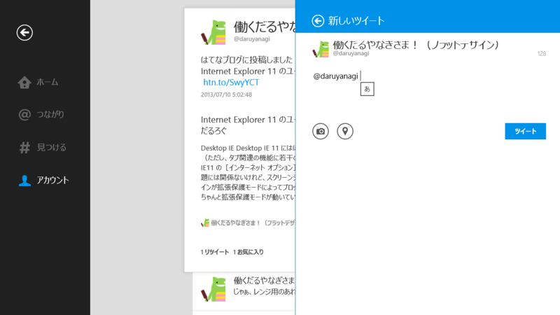

Windows 8.1 Preview の IME は挙動が少しおかしい。個人的に一番困るのが、Twitter アプリでリプライを書くときに、

キャレットの位置がなぜか先頭に移動してしまうこと。Windows 8.0 の Twitter アプリでは再現しない。

※ 一応フィードバックも投げておいた（<a href="http://answers.microsoft.com/ja-jp/windows/forum/windowsrt_1_pr-ime/twitter/0f9ac88d-00b1-4065-820e-83efe55151ea">http://answers.microsoft.com/ja-jp/windows/forum/windowsrt_1_pr-ime/twitter/0f9ac88d-00b1-4065-820e-83efe55151ea</a>）

ほかにもいろいろあるっぽいなぁ、と思って調べてみたところ、今のところ以下のような既知の問題があるみたい。

<blockquote cite="http://answers.microsoft.com/ja-jp/windows/forum/windows8_1_pr-ime/windows-81-preview-%E3%81%8A%E3%82%88%E3%81%B3/d50351f0-a633-4cbb-ae3b-4d4c3f327d47">

● 注目文節および複数文節の表示 
→ アプリが使用しているテキスト入力コンポーネントによって、未確定文字列の状態を示すアンダーライン等が表示されない場合があります。 
 
● 候補ウィンドウの表示位置 
→ アプリによって、候補ウィンドウが表示される位置が、本来とは違う位置に表示される場合があります。 
 
● 予測、次候補予測、変換候補の品質 
→ 予測 ・ 変換候補の辞書の品質は現在調整中であり、最終版では改善される予定です。 
 
● 全体のパフォーマンスと安定性 
→ パフォーマンスと安定性は現在調整中であり、最終版では改善される予定です。 
 
● カラー絵文字サポート 
→ 絵文字フォントがカラーをサポートしましたが、アプリによっては白黒表示になります。 
 
● Windows RT デバイスの動作 
→ Windows Update 経由の辞書のアップデートに失敗します。

<cite><a href="http://answers.microsoft.com/ja-jp/windows/forum/windows8_1_pr-ime/windows-81-preview-%E3%81%8A%E3%82%88%E3%81%B3/d50351f0-a633-4cbb-ae3b-4d4c3f327d47">Windows 8.1 Preview &#x304A;&#x3088;&#x3073; Windows RT 8.1 Preview &#x306E; IME &#x306E;&#x5236;&#x9650;&#x4E8B;&#x9805;&#x3092;&#x6559;&#x3048;&#x3066;&#x304F;&#x3060;&#x3055;&#x3044; - &#x30DE;&#x30A4;&#x30AF;&#x30ED;&#x30BD;&#x30D5;&#x30C8; &#x30B3;&#x30DF;&#x30E5;&#x30CB;&#x30C6;&#x30A3;</a></cite>
</blockquote>

あと、こんなのもあるみたい。

● 「Windows Liveメール」でメッセージを作成する際に IME が有効にならない 
→ ［Ctrl］＋［Tab］キーで有効になる

<ul>
<li><a href="http://answers.microsoft.com/ja-jp/windows/forum/windows8_1_pr-ime/win81pre-windows-live-mail/48ea0f6e-2b18-4433-9beb-da0db25d2911">[Win8.1Pre] Windows live mail &#x306E;&#x65B0;&#x898F;&#x4F5C;&#x6210;&#x672C;&#x6587;&#x3067;&#x3001;IME&#x304C;&#x4F7F;&#x7528;&#x4E0D;&#x80FD;&#x306B;&#x306A;&#x308B; - &#x30DE;&#x30A4;&#x30AF;&#x30ED;&#x30BD;&#x30D5;&#x30C8; &#x30B3;&#x30DF;&#x30E5;&#x30CB;&#x30C6;&#x30A3;</a></li>
</ul>
● Desktop IE 11の TEXTAREA でキャレットがずれる 
→ 製品版で修正予定

<ul>
<li><a href="http://answers.microsoft.com/ja-jp/windows/forum/windows8_1_pr-ime/win81pre-windows-live-mail/48ea0f6e-2b18-4433-9beb-da0db25d2911">[Win8.1Pre] Windows live mail &#x306E;&#x65B0;&#x898F;&#x4F5C;&#x6210;&#x672C;&#x6587;&#x3067;&#x3001;IME&#x304C;&#x4F7F;&#x7528;&#x4E0D;&#x80FD;&#x306B;&#x306A;&#x308B; - &#x30DE;&#x30A4;&#x30AF;&#x30ED;&#x30BD;&#x30D5;&#x30C8; &#x30B3;&#x30DF;&#x30E5;&#x30CB;&#x30C6;&#x30A3;</a></li>
</ul>
● ストアアプリで全角空白が入力できない 
→ 製品版で修正予定

<ul>
<li><a href="http://answers.microsoft.com/ja-jp/windows/forum/windows8_1_pr-ime/win81pre/7d7c47ea-1098-4db3-9a88-576e70e08ab0">[Win8.1Pre] &#x30B9;&#x30C8;&#x30A2;&#x30A2;&#x30D7;&#x30EA;&#x3067;&#x5168;&#x89D2;&#x7A7A;&#x767D;&#x304C;&#x5165;&#x529B;&#x3067;&#x304D;&#x306A;&#x3044; - &#x30DE;&#x30A4;&#x30AF;&#x30ED;&#x30BD;&#x30D5;&#x30C8; &#x30B3;&#x30DF;&#x30E5;&#x30CB;&#x30C6;&#x30A3;</a></li>
</ul>
● ストアアプリで［半角/全角］キーによる入力モードの変更ができない 
→ ［Alt］＋［半角/全角］キー、または［半角/全角］キーの二回押しで回避可能。製品版で修正予定

● 検索チャームやストアアプリでかな入力ができない 
→ かな入力なにそれ（

<ul>
<li><a href="http://answers.microsoft.com/ja-jp/windows/forum/windows8_1_pr-ime/win81pre-winows-81/8d37c43f-0979-4c40-ba36-8ed9415a86fc">[Win8.1Pre] Winows 8.1 Preview&#x306E;&#x691C;&#x7D22;&#x30C1;&#x30E3;&#x30FC;&#x30E0;&#x3084;&#x30B9;&#x30C8;&#x30A2;&#x30A2;&#x30D7;&#x30EA;&#x3067;&#x304B;&#x306A;&#x5165;&#x529B;&#x304C;&#x3067;&#x304D;&#x307E;&#x305B;&#x3093; - &#x30DE;&#x30A4;&#x30AF;&#x30ED;&#x30BD;&#x30D5;&#x30C8; &#x30B3;&#x30DF;&#x30E5;&#x30CB;&#x30C6;&#x30A3;</a></li>
</ul>
基本的に製品版までは修正が入らないっぽいのだけど、すごく不安だなぁ。

