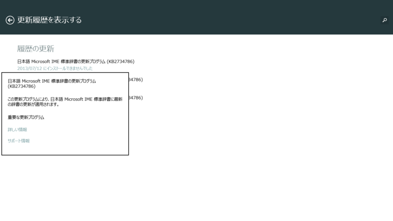

 

<blockquote cite="http://www.microsoft.com/surface/en-us/support/performance-and-maintenance/rt-update-history?lc=1041">

<h5>July 2013 updates</h5>

Released July 9

Firmware update enhances system performance and reliability.

<cite><a href="http://www.microsoft.com/surface/en-us/support/performance-and-maintenance/rt-update-history?lc=1041">Official Home of Microsoft Surface Computers &amp; Devices &ndash; Microsoft Surface</a></cite>
</blockquote>

楽しみにしていたのだけど、残念ながら Windows 8.1 RT 向けのリリースはないみたい。

ちなみに IME 辞書のインストールに失敗するのは、Windows 8.1 RT の IME における既知の問題（<a href="https://blog.daruyanagi.jp/entry/2013/07/10/053339">Windows 8.1 Preview &#x306E; IME &#x306B;&#x304A;&#x3051;&#x308B;&#x65E2;&#x77E5;&#x306E;&#x554F;&#x984C; - &#x3060;&#x308B;&#x308D;&#x3050;</a>）。

