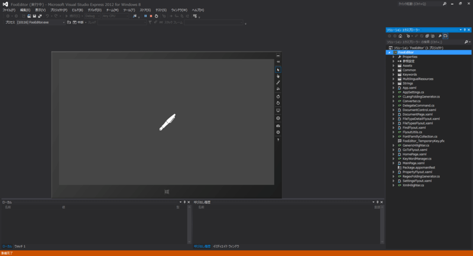
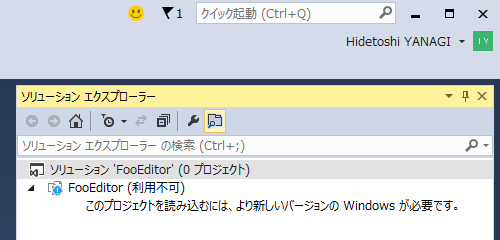
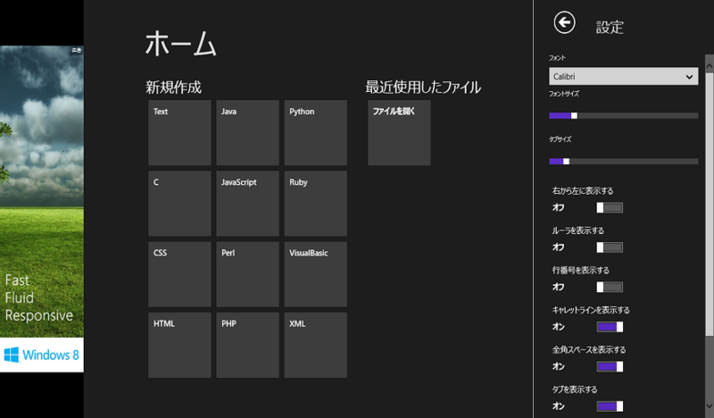
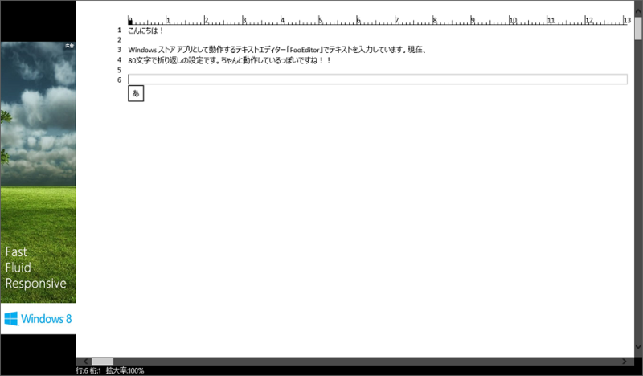
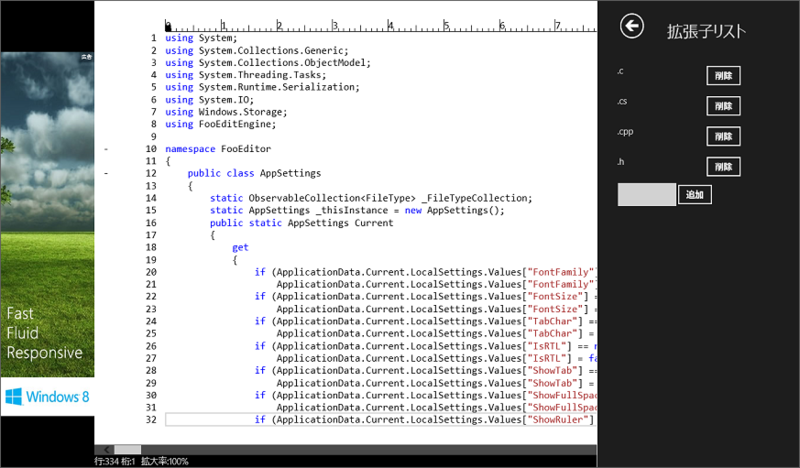
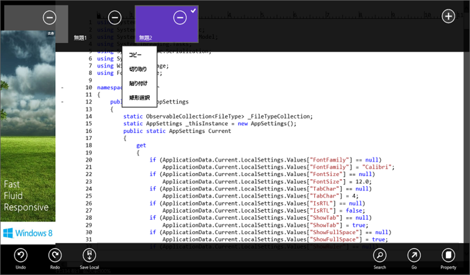
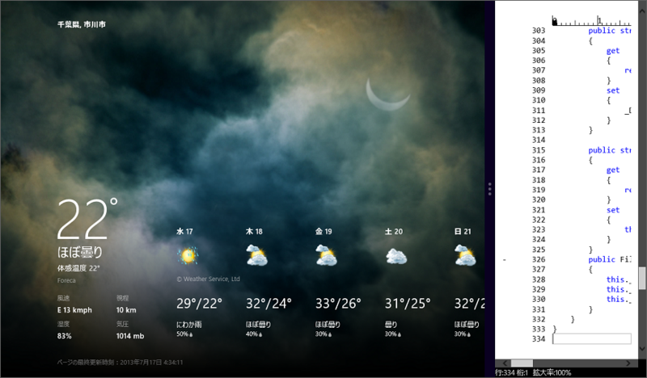
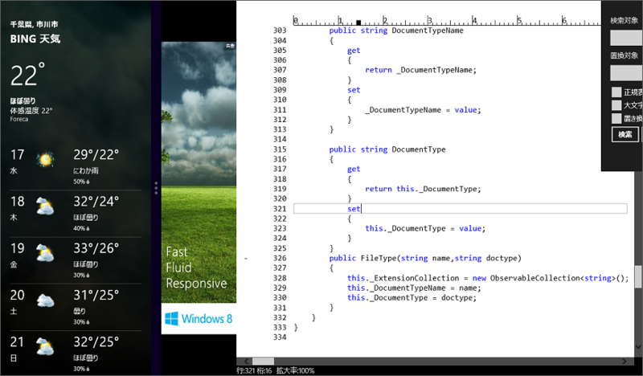

 

<blockquote cite="https://blog.daruyanagi.jp/entry/2013/06/03/194733">

<a href="http://blog.hatena.ne.jp/none_2271/">id:none_2271</a>

テキストエディター作りました。正規表現の検索・置き換え、指定桁数での折り返し、シンタックスハイライト、行ジャンプをサポートしています 
<a href="http://sourceforge.jp/users/gdkhd812/pf/fooeditor_metro/scm/tree/master/">http://sourceforge.jp/users/gdkhd812/pf/fooeditor_metro/scm/tree/master/</a>

<cite><a href="https://blog.daruyanagi.jp/entry/2013/06/03/194733">WinRT &#x3067;&#x4F7F;&#x3048;&#x308B;&#x30C6;&#x30AD;&#x30B9;&#x30C8;&#x30A8;&#x30C7;&#x30A3;&#x30BF;&#x30FC;&#x30B3;&#x30F3;&#x30DD;&#x30FC;&#x30CD;&#x30F3;&#x30C8; - &#x3060;&#x308B;&#x308D;&#x3050;</a></cite>
</blockquote>

最初 Visual Studio 2013 Preview でビルドできなくて「ふぁ( ﾟДﾟ)！？」ってなったのですが、Visual Studio 2013 Express for Desktop を入れると無事にビルドできました。あれ……Windows 8.x アプリの開発機能って含まれてなかったんだっけ……。

このエラーメッセージに騙されて、もしかしたら Windows 8.1 が必要なのかなーって一瞬思っちゃいました（てへぺろ）

<h3>ホーム画面</h3>

<a href="http://www.forest.impress.co.jp/docs/review/20130603_602043.html">&#x3010;&#x30EC;&#x30D3;&#x30E5;&#x30FC;&#x3011;&#x30BD;&#x30FC;&#x30B9;&#x30B3;&#x30FC;&#x30C9;&#x306E;&#x7DE8;&#x96C6;&#x306B;&#x7279;&#x5316;&#x3057;&#x305F;Windows &#x30B9;&#x30C8;&#x30A2;&#x30A2;&#x30D7;&#x30EA;&#x300C;Code Writer&#x300D; - &#x7A93;&#x306E;&#x675C;</a> を彷彿とさせるホーム画面。ドキュメントタイプを指定して新規作成したり、最近編集したファイルから開くといったタスクが、タイルで選択できます。

テキストエディターの設定はグローバルに効くのかな？　これはドキュメントタイプごとに行えるほうがよかったかもしれない。お盆休みに自分で改良してみよう。

<h3>日本語テキストの編集</h3>

指定桁数での折り返しは必須かなと思うのですけど、ちゃんと対応。禁則処理もしてあるのかな？　個人的には十分使えるなーと思いました。

<h3>ソースコードの編集</h3>

シンタックスハイライトが効きます。拡張子に応じてドキュメントタイプが切り替わるようですね。C# の構文色分けはできないけれど、まぁ、自分で作ってみましょう！

<h3>タブ切り替え</h3>

アプリバーでタブの切り替えが可能。広告がかぶったり、マウスの右クリックでアプリバーを呼び出すとコンテクストメニューが出るのは要調整だけれども、いい感じですね。

<h3>そのほか</h3>

スナップ（※ Widnows 8.1 では死語になる予定）したときだけ行番号を隠すといったオプションはほしくなるかもしれない。ストアアプリはほかのアプリと同居させた場合のことを考えると、なかなかデザインが難しかったりしますね。

自分で手を加えるなら、Internet Explorer 10 の“ページフリップ”のような機能なんかはほしいかも。キーボードレスでどこまで使い勝手を上げられるかも挑戦してみたいですね。

