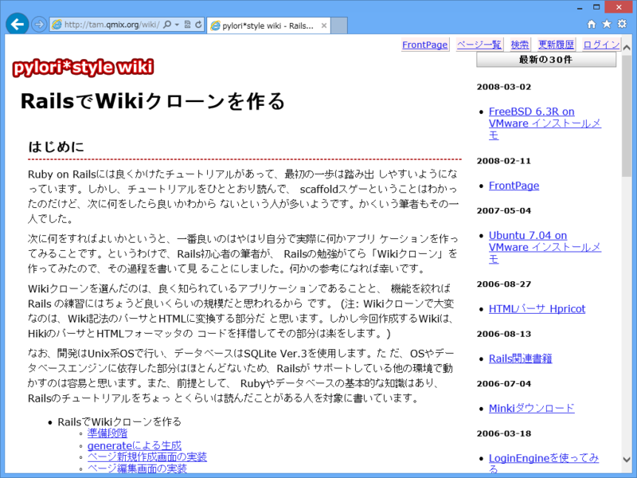
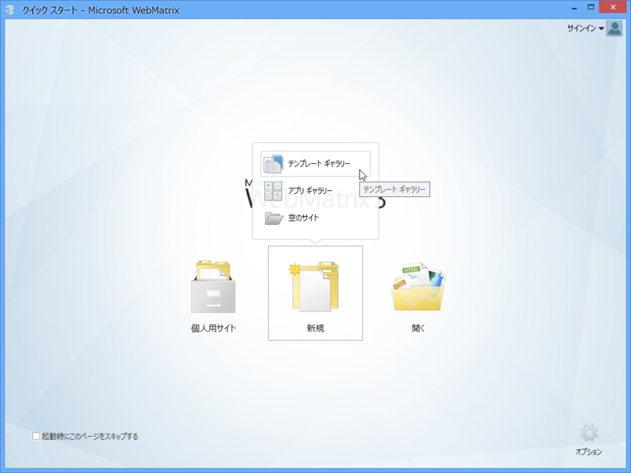
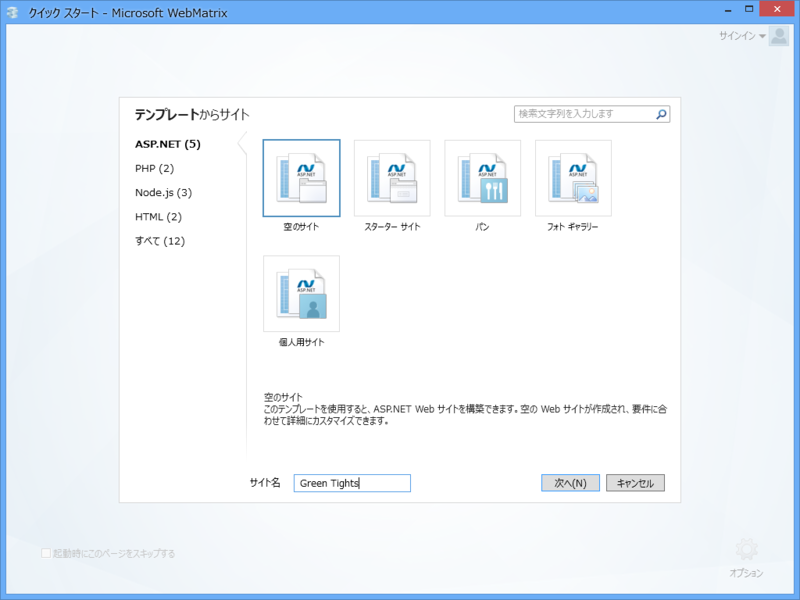
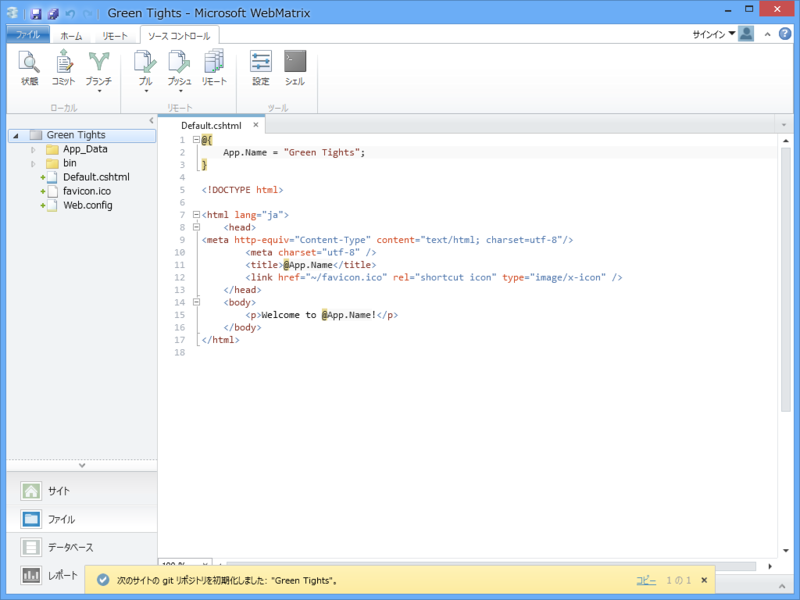
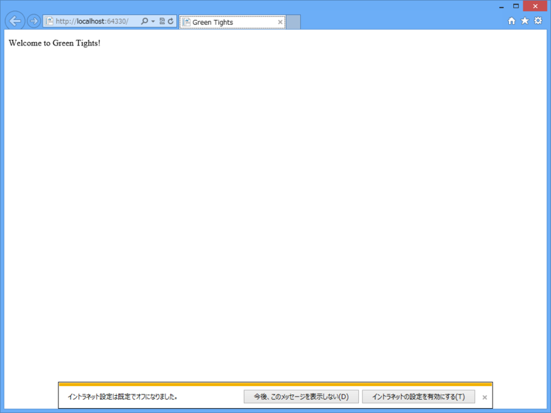

 

<blockquote cite="http://tam.qmix.org/wiki/Minki00.html">

Ruby on Railsには良くかけたチュートリアルがあって、最初の一歩は踏み出 しやすいようになっています。しかし、チュートリアルをひととおり読んで、 scaffoldスゲーということはわかったのだけど、次に何をしたら良いかわから ないという人が多いようです。かくいう筆者もその一人でした。

<cite><a href="http://tam.qmix.org/wiki/Minki00.html">http://tam.qmix.org/wiki/Minki00.html</a></cite>
</blockquote>

昔、Web アプリが作りたいなぁ、と思って手を出したのが Ruby on Rails でした。このサイトを参考にしながら、少しずつ Wiki を作って勉強したのを覚えています。当時は C# で Web アプリが書けるというのを知らなかったし、その環境も整っていなかった。なので、わざわざいちから Ruby という新しい言語を覚える必要がありました。それはそれで楽しいことだったし、今でもその経験は役に立っているのですけど、やっぱり使い慣れた C# で書けるならばそれに越したことはない。

今なら C# で Web アプリが簡単に作れる WebMatrix という優秀なツールがあります<a href="#f-f61de386" name="fn-f61de386" title="ほかにもできるけど、そっちを推すのはほかの人に任せる">*1</a>。でも、僕がかつてお世話になったチュートリアル的なコンテンツはまだまだ少ないのが現状です。

んなわけで、“WebMatrix 3 で Wiki クローンを作る（<a href="https://blog.daruyanagi.jp/category/WebMatrix%203%20%E3%81%A7%20Wiki%20%E3%82%AF%E3%83%AD%E3%83%BC%E3%83%B3%E3%82%92%E4%BD%9C%E3%82%8B">WebMatrix 3 &#x3067; Wiki &#x30AF;&#x30ED;&#x30FC;&#x30F3;&#x3092;&#x4F5C;&#x308B;</a>）”というのを、不定期にボチボチやっていこうかなと思います。でも、あんまり期待しないでください。

<h3>必要なもの</h3>

<ul>
<li><a href="http://www.microsoft.com/web/webmatrix/">Microsoft Developer</a></li>
</ul>
これだけです。できれば <a href="http://www.microsoft.com/visualstudio/jpn/products/visual-studio-express-for-web">http://www.microsoft.com/visualstudio/jpn/products/visual-studio-express-for-web</a> があるといろいろ便利。フレームワークには <a href="http://msdn.microsoft.com/ja-jp/library/hh396384(v=vs.111).aspx">ASP.NET Web Pages 2 | Microsoft Docs</a> を利用しますが、とりあえず今のところは<i>「C# で PHP っぽく Web アプリが書けるもの」</i>だとでも思っていただければ結構です。

<h3>プロジェクトの新規作成</h3>

テンプレートギャラリーから……

ASP.NET の“空のサイト”を選択。今回は @Webmatxirxman（<a href="https://twitter.com/WebMatrixMan">https://twitter.com/WebMatrixMan</a>）に敬意を表して<b>「Green Tights」</b>としました。<i>“C:\Users\***\Documents\My Web Sites\Green Tights”</i>がプロジェクトフォルダーになります。

まず、適当に Default.cshtml を編集しましょう。今回は冒頭の <b>@{}</b> コードブロックで <b>App.Name</b> に“Green Tights”という文字列を代入し、HTML で <b>@App.Name</b> のように記述して埋め込んでいます（2ケ所）。

<pre class="code lang-html" data-lang="html" data-unlink>@{
App.Name = &quot;Green Tights&quot;;
}

&lt;!DOCTYPE html&gt;

&lt;html lang=&quot;ja&quot;&gt;
&lt;head&gt;
&lt;meta http-equiv=&quot;Content-Type&quot; content=&quot;text/html; charset=utf-8&quot;/&gt;
        &lt;meta charset=&quot;utf-8&quot; /&gt;
        &lt;title&gt;@App.Name&lt;/title&gt;
        &lt;link href=&quot;~/favicon.ico&quot; rel=&quot;shortcut icon&quot; type=&quot;image/x-icon&quot; /&gt;
    &lt;/head&gt;
&lt;body&gt;
&lt;p&gt;Welcome to @App.Name!&lt;/p&gt;
&lt;/body&gt;
&lt;/html&gt;
</pre>
［実行］ボタンを押し……

ブラウザーでなにか表示されたら成功。ちゃんと動いてますね。この <b>@</b> で変数を評価して出力する記法を <b>Razor</b> と呼びます。

今日のところはこれで終わり！――次回はデータベースを用意して、書き込みと読み込みを行います。たぶん。

<h3>ソースコード</h3>

<ul>
<li><a href="https://greentights.codeplex.com/SourceControl/changeset/97f8b9647ae928e4fc375bbb7d9914d81e9dd314">CodePlex Archive</a></li>
</ul>

<a href="#fn-f61de386" name="f-f61de386" class="footnote-number">*1</a>:ほかにもできるけど、そっちを推すのはほかの人に任せる

