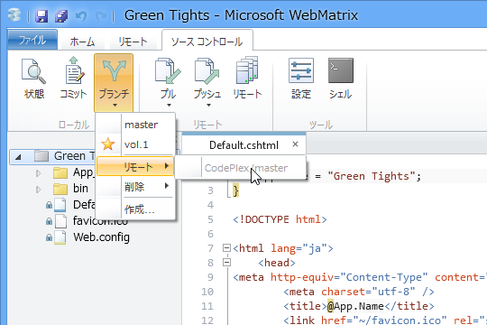
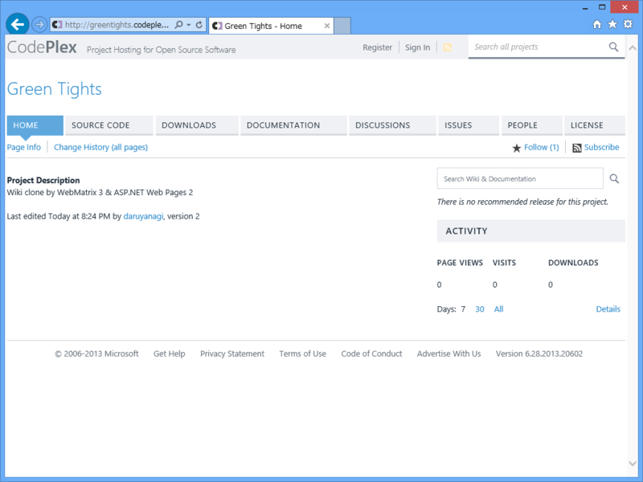
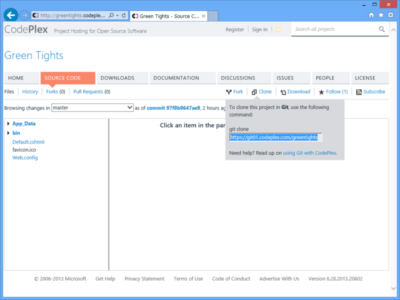
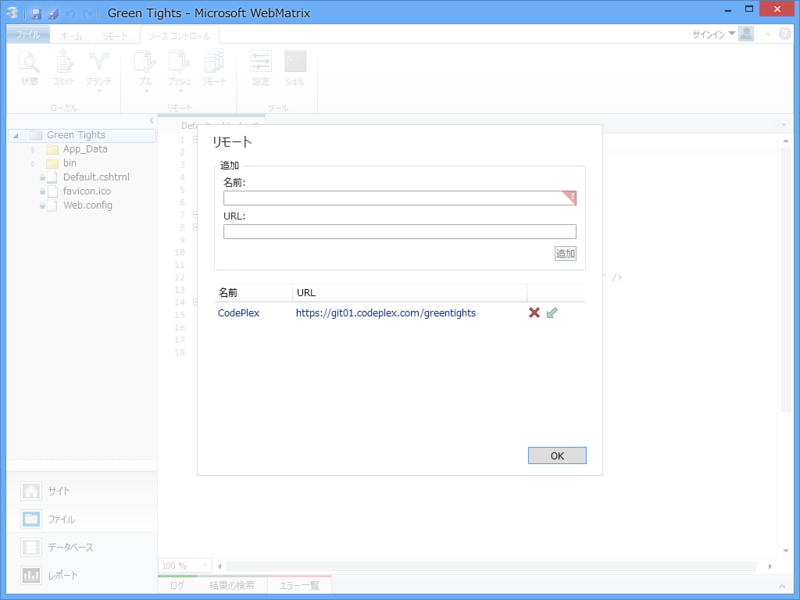
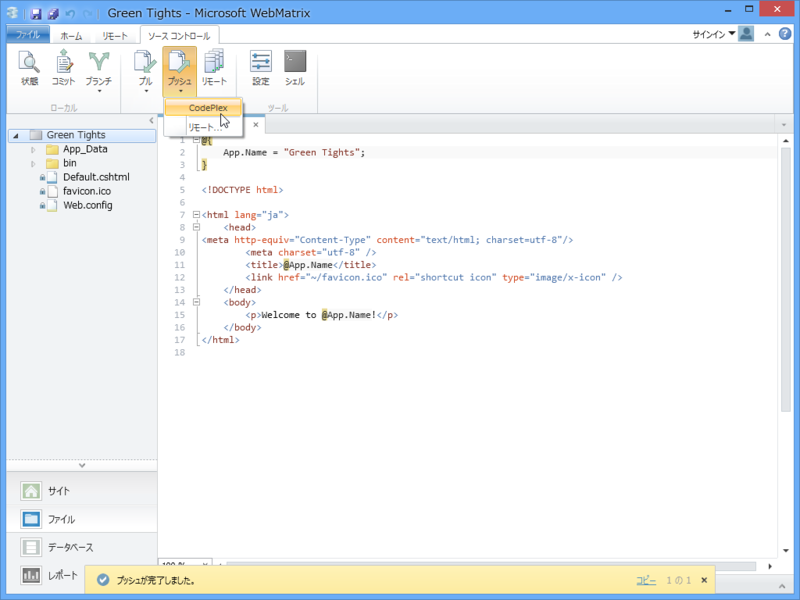
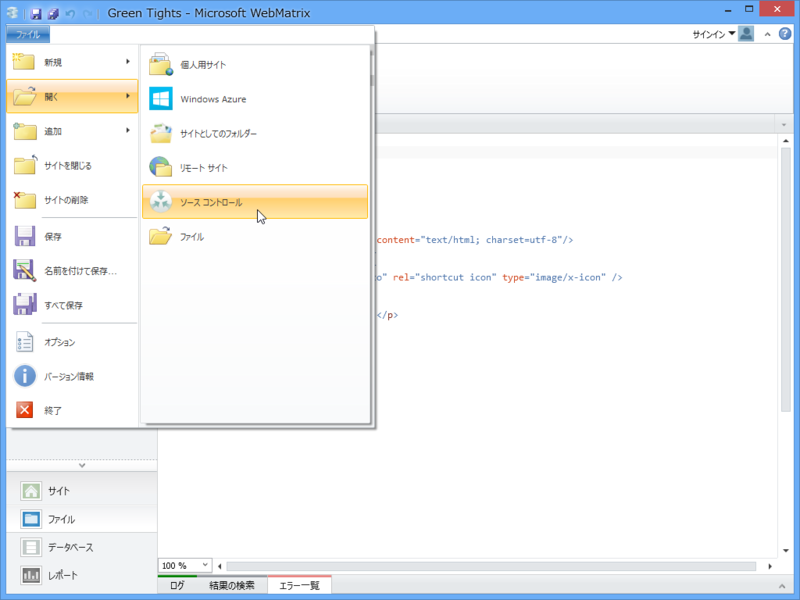
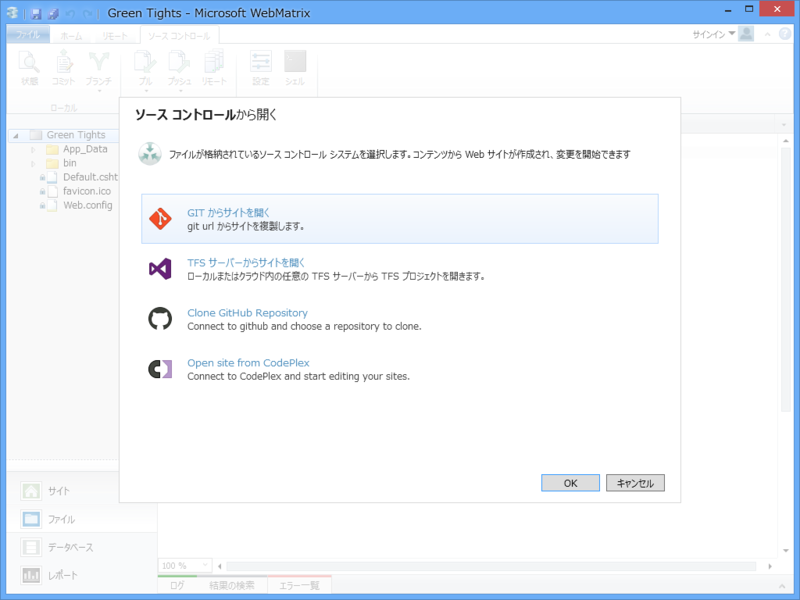
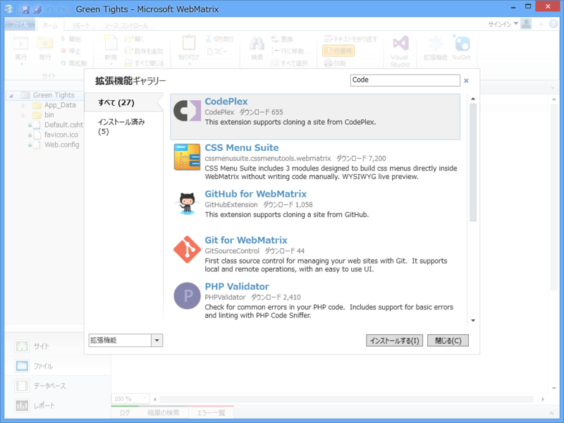

“WebMatrix 3 で Wiki クローンを作る（<a href="https://blog.daruyanagi.jp/category/WebMatrix%203%20%E3%81%A7%20Wiki%20%E3%82%AF%E3%83%AD%E3%83%BC%E3%83%B3%E3%82%92%E4%BD%9C%E3%82%8B">WebMatrix 3 &#x3067; Wiki &#x30AF;&#x30ED;&#x30FC;&#x30F3;&#x3092;&#x4F5C;&#x308B;</a>）”のソースコードは CodePlex でホストするつもり。WebMatrix にはバージョン管理システムが統合されているので（Git/TFS）、簡単に連携できるんだよね。

<h3>CodePlex のプロジェクトを作成</h3>

GitHub より多少めんどくさいけれどガンバレ。ソースコントロールのタイプは Git を選択（TFSでもいいのかもしれないけれど、あまり知らない）。

<h3>ソースコードのアップロード</h3>

ソースコードタブにある［Clone］ボタンから、リモートアドレスを取得。

WebMatrix 3 の［ソース コントロール］－［リモート］ボタンから、取得したリモートアドレスを登録。

あとは［ソース コントロール］－［プッシュ］ボタンで、ソースコードをアップロードすればよい。

<h3>逆にリモートの既存プロジェクトを WebMatrix で開きたい</h3>

これから新規にプロジェクトを作るならば、CodePlex 側でまずプロジェクトを作成し、それを［ファイル］－［ソース コントロール］メニューから開くのが手軽かもしれない。

拡張機能「CodePlex」をあらかじめインストールしておけば、このメニューからリモートプロジェクトが開ける。

GitHub でホストしているリモートプロジェクトも、拡張機能「GitHub for WebMatrix」で開ける。

