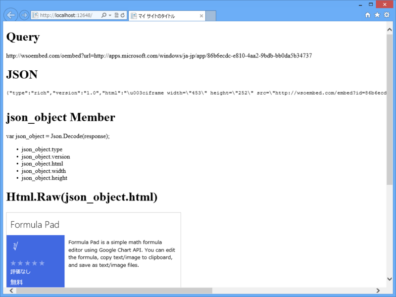
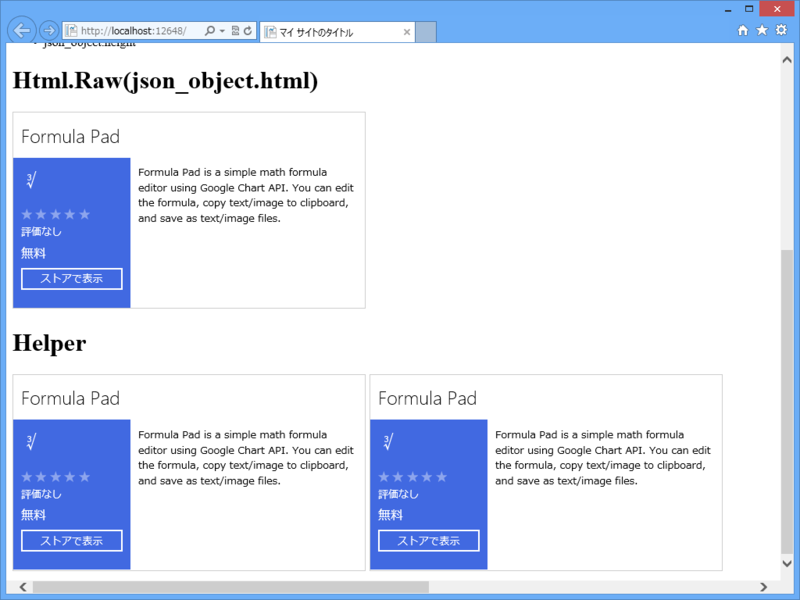

<a href="http://wsoembed.com/">Windows Store oEmbed API</a> は、なかなかいいですね。ブログにこんなかんじでストアアプリの情報が貼り付けられます。

<iframe width="453" height="252" src="http://wsoembed.com/embed?id=24b07f02-446a-4861-b265-1d2fe4dd5383" frameborder="0"></iframe>

<iframe width="453" height="252" src="http://wsoembed.com/embed?id=86b6ecdc-e810-4aa2-9bdb-bb0da5b34737" frameborder="0"></iframe>

使い方などは以下の URL を参照してください。

<ul>
<li><a href="http://shiba-yan.hatenablog.jp/entry/20130717/1373987475">Windows Store oEmbed API &#x3068;&#x3057;&#x3066;&#x516C;&#x958B;&#x3057;&#x306A;&#x304A;&#x3057;&#x307E;&#x3057;&#x305F; - &#x3057;&#x3070;&#x3084;&#x3093;&#x96D1;&#x8A18;</a></li>
<li><a href="http://shiba-yan.hatenablog.jp/entry/20130716/1373916091">Windows &#x30B9;&#x30C8;&#x30A2;&#x306E;&#x5185;&#x5BB9;&#x3092;&#x57CB;&#x3081;&#x8FBC;&#x3081;&#x308B; oEmbed API &#x3092;&#x4F5C;&#x3063;&#x305F; - &#x3057;&#x3070;&#x3084;&#x3093;&#x96D1;&#x8A18;</a></li>
</ul>
またストアアプリを作りたくなりました（ぁ

<h3>WebMatrix 3 で Windows Store oEmbed API を利用する</h3>

<a href="http://shiba-yan.hatenablog.jp/entry/20130718/1374073617">Windows Store oEmbed API &#x3068; jquery-oembed &#x3092;&#x7D44;&#x307F;&#x5408;&#x308F;&#x305B;&#x3066;&#x4F7F;&#x3046;&#x65B9;&#x6CD5; - &#x3057;&#x3070;&#x3084;&#x3093;&#x96D1;&#x8A18;</a> のように JavaScript（クライアントサイド）で利用するのがよいと思いますが、C#（サーバーサイド）で使うこともできます。説明するのは面倒なので、コードだけおいておきます。APS.NET の“空のサイト”を作成し、Default.cshtml を以下のように編集してください。

<pre class="code lang-html" data-lang="html" data-unlink>@{
const string API_ENDPOINT = @&quot;http://wsoembed.com/oembed&quot;;
const string APP_URL = @&quot;http://apps.microsoft.com/windows/ja-jp/app/86b6ecdc-e810-4aa2-9bdb-bb0da5b34737&quot;;

var url = string.Format(&quot;{0}?url={1}&quot;, API_ENDPOINT, APP_URL);
var response = string.Empty;

using (var downloader = new WebClient(){ Encoding = System.Text.Encoding.UTF8 })
{
response = downloader.DownloadString(url);
}

var json_object = Json.Decode(response);
}

&lt;!DOCTYPE html&gt;

&lt;html lang=&quot;ja&quot;&gt;
&lt;head&gt;
        &lt;meta http-equiv=&quot;Content-Type&quot; content=&quot;text/html; charset=utf-8&quot;/&gt;
        &lt;meta charset=&quot;utf-8&quot; /&gt;
        &lt;title&gt;マイ サイトのタイトル&lt;/title&gt;
        &lt;link href=&quot;~/favicon.ico&quot; rel=&quot;shortcut icon&quot; type=&quot;image/x-icon&quot; /&gt;
    &lt;/head&gt;
&lt;body&gt;
&lt;h1&gt;Query&lt;/h1&gt;
&lt;p&gt;@url&lt;/p&gt;

&lt;h1&gt;JSON&lt;/h1&gt;
&lt;pre&gt;
@response
&lt;/pre&gt;

&lt;h1&gt;json_object Member&lt;/h1&gt;
&lt;p&gt;var json_object = Json.Decode(response);&lt;/p&gt;
&lt;ul&gt;
@foreach(var member in json_object.GetDynamicMemberNames())
{
&lt;li&gt;json_object.@member&lt;/li&gt;
}
&lt;/ul&gt;

&lt;h1&gt;Html.Raw(json_object.html)&lt;/h1&gt;
@Html.Raw(json_object.html)
&lt;/body&gt;
&lt;/html&gt;
</pre>
結果はこんなかんじです。

API_ENDPOINT を叩けば JSON が返ってくるので、JSON ヘルパーを利用してオブジェクトにしてやりましょう。このオブジェクトは dynamic なので、json_object.html などとしてやれば値がとれます。大文字小文字に注意してね ☆（ゝω・）vｷｬﾋﾟ

<h3>Windows Store oEmbed API ヘルパー</h3>

こんなコード、毎回書くのは面倒なので、ヘルパーにしてしまいましょう。ルートフォルダーに App_Code フォルダーを作成し、WindowsStore.cshtml を作成します。中身はこんな感じ。

<pre class="code lang-cs" data-lang="cs" data-unlink>@helper GetHtml(string app_id) {
// app_id が url で渡されても許容する
app_id = app_id.Split('/').Last();

const string API_ENDPOINT = @&quot;http://wsoembed.com/oembed&quot;;
const string APP_BASEURL = @&quot;http://apps.microsoft.com/windows/ja-jp/app/&quot;;

var url = string.Format(&quot;{0}?url={1}&quot;, API_ENDPOINT, APP_BASEURL + app_id);

using (var downloader = new WebClient(){ Encoding = System.Text.Encoding.UTF8 })
{
var response = downloader.DownloadString(url);
var json_object = Json.Decode(response);

@Html.Raw(json_object.html)
}
}
</pre>
使い方はこんな感じ。Default.cshtml の最後の方にでも書き足してみてください。

<pre class="code lang-html" data-lang="html" data-unlink>        :
:
&lt;h1&gt;Helper&lt;/h1&gt;
@WindowsStore.GetHtml(APP_URL)

@WindowsStore.GetHtml(&quot;86b6ecdc-e810-4aa2-9bdb-bb0da5b34737&quot;)
&lt;/body&gt;
&lt;/html&gt;
</pre>
結果はこんなかんじです。

ja-jp で決め打ちになっているのはアレなので、

<pre class="code lang-cs" data-lang="cs" data-unlink>@helper GetHtml(string app_id, string locale = &quot;en-us&quot;) {
：
：
</pre>
みたいなシグネチャの方がいいのかもしれませんね。

