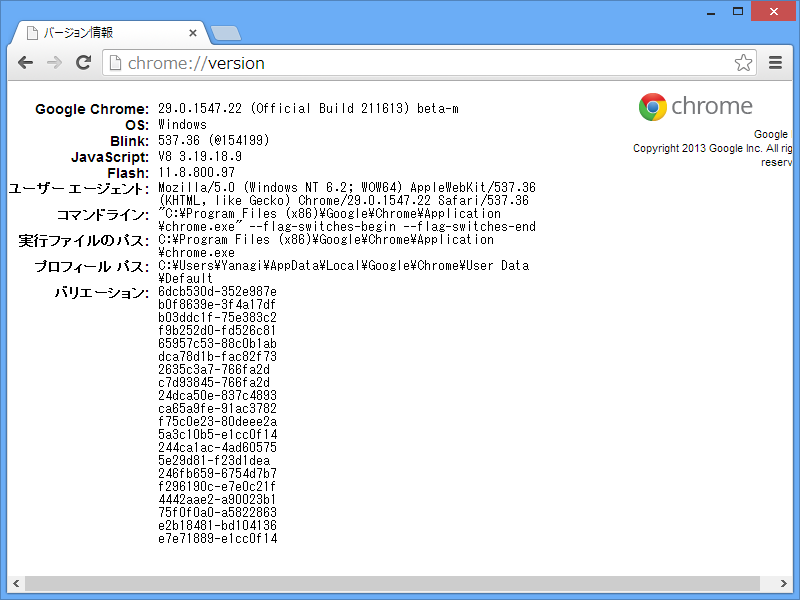
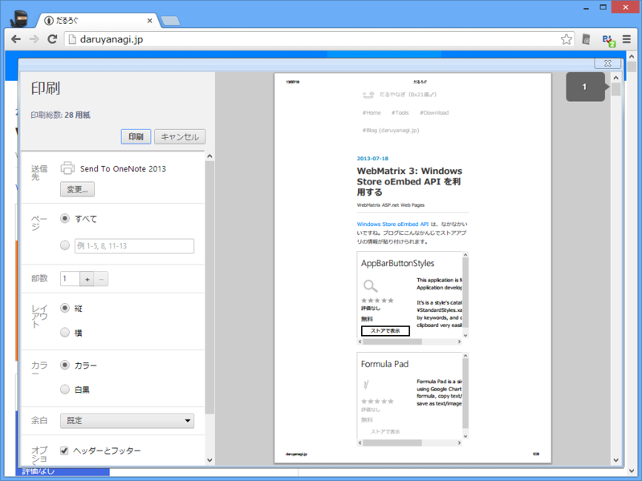
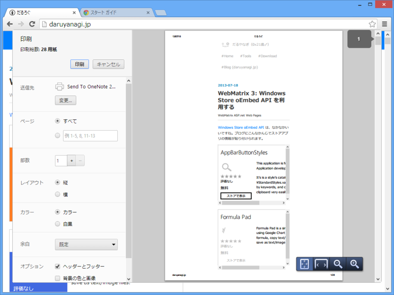

<ul>
<li><a href="http://www.forest.impress.co.jp/docs/news/20130717_607920.html">&ldquo;VP9&rdquo;&#x30B3;&#x30FC;&#x30C7;&#x30C3;&#x30AF;&#x3092;&#x30B5;&#x30DD;&#x30FC;&#x30C8;&#x3057;&#x305F;&#x300C;Google Chrome 29&#x300D;&#x304C;&#x30D9;&#x30FC;&#x30BF;&#x7248;&#x306B; - &#x7A93;&#x306E;&#x675C;</a></li>
</ul>
Blink は 537.36、JavaScript（V8）は 3.19.18.9。Dev の方はもう「30」だそうで。ほんと、月日が流れるのは早いですね！（違

Google Chrome 28 Stable

Google Chrome 29 Beta

オムニボックスのデザインが変更された以外では、印刷ダイアログが少し変わったのが目に付く程度。

それはそうと、「Google Chrome」はスケーリングに対応していないんだね。Surface Pro で使うと表示がボヤけて気持ち悪い。まぁ、タッチでは「Internet Explorer」の方が使いやすいので、Touch Cover/Type Cover があるときでさえ、もっぱらそっちを利用しているのだけれど。

