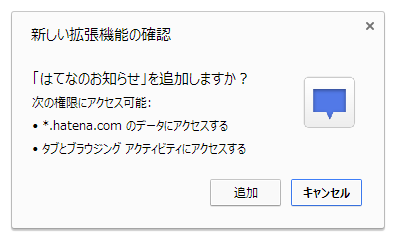
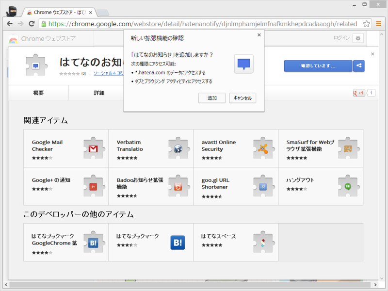
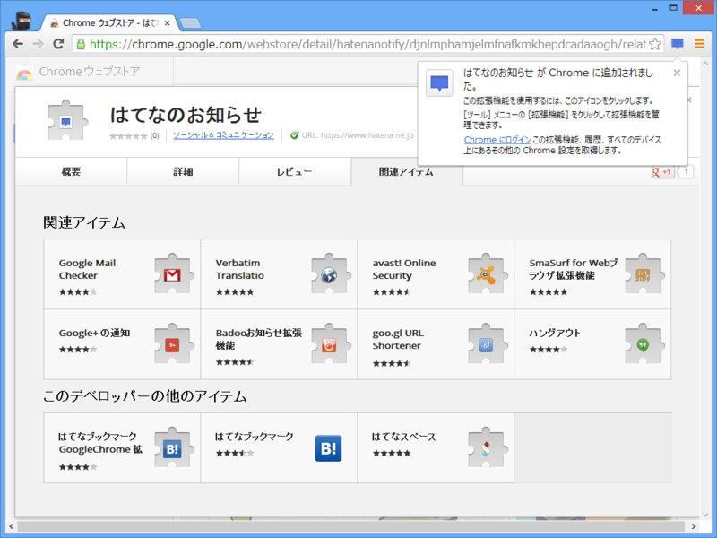
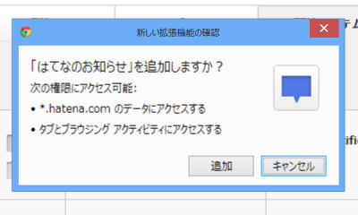

<a href="https://blog.daruyanagi.jp/entry/2013/07/18/050648">Google Chrome 29 Beta &#x306E;&#x5370;&#x5237;&#x30C0;&#x30A4;&#x30A2;&#x30ED;&#x30B0; - &#x3060;&#x308B;&#x308D;&#x3050;</a> だけじゃなかった。

二枚目のポップアップのデザインは従来と変わらない。

ちなみに「Google Chrome 28」のインストール確認ダイアログはこんなだった。Surface Pro（スケーリング: 150%）でスクリーンショットを撮ったのでボヤけているが、仕方ない。

