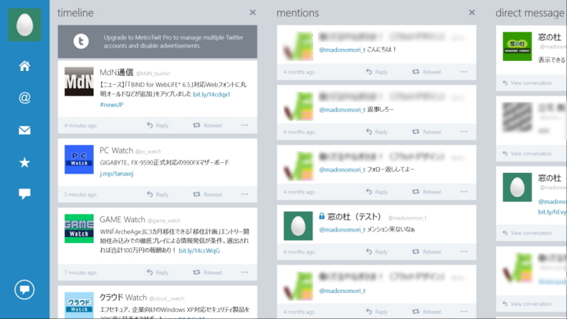
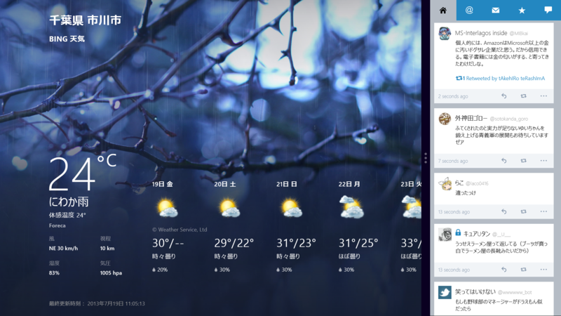

<ul>
<li><a href="http://www.forest.impress.co.jp/docs/news/20130717_607939.html">&#x300C;MetroTwit for Windows 8&#x300D;&#x304C;&#x30E1;&#x30B8;&#x30E3;&#x30FC;&#x30A2;&#x30C3;&#x30D7;&#x30C7;&#x30FC;&#x30C8;&#x3001;&#x771F;&#x306E;&ldquo;&#x30DE;&#x30EB;&#x30C1;&#x30AB;&#x30E9;&#x30E0;&rdquo;&#x578B;&#x306B; - &#x7A93;&#x306E;&#x675C;</a></li>
</ul>
そうそう、こういうのがほしかったんだよ！　User Streams にも対応。まだちょっと不安定で落ちることはあるけれど、Windows 8 向けとしては、いまのところ一番優れているように思う。 

スナップさせると、スマートフォンのクライアントによくあるタブ切り替え型になる。

あとは、検索タイムラインのピン留めと、プッシュ通知に対応してほしいかな。ひとによってはタグやスクリーンネームの入力補完がほしいって思うかもしれないけれど、とりあえずはこれで事足りると思う。

もう Twitter が買収して、オフィシャルクライアントにしてしまえばいいんちゃう？

      MetroTwit for Windows 8 はメモリかなり食うし、定期的に落ちる。メモリリークくさい……それを割り引いてもなかなか使えると思う

<a href="http://twitter.com/daruyanagi/status/358063283024039936" class="twitter-detail-info-permalink">2013-07-19 12:18:33</a> via <a href="http://www.metrotwit.com/" rel="nofollow">MetroTwit</a>

<h3>追伸</h3>

デスクトップ向けは API が足りなくて苦しい……

