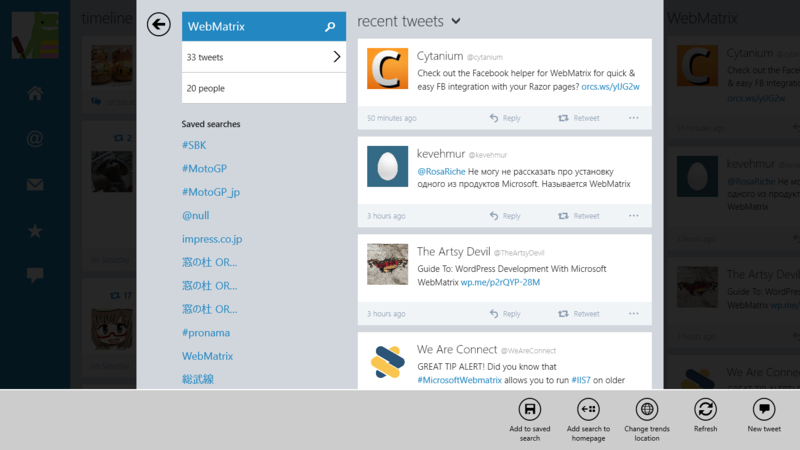

<blockquote cite="https://blog.daruyanagi.jp/entry/2013/07/19/111834">

あとは、検索タイムラインのピン留めと、プッシュ通知に対応してほしいかな。ひとによってはタグやスクリーンネームの入力補完がほしいって思うかもしれないけれど、とりあえずはこれで事足りると思う。

<cite><a href="https://blog.daruyanagi.jp/entry/2013/07/19/111834">&#x65B0;&#x3057;&#x3044; MetroTwit for Windows 8 &#x304C;&#x306A;&#x304B;&#x306A;&#x304B;&#x3088;&#x308D;&#x3057;&#x3044; - &#x3060;&#x308B;&#x308D;&#x3050;</a></cite>
</blockquote>

てっきり検索やリストのピン留めには対応していないと思っていたのだけど、フツーにできた。

検索結果（やリスト）にアクセスして、アプリバーから［Add search to homepage］を選ぶだけ。んー、ほかのタイムラインと操作系が違うこともあって、ちょっとわかりにくいかなと思った。

