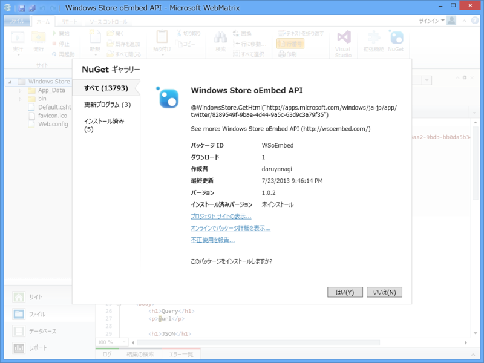
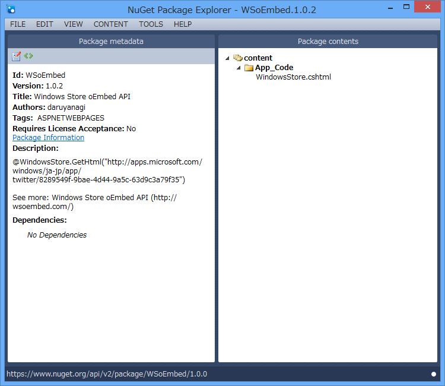
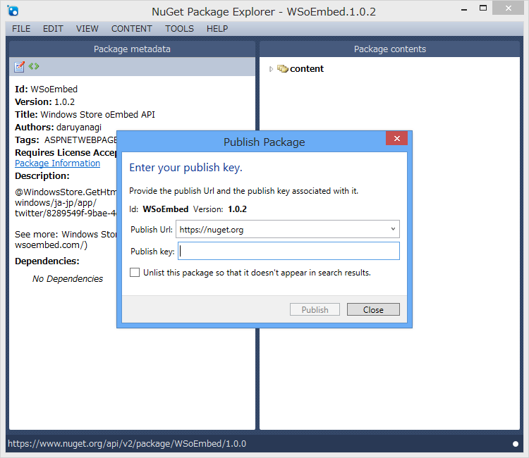
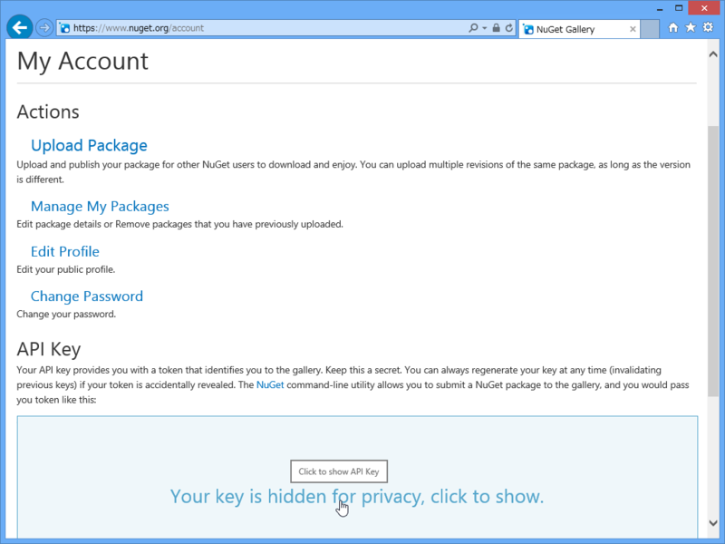
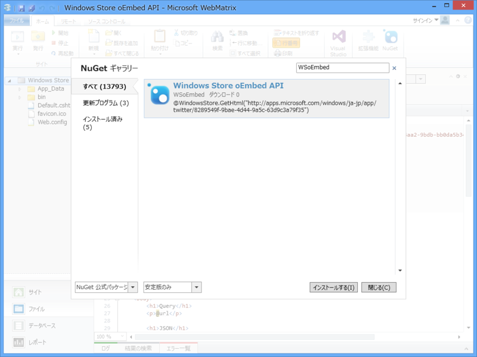
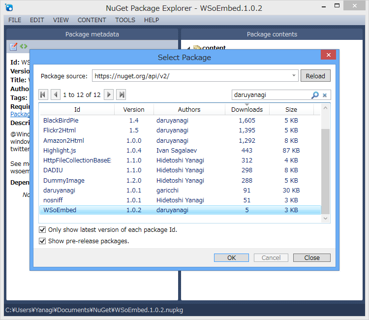

<a href="https://blog.daruyanagi.jp/entry/2013/07/18/033539">WebMatrix 3: Windows Store oEmbed API &#x3092;&#x5229;&#x7528;&#x3059;&#x308B; - &#x3060;&#x308B;&#x308D;&#x3050;</a> を NuGet にして NuGet Gallery で公開しました。

<ul>
<li><a href="https://www.nuget.org/packages/WSoEmbed">NuGet Gallery | WSoEmbed 1.0.2</a></li>
</ul>
前回の記事からの変更点は、System.Threading.Thread.CurrentThread.CurrentUICulture で言語を取得して URL をビルドするようにしたことのみ。

<pre class="code lang-cs" data-lang="cs" data-unlink>@WindowsStore.GetHtml(APP_URL)

@WindowsStore.GetHtml(&quot;8289549f-9bae-4d44-9a5c-63d9c3a79f35&quot;)
</pre>

<h3>ついでに NuGet パッケージの作成・公開方法を復習（簡易版）</h3>

NuGet パッケージの作成には、<a href="http://npe.codeplex.com/">CodePlex Archive</a> を使うのがオススメ。今回のように簡単な NuGet ならば nuspec をゴリゴリかいたほうが早いかもしれませんが。

適当に必要項目を埋めたら、［File］－［Publish］するだけ。

Publish Key は <a href="https://www.nuget.org/account">https://www.nuget.org/account</a> で取得できます。

公開したら WebMatrix などでインストールの確認。リポジトリのソースを変えてみたりしないと、検索結果にでてこないかもしれない。

<a href="http://www.nuget.org/">NuGet Gallery | Home</a> で公開しておけば、パッケージをリモートから取得して開くこともできます。パブリックに公開したくない場合は、<a href="https://blog.daruyanagi.jp/entry/2013/04/05/133515">WebMatrix&#xFF1A;NuGet &#x30B5;&#x30FC;&#x30D0;&#x30FC;&#x3092;&#x305F;&#x3066;&#x308B; - &#x3060;&#x308B;&#x308D;&#x3050;</a> なんてこともできます。

この NuGet Package Explorer、最近は Windows ストア アプリ版もあるみたいですね。こんど Surface RT で遊んでみよう。

