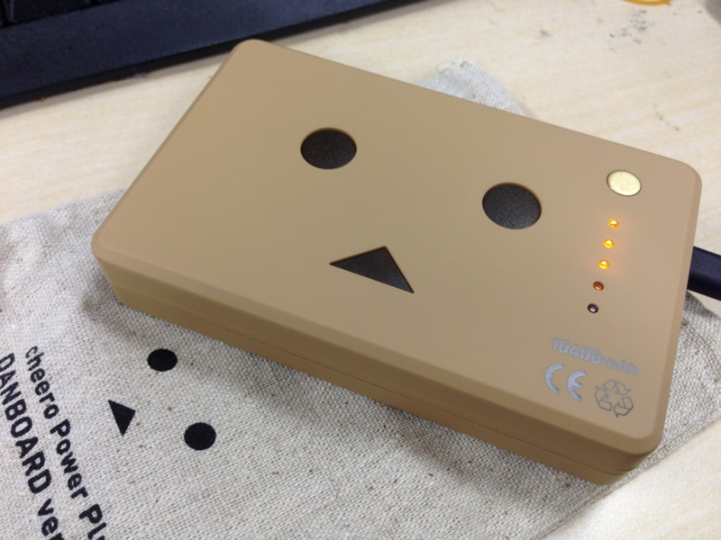
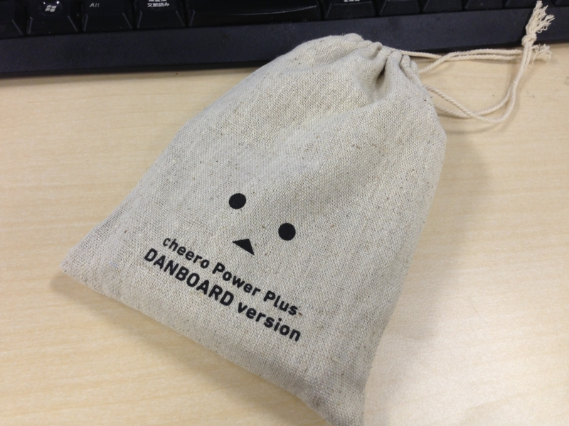

<a href="http://d.hatena.ne.jp/asin/B00CY6P968/bestylesnet-22">cheero Power Plus 10400mAh DANBOARD Version マルチデバイス対応モバイルバッテリー</a> をゲット！　Amazon で大人気の商品で、発売速品切れ、ボッタクリまで横行する始末。そんななか、以前ご好意で1個確保してもらったのだけど、それは @subsfn の誕生日プレゼントとしてあげてしまった。だから、自分のものが手に入るまで、まるまる1ヶ月を要した……待ちくたびれた。

しかし、型落ちのモバイルバッテリー（現行版: <a href="http://d.hatena.ne.jp/asin/B00ASSGJ6I/bestylesnet-22">マルチデバイス対応 cheero Power Plus 2 10400mAh (ブラック)</a>）がダンボーとコラボするだけでこんだけ人気になるのだからスゴい。中身ももちろん疎かにしちゃいけないのだけど、パッと見「ほしい！」って思わせるの、ほんとうに大事だね。

ちなみに、ダンボーというのはマンガ『よつばと！』（自分も途中の巻を一冊だけもってる）由来のキャラクターらしい。写真旅行のおともに大変よろしい（<a href="http://matome.naver.jp/odai/2126930872407661101">&#x300A;&#x3088;&#x3064;&#x3070;&#x3068;&#x300B;&#x30C0;&#x30F3;&#x30DC;&#x30FC;&#x3068;&#x98A8;&#x666F;&#x306E;&#x5199;&#x771F;&#x96C6; - NAVER &#x307E;&#x3068;&#x3081;</a>）。

<a href="http://www.amazon.co.jp/exec/obidos/ASIN/B00CU6Z03O/bestylesnet-22/">【Amazon.co.jp限定】 リボルテック ダンボー・ミニ Amazon.co.jpボックスver (リボコンテナ入り/ダンボールカラー)</a>
<ul><li>出版社/メーカー: 海洋堂</li><li>発売日: 2013/07/24</li><li>メディア: おもちゃ＆ホビー</li><li><a href="http://d.hatena.ne.jp/asin/B00CU6Z03O/bestylesnet-22" target="_blank">この商品を含むブログを見る</a></li></ul>

容量は 10400mAh （iPhone が5回ぐらいフル充電できるのだそうだ）でずっしりと重い。1A と 2.1A のポートを備えていて、iPad の高速充電にも対応する。これがひとつあれば、旅行中、電源の確保で困ることもなくなりそう。ウチの iPhone 5 は最近バッテリーがヘタっておってのぉ……頻繁に充電が必要なのぢゃ。

ダンボーをあしらった巾着袋がついていて、これまた愛らしい。付属の USB ケーブル（充電と給電に使える）と一緒に入れておくとちょうどいい大きさ。iPhone 5 のケーブルも入れておきたいので、もう一回り大きくてもよかったかな。

<a href="http://www.amazon.co.jp/exec/obidos/ASIN/B00CY6P968/bestylesnet-22/">cheero Power Plus 10400mAh DANBOARD Version マルチデバイス対応モバイルバッテリー</a>
<ul><li>出版社/メーカー: cheero mart</li><li>メディア: エレクトロニクス</li><li><a href="http://d.hatena.ne.jp/asin/B00CY6P968/bestylesnet-22" target="_blank">この商品を含むブログ (9件) を見る</a></li></ul>

<h3>追記</h3>

細かいところだけど、リサイクルマークなんかは裏に印字してほしかったな。

