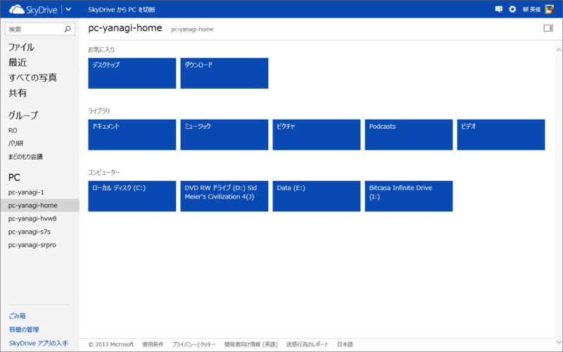
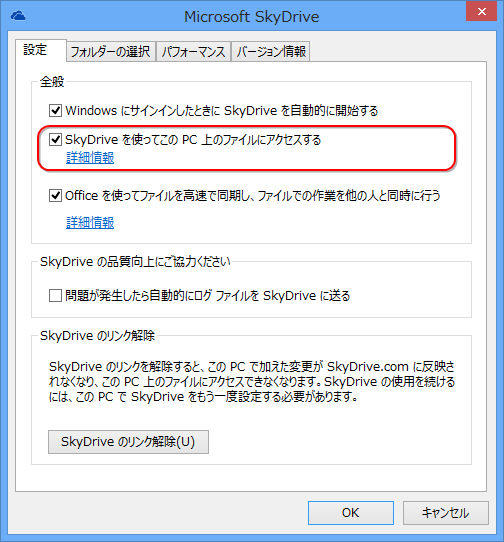

<blockquote cite="http://windows.microsoft.com/ja-JP/skydrive/fetch-files-pc-ui">

Windows 用の SkyDrive デスクトップ アプリが PC にインストールされている場合は、ファイルの取得機能を使って、SkyDrive.com で別のコンピューターからその PC 上のすべてのファイルにアクセスできます。PC のファイルをリモートで参照すると、ファイルのコピーをダウンロードして操作できます。

<cite><a href="http://windows.microsoft.com/ja-JP/skydrive/fetch-files-pc-ui">PC &#x4E0A;&#x306E;&#x30D5;&#x30A1;&#x30A4;&#x30EB;&#x3092;&#x53D6;&#x5F97;&#x3059;&#x308B; - Microsoft Windows &#x30D8;&#x30EB;&#x30D7;</a></cite>
</blockquote>

SkyDrive にはブラウザーから PC のファイルへアクセスできる機能があって、これがたまに便利。この機能を利用するためには、

<ul>
<li>アクセス先の PC の電源がオンになっていて、インターネットに接続されている</li>
<li>アクセス先の PC で SkyDrive が実行されていて、ファイルの取得設定が有効になっている</li>
</ul>
この2つが条件。

ファイルの取得設定っていうのは、この“SkyDrive を使ってこの PC 上のファイルにアクセスする”っていうオプションね。

しかしこの機能、どうも Windows 8.1 の SkyDrive では使えなくなるみたい。少なくとも、設定を有効化するユーザーインターフェースはみつからなかった。

      記事には書かなかったけど、 Windows 8.1 って SkyDrive のリモートアクセス対象にできなくない？　調査不足かなぁと思ってたんだけど、信頼済みにしてもダメなんだよね

<a href="http://twitter.com/daruyanagi/status/362879428184911872" class="twitter-detail-info-permalink">2013-08-01 19:16:12</a> via <a href="http://www.metrotwit.com/" rel="nofollow">MetroTwit</a>

 

      @<a class="twitter-user-screen-name" href="http://twitter.com/daruyanagi" target="_top">daruyanagi</a> やはりそうかー、リモート無いの痛い……(´･ω･`)

<a href="http://twitter.com/ugsasaki/status/362908656649510913" class="twitter-detail-info-permalink">2013-08-01 21:12:20</a> via <a href="http://twicca.r246.jp/" rel="nofollow">twicca</a> to @<a href="http://twitter.com/daruyanagi/status/362879428184911872"  class="twitter-user-screen-name">daruyanagi</a>

復活を希望したいけれど、この機能ってもともと Windows Live Mesh 由来の機能だったはず。SkyDrive に含めるには少し無理のある機能というか、オマケのような機能なのだよね。ない方が SkyDrive ができることはシンプルで伝えやすくなるわけで、この際削っちゃう気なのかもしれない……。ちょっと残念かも。

<ul>
<li><a href="http://www.forest.impress.co.jp/docs/special/20130801_610004.html">&#x3010;&#x7279;&#x5225;&#x4F01;&#x753B;&#x3011;Windows 8.1&#x5FB9;&#x5E95;&#x89E3;&#x5256; &#x7B2C;1&#x56DE; OS&#x306B;&#x7D71;&#x5408;&#x3055;&#x308C;&#x305F;&ldquo;SkyDrive&rdquo; - &#x7A93;&#x306E;&#x675C;</a></li>
</ul>