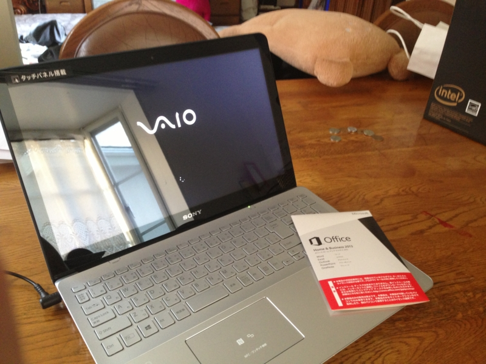
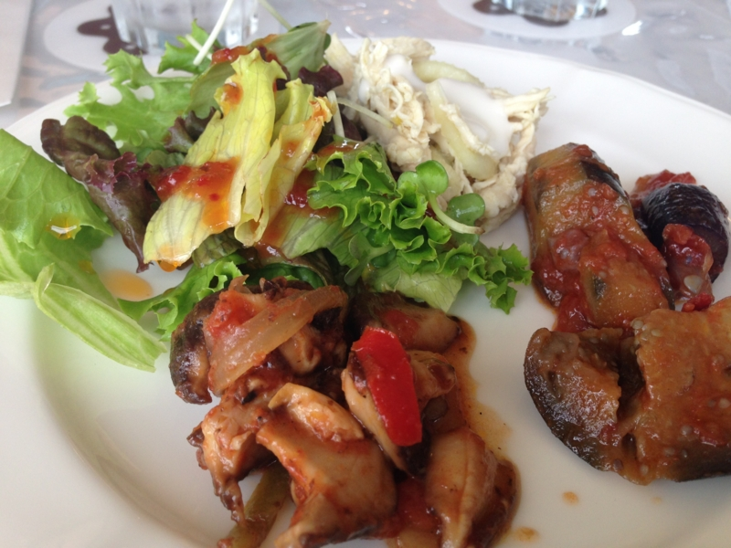

「ノーパソ壊れたから、新しいのがほしい」という連絡が、実家からあった。ちなみにその“壊れたノーパソ”というのは、僕からタダで召し上げた Mac Book Pro である。泣きたい。

最初はほしいスペックだけ聞いて適当に Web で注文しようと思ったのだけれど、おかんが「実際に触って決めたい」「家に帰ってすぐに使えるようにしてほしい」というので、クルマで千葉のヨドバシカメラへ向かった……のだけど、検見川で妹と合流し、稲毛海岸で昼食をとってるうちに、渋滞の中を千葉まで行くのが面倒くさくなり、近所のコジマデンキに寄った。

<a href="http://www.amazon.co.jp/exec/obidos/ASIN/B00COWK1YW/bestylesnet-22/">ソニー(VAIO) VAIO Fit 15 (15.5型タッチ) SVF15A18CJS</a>
<ul><li>出版社/メーカー: ソニー(SONY)</li><li>発売日: 2013/05/18</li><li>メディア: Personal Computers</li><li><a href="http://d.hatena.ne.jp/asin/B00COWK1YW/bestylesnet-22" target="_blank">この商品を含むブログを見る</a></li></ul>

いろいろ見て歩くに、コレが気に入ったらしい。パソコンを選ぶ際の優先基準はおおむね、

<ul>
<li>画面の大きさ（＋字が大きくなるか）</li>
<li>色（デザイン）</li>
<li>スペック</li>
<li>値段</li>
</ul>
という感じだった。意外に色の比重が大きいのな。おかんは「なぜ同じ大きさのパソコンを並べて展示しないのか」と訝しがってたけど、普通はブランド別だよね。ちなみに、彼女が知っているブランドは VAIO だけだったが、別に知っているブランドだから買ったというわけではなく、「黒とか白はあまり好きじゃない」とらしく、シルバーのラインナップがあることが理由だったらしい。

僕にはあまり理解できない選択基準だ。NEC や Fujitsu のなかのひとが泣くぞ。

しかしまぁ、そのコジマデンキがしみったれた雰囲気で、しかも高い。おかんと妹が総掛かりで値切ったが、ヤマダデンキより高いことこそ認めたものの、「ポイントじゃないと値引きには応じられない」とのこと。今どきコジマのポイントカードなんか作ってもしょうがない。

とはいえ、お昼ごはんをたらふく食べて眠くなっていたし、早く家に帰って「艦これ」したかったので、「もう諦めて買っちゃえば？」と勧めた。しかし、どうも二人は諦めきれない。あっちこっちに電話で値段を聞き、結局ケーズデンキが5,000円安くしてくれるというのでそっちへ向かった。

スゴいバイタリティ。もはや、逆らえない。

そのケーズデンキの担当はなかなかいい人で、二人の値引き要求をうまく受け流しながら、逆に妹へ掃除機を買わせることに成功。僕もなぜか展示品処分の水筒を買っていた。意味がわからんが、これがマーケティングというものらしいな。来週から水筒男子として頑張ろう。

――さて、そんなこんなで買った VAIO Fit 15 だったのだけど、とんだクソトラブルに巻き込まれて、満足に使えるようにするまでかなり時間を要した。その話は今度気が向いたらしたい。

