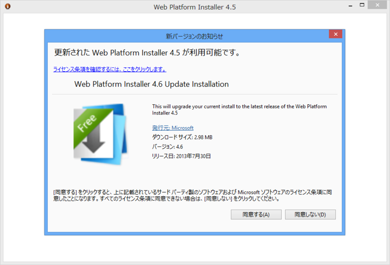
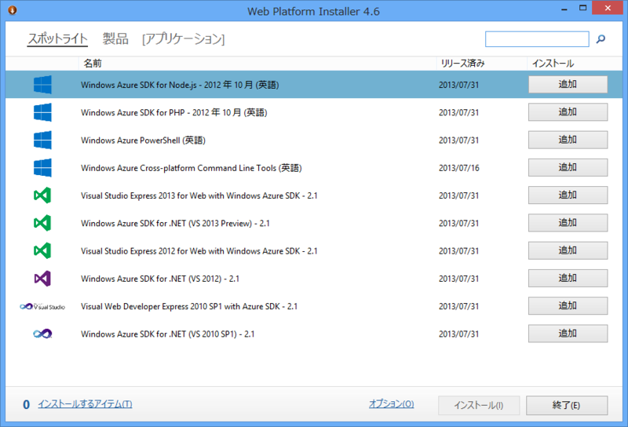

新しいのがリリースされていたなんて、全然気づいてませんでした（7月30日付け）。「Web PI 4.5」がすでにインストールされている場合は、起動時にアップデートの案内が表示されます。どこかに更新点が書いてあればいいのだけど……。

更新して起動してみても、とくに新しいところは見当たらず。「Visual Studio 2013 Express for Web with Windows Azure SDK 2.1」（ながっ！）というのが気になる程度ですかね。

<ul>
<li><a href="http://buchizo.wordpress.com/2013/08/01/windows-azure-sdk-2-1-%E3%83%AA%E3%83%AA%E3%83%BC%E3%82%B9/">Windows Azure SDK 2.1 &#x30EA;&#x30EA;&#x30FC;&#x30B9; | &#x30D6;&#x30C1;&#x30B6;&#x30C3;&#x30AD;</a></li>
<li><a href="http://opcdiary.net/?p=26908">Windows Azure SDK Ver. 2.1 #azurejp | OPC Diary - No Code, No Life.</a></li>
</ul>