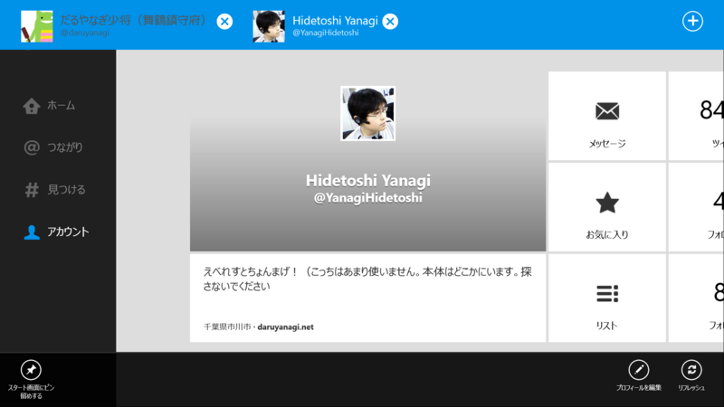

      The latest Twitter for Windows 8 now supports multiple accounts, lists + more. Get the update: <a class="twitter-tweet-url" href="http://t.co/CHZQdBACgu" target="_top">URL</a>

<a href="http://twitter.com/twitter/status/362995368629243905" class="twitter-detail-info-permalink">2013-08-02 02:56:54</a> via web

マルチアカウント━━━━(ﾟ∀ﾟ)━━━━!!

リスト━━━━(ﾟ∀ﾟ)━━━━!!

ピン留め━━━━(ﾟ∀ﾟ)━━━━!!

<ul>
<li><a href="http://www.forest.impress.co.jp/docs/news/20130805_610394.html">&#x300C;Twitter for Windows 8&#x300D;&#x304C;&#x30DE;&#x30EB;&#x30C1;&#x30A2;&#x30AB;&#x30A6;&#x30F3;&#x30C8;&#x306B;&#x5BFE;&#x5FDC; - &#x7A93;&#x306E;&#x675C;</a></li>
</ul>
個人的には割りとどうでもいいアップデートだったけど<a href="#f1" name="fn1" title="ぇ、リスト読めなかったの！？">*1</a>、ちゃんと開発が進んでるのがわかって安心した。

そのほかにも、新着タイムラインの左にインジケーターがつくようになったり<a href="#f2" name="fn2" title="これ、前はなかったよね？">*2</a>。あと、未受信のメンション（＠つながり）が大量にある場合に、何度もリロードしないと最新のメンションが読めない問題も治った。こういう細かい部分の改善はありがたいな……。

ただし、リロードした際に最新のメンションがとれるのはいいのだけど、抜け落ちた分をロードする手段がない<a href="#f3" name="fn3" title="ほかのプラットフォームだとだいたいあるよね">*3</a>。これはこれで不便なので、さらなるアップデートに期待。

<a href="#fn1" name="f1" class="footnote-number">*1</a>:ぇ、リスト読めなかったの！？

<a href="#fn2" name="f2" class="footnote-number">*2</a>:これ、前はなかったよね？

<a href="#fn3" name="f3" class="footnote-number">*3</a>:ほかのプラットフォームだとだいたいあるよね

