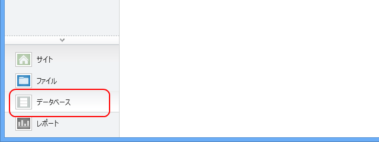

前回（<a href="https://blog.daruyanagi.jp/entry/2013/07/17/054740">WebMatrix 3 &#x3067; Wiki &#x30AF;&#x30ED;&#x30FC;&#x30F3;&#x3092;&#x4F5C;&#x308B; vol.0 - &#x3060;&#x308B;&#x308D;&#x3050;</a>）からすでに1ヶ月たちましたが、だいたいこんなペースで、気が向いたときにやっていくと思います。すまんやで！

さて、今回はデータの読み書きです。Wiki と言えば、データはテキストとして保存するるタイプが多いんですかね？　まぁ、それでもいいんですけど、WebMatrix では <b>SQL Server Compact Edition</b>（SQL CE と略されることが多いです）が簡単に扱えるので、それを利用したいと思います。

<b>SQL CE</b> というのは Microsoft SQL Server 兄弟の末弟で、SQLite みたいにポータブルに扱えるタイプのデータベースです。ちなみに、WebMatrix はそのお兄さん（SQL Server）や、お兄さんのライバル（MySQL）なんかともなかよくできるのですけれど、ああいうのはインストールとかセッティングとかメンテナンスとか面倒ですよね。その点、SQL CE はデータベースファイルをひとつポンと作るだけなので楽ちんです。ちなみに、タダ。

<h3>データベースの作成</h3>

WebMatrix でデータを扱うには、［データベース］というワークスペースを選択します。

では、さっそくデータベースを作りましょう。データベースのファイル名はなんでもいいです。今回はプロジェクト名そのままの“Green Tights.sdf”にしました。続いてテーブルの作成。

今回はこんなかんじにしてみました。ついでにテーブルの定義も作っておきましょう。テーブルの名前は“Post”で、投稿を管理するテーブルです。

<ul>
<li>PostId：bigint（でっかい整数）型。“主キーかどうか”“ID かどうか”の両方を“はい”にしました。テーブルに行が挿入されると自動でインクリメントされるはずです。</li>
<li>Title：最大60文字の nvarchar（文字列）型。文字数は適当……。“Null（からっぽ）を許可”を“いいえ”にしておきます。</li>
<li>RawText：ntext 型。あらかじめ文字列の数を決めなくてよいテキスト型。本文をぶちこんでおくには最適かな？</li>
<li>CreatedAt：datetime（日時）型。その名の通り作成日時です。</li>
<li>UpdatedAt：datetime（日時）型。今回は使いませんが、のちのち更新日を記録しておきたくなると思うので。</li>
</ul>
これを“Post”という名前で作っておきます。

<h3>データの入力画面の作成</h3>

［ファイル］ワークスペースへ移行、とりあえず NewPost.cshtml という名前でデータの入力画面ページをルートフォルダ―に作成します。この画面には、<a href="http://***/NewPost">http://***/NewPost</a> でアクセスできます。

コードの方はこんな感じ。ごくごく簡単で、エラー処理っぽいことはしていません。

<pre class="code lang-cs" data-lang="cs" data-unlink>@{
if (IsPost) // POST 要求だけを受け付けましょう
{
// Request[&quot;name&quot;] で送られてきた名前を取得。
// POST データなら Request.Form[&quot;name&quot;] の方がフォーマルな書き方かな
var title = Request[&quot;title&quot;];
var raw_text = Request[&quot;raw-text&quot;];
var now = DateTime.Now;

// データベースを開く。拡張子はいらない
using (var db = Database.Open(&quot;Green Tights&quot;))
{
const string query = @&quot;
                INSERT INTO Post(Title, CreatedAt, UpdatedAt, RawText)
                VALUES(@0, @1, @2, @3)
                &quot;;
db.Query(query, title, now, now, raw_text);
}
}
}

&lt;!DOCTYPE html&gt;

&lt;html lang=&quot;en&quot;&gt;
&lt;head&gt;
&lt;meta charset=&quot;utf-8&quot; /&gt;
&lt;title&gt;&lt;/title&gt;
&lt;/head&gt;
&lt;body&gt;
&lt;form method=&quot;post&quot;&gt; &lt;!-- Submit すると自分を POST で呼ぶ --&gt;
&lt;p&gt;&lt;input type=&quot;text&quot; id=&quot;title&quot; name=&quot;title&quot; /&gt;&lt;/p&gt;
&lt;p&gt;&lt;textarea id=&quot;raw-text&quot; name=&quot;raw-text&quot;&gt;&lt;/textarea&gt;&lt;/p&gt;
&lt;p&gt;&lt;input type=&quot;submit&quot; /&gt;&lt;/p&gt;
&lt;/form&gt;
&lt;/body&gt;
&lt;/html&gt;
</pre>
試しに実行し、［データ］ワークペースでデータを確認してみましょう。表示モードを［定義］から［データ］に切り替えてね！

なにか……入ってますね？　成功！　次回はこれを取り出して表示して見ることにしましょう。おつかれさまです。

<a href="https://blog.daruyanagi.jp/category/WebMatrix%203%20%E3%81%A7%20Wiki%20%E3%82%AF%E3%83%AD%E3%83%BC%E3%83%B3%E3%82%92%E4%BD%9C%E3%82%8B">WebMatrix 3 &#x3067; Wiki &#x30AF;&#x30ED;&#x30FC;&#x30F3;&#x3092;&#x4F5C;&#x308B;</a>

