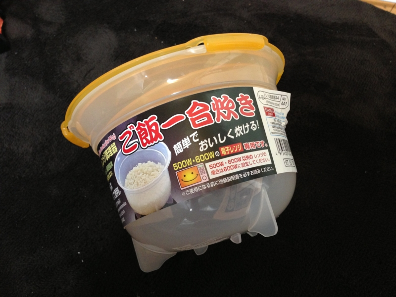
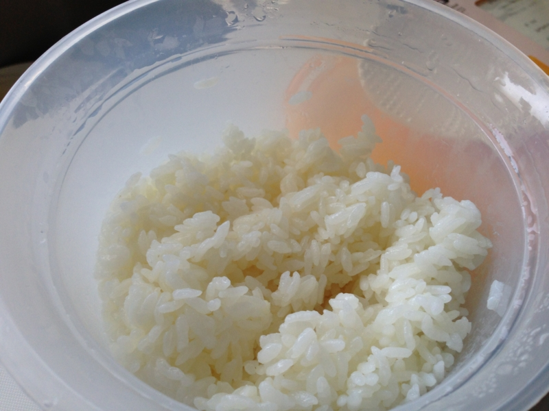
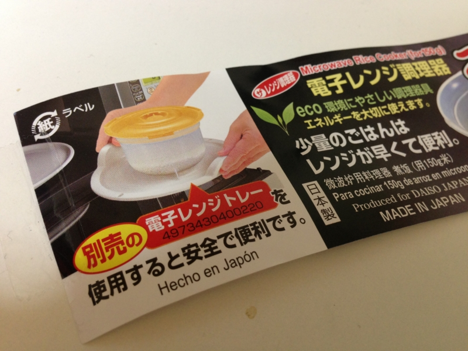

ダイソーで「ご飯一合炊き」という商品を買ってみた（<a href="http://www.daiso-sangyo.co.jp/recommend/201106.html">&#x30C0;&#x30A4;&#x30BD;&#x30FC;&#xFF5C;&#x30C0;&#x30A4;&#x30BD;&#x30FC;&#x30DB;&#x30FC;&#x30E0;&#x30DA;&#x30FC;&#x30B8;&#xFF5C;&#x30B9;&#x30BF;&#x30C3;&#x30D5;&#x304A;&#x3059;&#x3059;&#x3081;&#xFF01;</a>）。値段はもちろん105円（税込み）。レンジで簡単にご飯が炊けるんだそうな。パスタの方は結構役立っているし、もしかしたらこれも便利かもしれない。

けど、結論から言うと結構手間がかかった。

<ol>
<li>コメを研ぐ。水切りが付いているのがいいなぁ</li>
<li>コメを研いで水をよく切ったら、水 200 ml を足す</li>
<li>レンジに入れて 600W で 5分間</li>
<li>レンジに入れて 200W で 12分間</li>
</ol>
よく考えたらうちには炊飯器があるわけで、そっちだったらワンタッチなわけで。しかもウチのレンジは物心ついた時から実家にある年代物で、乾燥機と一緒に使うとブレーカーが落ちるわけで。こんなに手間がかかるなら、あんまりいらんかった気がする。とはいえ、炊飯器の方も大学生の頃から使ってる安物で、いつ爆発してもおかしくない。とりあえずこういうのをもっておくのもいいのかもしれない。

炊き上がりは、ちょっと硬かったけどまぁまぁ。もう少し浸して、水切りをもう少し適当にすれば、手順通りにやってちょうどいい感じに炊き上がりそう。

あと、レンジに入れると皿がめちゃくちゃ熱くなるので、別売りのトレイを買うとよいようだ。目に入らなかった……

<h3>追記</h3>

レンジで焼きそばが作れるという容器も買ってしまったので、今度試す。

