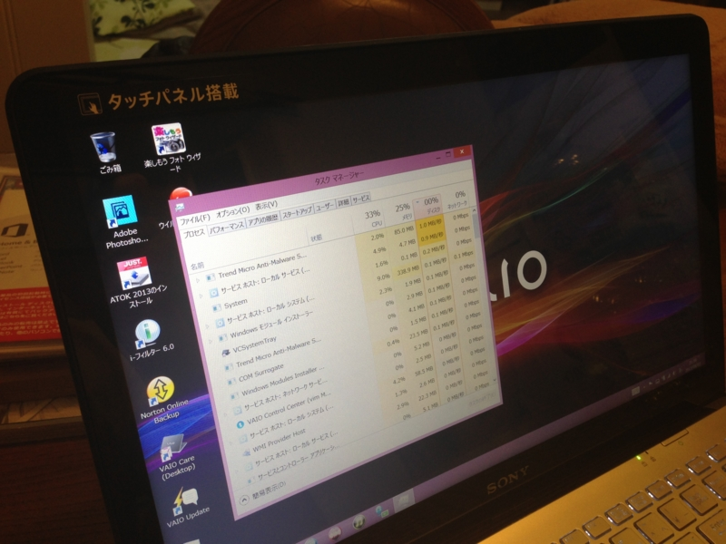
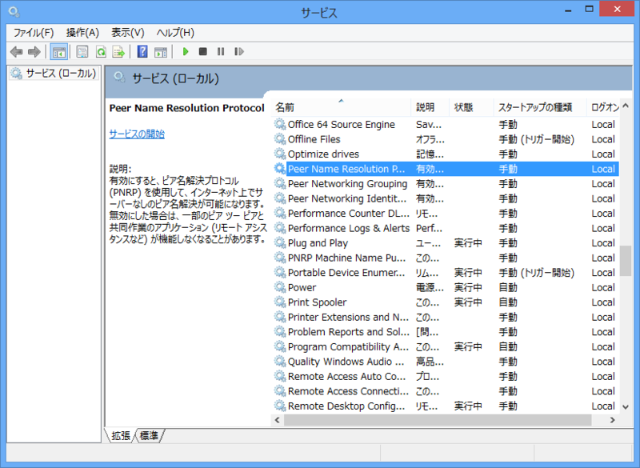
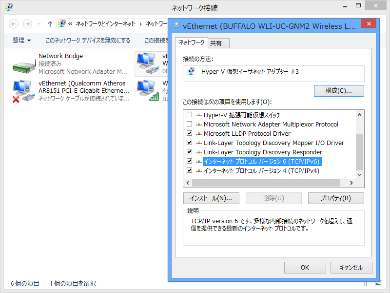

 

<blockquote cite="https://blog.daruyanagi.jp/entry/2013/08/04/153745">

さて、そんなこんなで買った VAIO Fit 15 だったのだけど、とんだクソトラブルに巻き込まれて、満足に使えるようにするまでかなり時間を要した。その話は今度気が向いたらしたい。

<cite><a href="https://blog.daruyanagi.jp/entry/2013/08/04/153745">&#x5B9F;&#x5BB6;&#x306E;&#x30CE;&#x30FC;&#x30D1;&#x30BD;&#x8CB7;&#x3044;&#x66FF;&#x3048;&#x306B;&#x4ED8;&#x304D;&#x5408;&#x308F;&#x3055;&#x308C;&#x305F; - &#x3060;&#x308B;&#x308D;&#x3050;</a></cite>
</blockquote>

実家で買った VAIO Fit 15 なんだけど、起動後数分経ってもディスクアクセスがおさまらず、まったく使えたものではない。そばで見ていたおかんは「Windows 8 ってこんなに遅いの？」と不安げな表情。まぁ、そんなはずもないので泣く泣くトラブルシューティング。買って箱から出して起動しただけなのに……新しい PC を開けるときのウキウキした気分は見事粉砕された。

まず、プリインストールされていたウイルスバスターを疑った。そもそも、OS の初回起動時にウイルスバスターの利用規約（これ、Windows 8 からは OS のセットアップ時に表示できるようになってるんだな）を断ったにもかかわらず、裏でコソコソ動いていて気持ち悪い。速攻アンインストールしたが、状況は改善されず。

<blockquote cite="http://answers.microsoft.com/ja-jp/windows/forum/windows_8-performance/windows8%E3%81%AB%E3%82%A2%E3%83%83%E3%83%97/70539afc-7ec8-4c9e-bf90-2874483f2a5c">

Windows8にアップグレードしてから、かれこれ24時間、ずっとディスクアクセスされています。

「PC設定の変更」のWindowsUpdateをみたら、 
重要な7個のアップデートがあります。自動的にインストールされますと表示されていたので 
それらが順にインストールされているのかな？と思ったのですが、 
一向に進展なしなので、手動でこれらの7つのアップデートをインストールしました。

それでも、まだディスクアクセスが頻繁に発生しています。 
（頻繁というよりも、ほぼ連続的に）

これって、Windows8にしたことで、 
常時ディスクにアクセスするサービスでも動いてしまっているのでしょうか？

<cite><a href="http://answers.microsoft.com/ja-jp/windows/forum/windows_8-performance/windows8%E3%81%AB%E3%82%A2%E3%83%83%E3%83%97/70539afc-7ec8-4c9e-bf90-2874483f2a5c">Windows8&#x306B;&#x30A2;&#x30C3;&#x30D7;&#x30B0;&#x30EC;&#x30FC;&#x30C9;&#x3057;&#x3066;&#x304B;&#x3089;&#x3001;&#x305A;&#x3063;&#x3068;&#x30C7;&#x30A3;&#x30B9;&#x30AF;&#x30A2;&#x30AF;&#x30BB;&#x30B9;&#x3057;&#x3063;&#x653E;&#x3057;&#x3067;&#x3059; - &#x30DE;&#x30A4;&#x30AF;&#x30ED;&#x30BD;&#x30D5;&#x30C8; &#x30B3;&#x30DF;&#x30E5;&#x30CB;&#x30C6;&#x30A3;</a></cite>
</blockquote>

結局、これと同じ症状だった模様。

<ul>
<li>Peer Networking Identity Manager</li>
<li>Peer Networking Grouping</li>
<li>Peer Name Resolution Protocol</li>
</ul>
が暴走しているので、それを止めればよい。

<blockquote cite="http://technet.microsoft.com/ja-jp/library/bb726971.aspx">

ピアツーピア環境において、ピアは名前解決システムを使用して、互いのネットワーク上の場所 (アドレス、プロトコル、およびポート) をその名前や他の識別子から解決します。ドメイン名システム (DNS) によるピアツーピア名前解決は、一過性の接続問題や不具合などで複雑化しています。 
Microsoft® Windows® ピアツーピア ネットワーク プラットフォームは、ピア名解決プロトコル (PNRP) を使用してこの問題を解決します。PNRP は、セキュリティ保護されたスケーラブル、かつ動的な名前登録および名前解決プロトコルで、当初 Windows XP 用に開発され、Windows Vista™ ではアップグレードされています。PNRP は、従来の名前解決システムとは機能が大きく異なり、アプリケーション開発者にとってエキサイティングかつ新しい可能性を開拓します。

<cite><a href="http://technet.microsoft.com/ja-jp/library/bb726971.aspx">Peer Name Resolution Protocol | Microsoft Docs</a></cite>
</blockquote>

このサービスは PNRP プロトコルによるピアツーピア接続をつかさどっているらしい。止めてしまうとリモートアシスタンスやホームグループといった機能に影響があるかもしれないが、まぁ、あまり使わないだろうしいいか。

あと、

<blockquote>

で、いろいろとしらべて試したところ、ネットワーク接続の設定で 
「インターネット　プロトコル　バージョン６」のチェックを外すと、おさまりました。

</blockquote>

というのも効果的だった。これだと、上記のサービスを止めなくてもよい 。

これは PNRP v2 プロトコルがそもそも IPv6 に依存しているからであるらしい。ワークアラウンドとしてこういう処置をとっておいたけど、なにが原因だったのだろう？　もしかしたらルーターが悪いのだろうか（プロバイダーから貸与されたモノだった気がするが）。

