
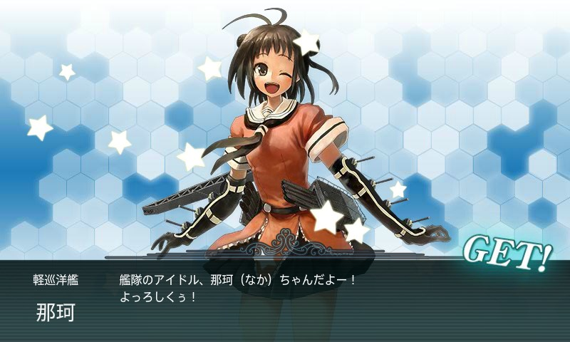

なんとなくみんなでどこかへ行こうという話になったので、那珂湊・大洗へ行ってきた。お目当ては、軍艦・<b>那珂</b>の忠魂碑。忠魂碑というのは、「明治政府の成立以降、日清戦争や日露戦争での戦死者の供養のために、自治体で建立した碑」（<a href="http://ja.wikipedia.org/wiki/%E5%BF%A0%E9%AD%82%E7%A2%91">&#x5FE0;&#x9B42;&#x7891; - Wikipedia</a>）のことで、忠霊碑、慰霊碑、凱旋碑という言い方をする場合もあるのだそう。いわば、お墓のようなモノだね。戦意高揚や戦時教育にも利用された経緯もあるそうで、自治体が建立することには政教分離の観点から異論もあるようだけど、今回の那珂ちゃんのお墓は<b>大洗磯前（いそさき）神社</b>にあるので関係はなさそう。

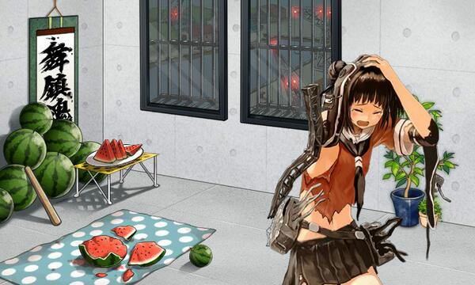

ちなみにゲーム「艦これ」で那珂ちゃんが“艦隊のアイドル”という扱いなのは、高橋伊望中将率いる第3艦隊の一員として陸軍の第48師団を輸送（<a href="http://ja.wikipedia.org/wiki/%E9%82%A3%E7%8F%82_(%E8%BB%BD%E5%B7%A1%E6%B4%8B%E8%89%A6)">&#x90A3;&#x73C2; (&#x8EFD;&#x5DE1;&#x6D0B;&#x8266;) - Wikipedia</a>） → AKB48 、那珂 → 中 → センター という連想からであるらしい。頼まれもしないのにやたらドロップしたり建造されたりすることから“要らない子”扱いをされたりもするけど、自分の場合は最後にゲットした川内型だったので、あまり悪い印象はない（最初に手に入ったのは川内）。ただ、本人が言うほどアイドルのオーラはない気がする。

<h3>行程表</h3>

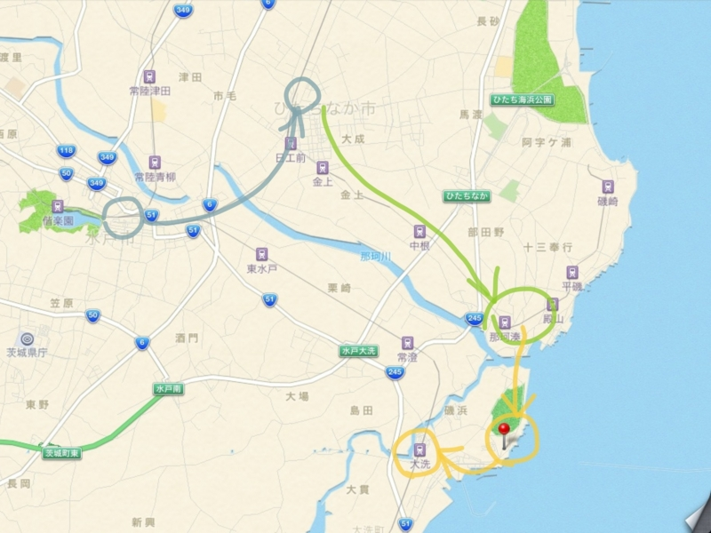

13日の夕方に市川を出発、バスで松戸へ出て常磐線を水戸へ。その日はそこで一泊し、午前10時頃、のそのそと宿をよろばいでてまずは那珂湊へ向かう。お昼ごはんは那珂湊で美味しいお寿司を食べたい。あと「那珂」の名前の由来にもなっている那珂川をちょっと見てみたい。那珂湊からは、徒歩かバスで大洗へ抜ける計画。

<h3>ひたちなか海浜鉄道</h3>

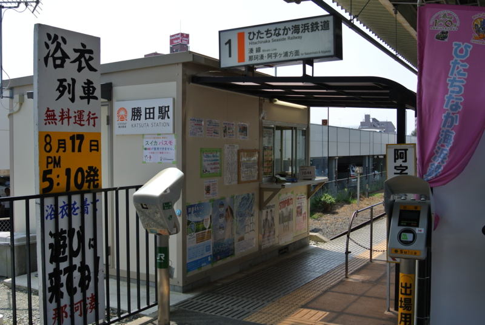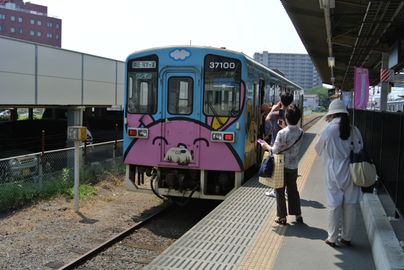

水戸駅から一駅、常磐線を下り、勝田駅で降りる（上に掲出した地図でいうと青線の部分）。その勝田駅の二番ホームの隅っこに、ひたちなか海浜鉄道のホームとなる一番ホームがくっついて、那珂湊へ行く路線が伸びている（同、緑線）。SUICA は使えず、ちいさな券売機で乗車券を買う必要がある。

車両は一両編成で、ディーゼル駆動。“列車”でも“電車”でもないけれど、カワイくていい。青い空と田圃の間を、小さなカラダを震わせながら疾走すること15分（体感で）。那珂湊の駅に着いた。

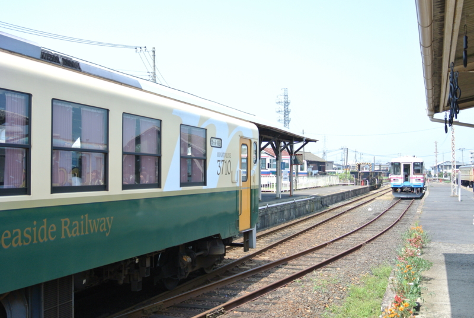

この駅では、観光地図と乗車証明書がもらえる。これを地元のお店でみせると食事やショッピングで割引が受けられるのだそうだけど、みせるのを忘れてしまった……。まぁ、地元経済に貢献したということで、これはこれでよし。

<h3>那珂湊を散策</h3>

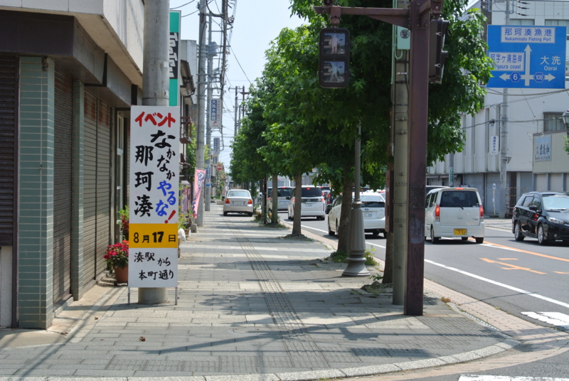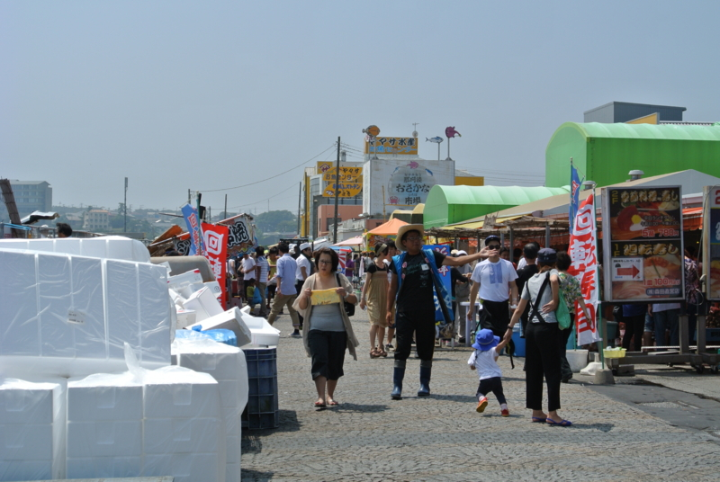

そこから徒歩で15分ほど歩く。暑い……。やっとこさ那珂湊の漁港だか魚市場だかに到着。

      @<a class="twitter-user-screen-name" href="http://twitter.com/daruyanagi" target="_top">daruyanagi</a> 昼飯かー　大洗よりも那珂湊かもなー　無難なのは森田水産って回転ずしかなー　混んでるかもなー

<a href="http://twitter.com/herata_jp/status/366850529181179904" class="twitter-detail-info-permalink">2013-08-12 18:15:56</a> via <a href="http://www.s-software.net/" rel="nofollow">みについ</a> to @<a href="http://twitter.com/daruyanagi/status/366782808645058561"  class="twitter-user-screen-name">daruyanagi</a>

ここの回転寿司が無難においしいという事前情報を入手していたので、ここでお昼ご飯をいただく。だいぶ混んでたけど、それほど待たされずに座れた。

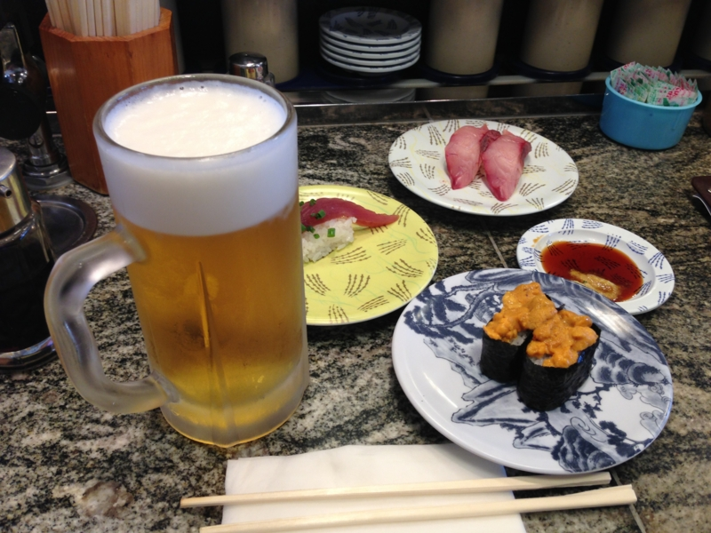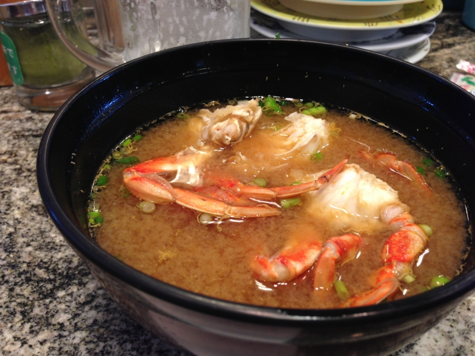

トロがとろっとろで美味しかった。洒落ちゃうで。

<h3>那珂川</h3>

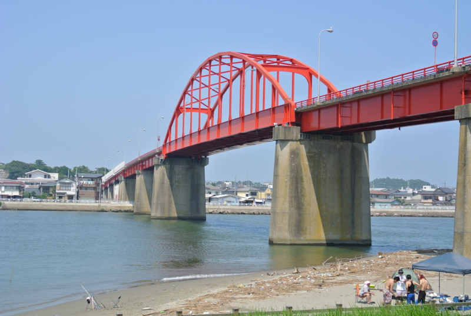

お寿司をたらふくおなかに格納したので、テケテケと大洗へ向かって歩く。途中、バスを捕まえようと思ったけど、停留所じゃなかったせいか乗せてもらえなかった。致し方なし。まぁ、アクアワールド大洗水族館に行くクルマで道がかなり混んでいて、歩いたほうが早かったのだけど。海門橋という赤い橋を越えて、那珂川を望む（右写真の左側にある黄色い建物が魚市場の辺り）。

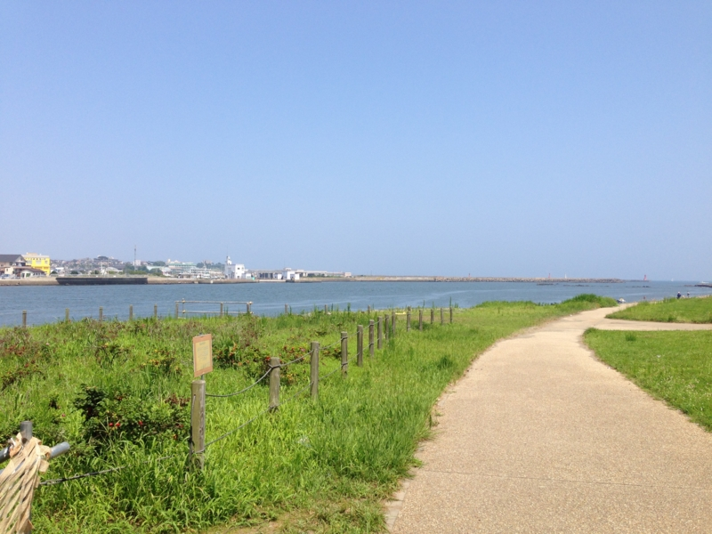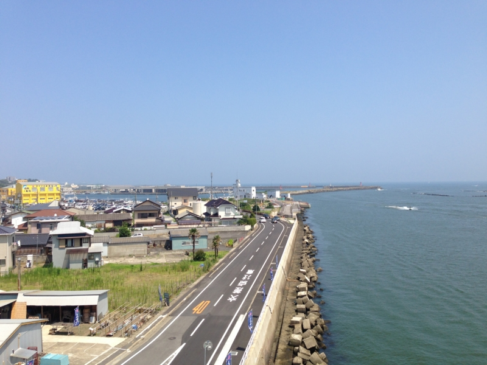

      那珂ちゃんだよーーーっ！ <a class="twitter-tweet-url" href="http://t.co/hEZBF0z527" target="_top">URL</a>

<a href="http://twitter.com/daruyanagi/status/367487060145238016" class="twitter-detail-info-permalink">2013-08-14 12:25:17</a> via <a href="http://www.apple.com" rel="nofollow">Camera on iOS</a>

ちなみに、旧帝国海軍では艦名を「一等巡洋艦（重巡洋艦）は山の名前、二等巡洋艦（軽巡洋艦）は川の名前から」とるのが決まりになっていた（歴史的経緯による例外はある）。

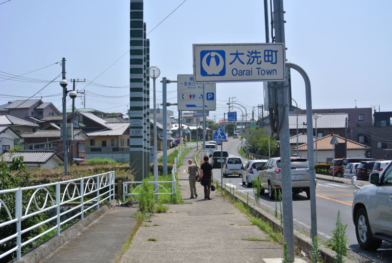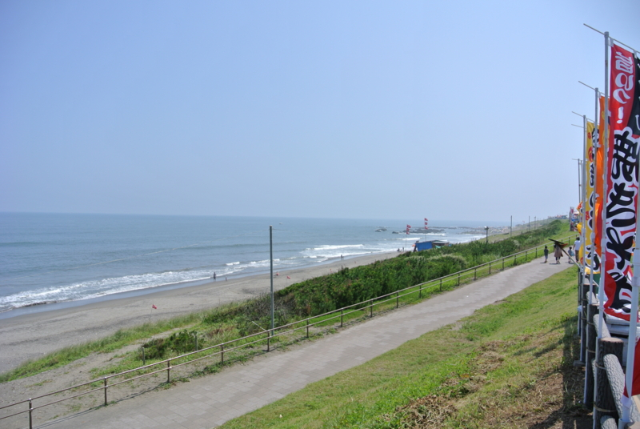

灼熱の那珂、じゃなくて中、海岸に打ち寄せる波と風を感じながら2時間ほど歩く。震災のときはここまで津波が押し寄せたそうだが、その面影はほとんど残っていないように感じた。

<h3>大洗磯前神社</h3>

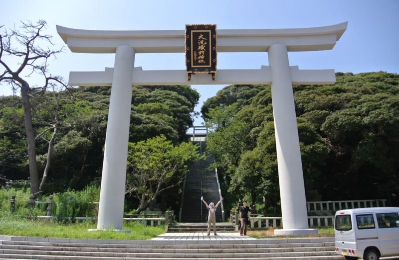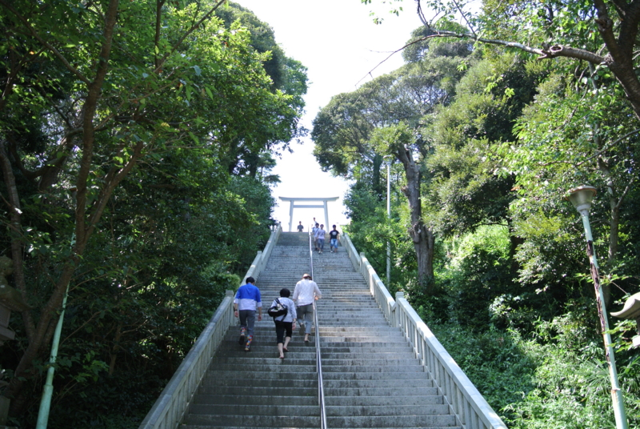

とうとう着いた！　デッカい鳥居！！　んで、長い階段……orz　息を切らしながらその階段を上り詰めると――

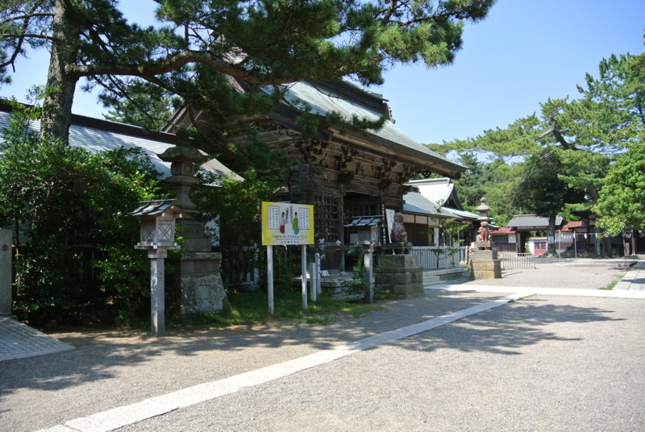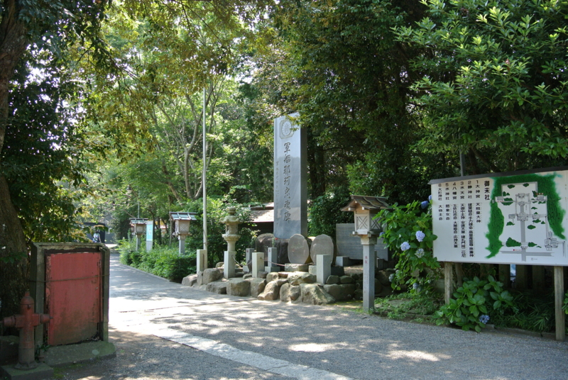

本殿があり、その左、木陰の那珂、じゃなくて中に忠魂碑が建っていた。

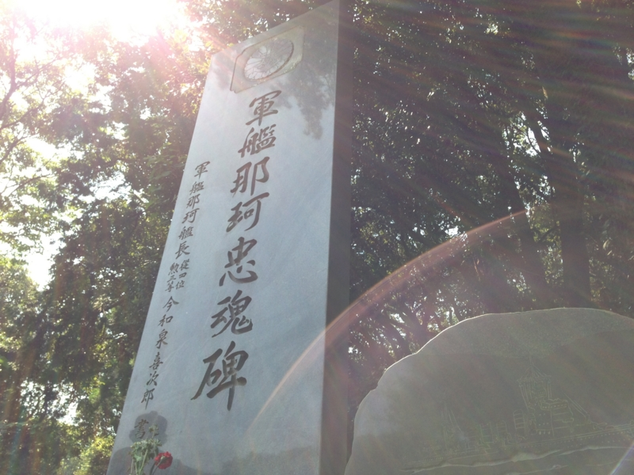

那珂は長良型に続く5,500t軽巡・川内型軽巡洋艦の2番艦として建造されたが、関東大震災で被災して船体に大きな損傷を受けたため一度解体。改めて3番艦として起工された（そのため、三女のはずの神通が次女になった）。大正14年3月に進水、同11月に竣工して呉鎮守に所属。のち、横須賀鎮守府に転籍。おもに南方で兵員や物資の輸送の護衛に当たるが、

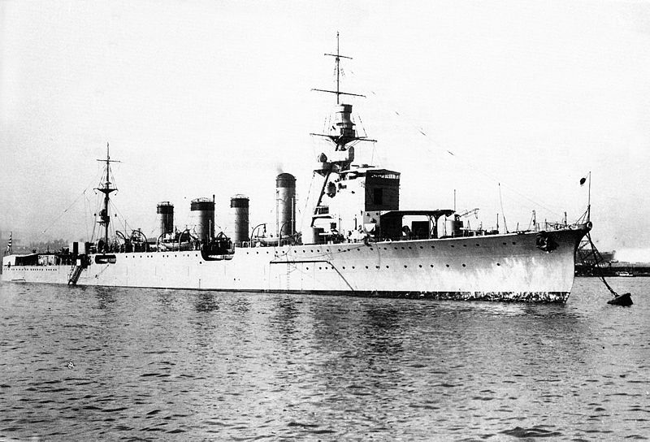

<blockquote>

昭和19年2月17日、トラック島ニ来襲敵機動部隊ト応戦、同島南西海域ニ於イテ九時間ニ及ブ激烈ナル対空戦斗ノ末満身創痍、砲ハ飛散、艦首艦橋切断、海中ニ没ス。後進交戦魔ノ紅ノ炎ト化シ遂ニ沈没。連合艦隊ノ一翼ノ使命ヲ果タシ輝カシイ武勲ヲ残シテ終焉。

</blockquote>

航行不能になった巡洋艦・阿賀野を曳航するためにトラック島を出発するも、すでに沈没したとの報を受け引き返えす。しかしその途中、敵空母の艦載機による攻撃を受け、船体が真っ二つになり沈没。乗員（定員：約450名）のほぼすべてが戦死している。1944年3月31日、除籍。（<a href="http://ja.wikipedia.org/wiki/%E3%83%88%E3%83%A9%E3%83%83%E3%82%AF%E5%B3%B6%E7%A9%BA%E8%A5%B2">&#x30C8;&#x30E9;&#x30C3;&#x30AF;&#x5CF6;&#x7A7A;&#x8972; - Wikipedia</a>）

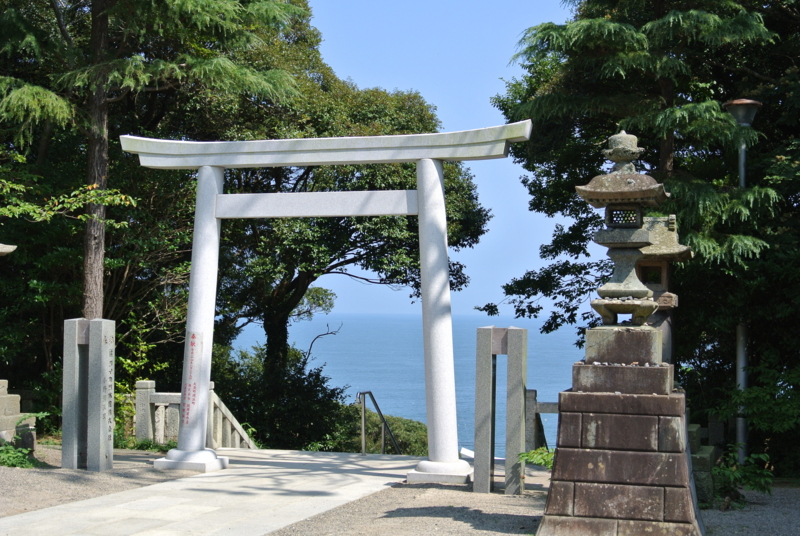

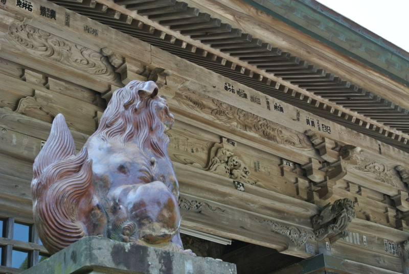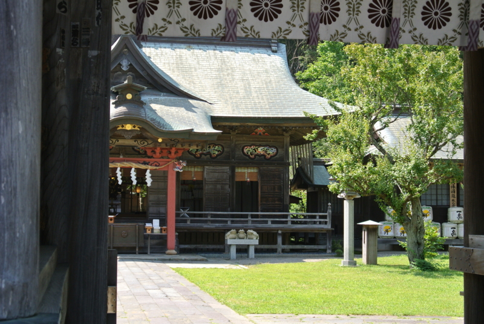

      那珂ちゃんのお墓に、100円玉置いてきた（課金

<a href="http://twitter.com/daruyanagi/status/367509392570068992" class="twitter-detail-info-permalink">2013-08-14 13:54:01</a> via <a href="http://twitter.com/download/iphone" rel="nofollow">Twitter for iPhone</a>

 

      この神社はのんびりするにいいところだな。SBM の LTE も電波一本だけはいるし（

<a href="http://twitter.com/daruyanagi/status/367509848587370496" class="twitter-detail-info-permalink">2013-08-14 13:55:50</a> via <a href="http://twitter.com/download/iphone" rel="nofollow">Twitter for iPhone</a>

海を臨むとても静かなところで、それがなぜかとても嬉しかった。

ちなみに、このような軍艦の忠魂碑はほかにもあるそう。機会があれば訪れてみたいと思う。

<ul>
<li><a href="http://www.geocities.jp/tcdnh830/sub/ibutu/sekihi/irei-13.html">http://www.geocities.jp/tcdnh830/sub/ibutu/sekihi/irei-13.html</a>（駆逐艦・村雨）</li>
<li><a href="http://www.geocities.jp/tcdnh830/sub/ibutu/sekihi/kinen-1.html">http://www.geocities.jp/tcdnh830/sub/ibutu/sekihi/kinen-1.html</a>（戦艦・長門）</li>
<li><a href="http://www.geocities.jp/tcdnh830/sub/ibutu/sekihi/irei-10.html">http://www.geocities.jp/tcdnh830/sub/ibutu/sekihi/irei-10.html</a>（戦艦・山城）</li>
<li><a href="http://torakyojin88.web.fc2.com/g31.html">http://torakyojin88.web.fc2.com/g31.html</a>（軍艦・比叡）</li>
</ul>

<a href="http://www.amazon.co.jp/exec/obidos/ASIN/B0019TVWAI/bestylesnet-22/">1/700 ウォーターライン No.352 日本海軍軽巡洋艦 那珂 1943</a>
<ul><li>出版社/メーカー: 青島文化教材社</li><li>メディア: おもちゃ＆ホビー</li><li> クリック: 1回</li><li><a href="http://d.hatena.ne.jp/asin/B0019TVWAI/bestylesnet-22" target="_blank">この商品を含むブログを見る</a></li></ul>

<h3>追記</h3>

      1秒のプレイしてない艦これの那珂ちゃんとやらのために大洗にまで行ったので、艦これは恐ろしいゲームだ

<a href="http://twitter.com/daisuke_nomura/status/368058492042477569" class="twitter-detail-info-permalink">2013-08-16 02:15:57</a> via <a href="http://itunes.apple.com/us/app/twitter/id409789998?mt=12" rel="nofollow">Twitter for Mac</a>

同行の @daisuke_nomura もブログ書いてた（<a href="http://daisukenomura.hatenablog.com/entry/2013/08/17/194755">&#x90A3;&#x73C2;&#x3068;&#x5927;&#x6D17;&#x8FBA;&#x308A;&#x3092;&#x65C5;&#x884C;&#x3057;&#x3066;&#x304D;&#x305F; - .@daisuke_nomura&#x306E;&#x65E5;&#x8A18;</a>）。

