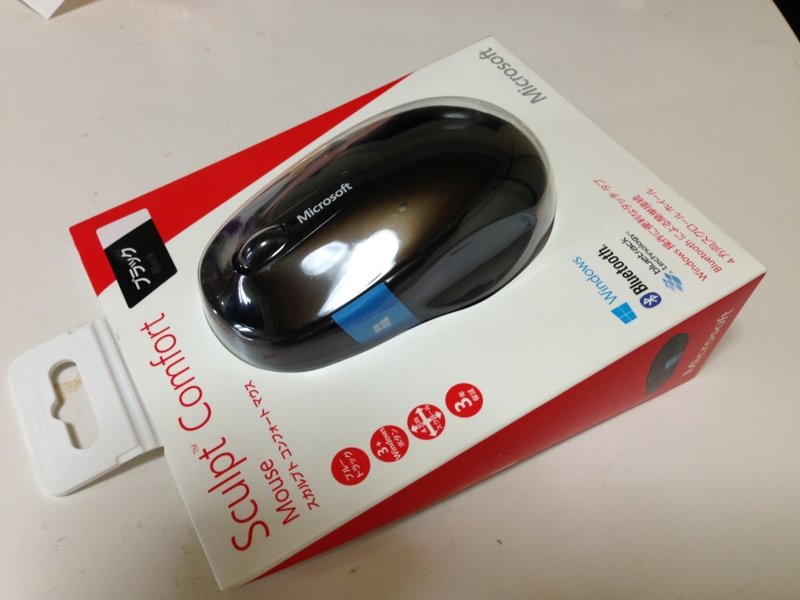
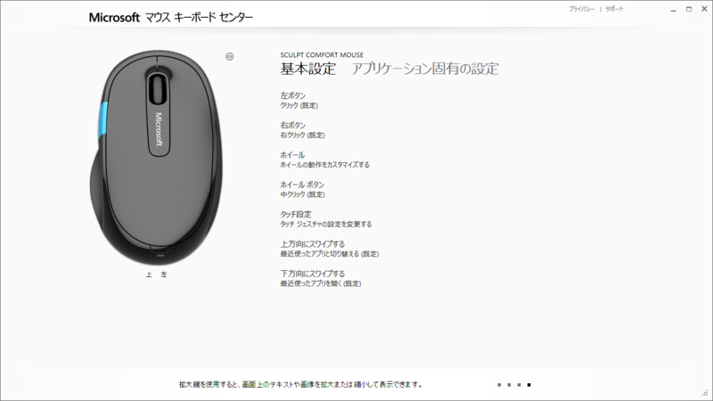
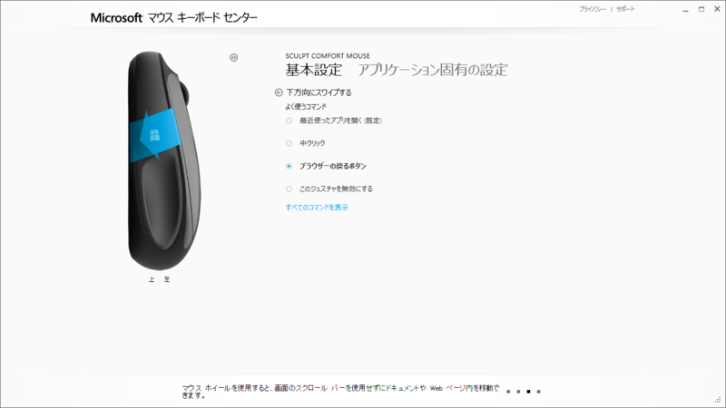
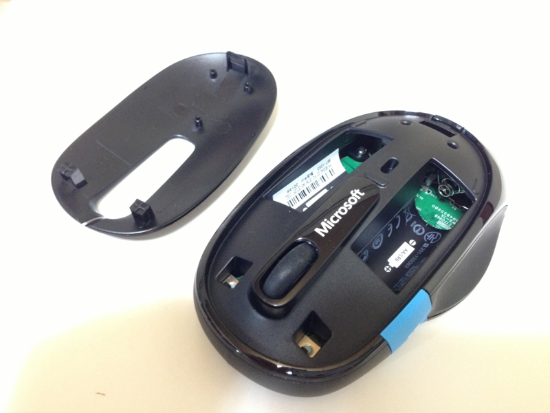

マウスは長らく Microsoft 製の Intelli Mouse Explorer 4.0 を愛用してきたのだけど、とうとう最後の一台もダメになってしまった。左クリックが反応しなかったり、ダブルクリックになったりする。製品そのものも「Microsoft マウス キーボード センター」（<a href="http://www.forest.impress.co.jp/docs/news/20121023_567863.html">&#x7A93;&#x306E;&#x675C; - &#x3010;NEWS&#x3011;Microsoft&#x3001;&#x30C9;&#x30E9;&#x30A4;&#x30D0;&#x30FC;&#x30BD;&#x30D5;&#x30C8;&#x300C;Microsoft &#x30DE;&#x30A6;&#x30B9; &#x30AD;&#x30FC;&#x30DC;&#x30FC;&#x30C9; &#x30BB;&#x30F3;&#x30BF;&#x30FC;&#x300D;v2.0&#x3092;&#x516C;&#x958B;</a>）に未対応であるなど、もうだいぶ旧式という感じになってしまった。かなり気に入っていたのだけど、こればっかりは仕方ない。

で、実はいろいろ後継機を探していたのだけれど、どうも自分にしっくりくるものがない。ドライバーを入れるの面倒だしできれば Microsoft 製がいいのだけど、ベーシックでシンプルなのが最近あまりない。

Microsoft 的にはマウスでタッチオペレーションがつかえるタイプを訴求したいみたいなのだけど、マウスなんかポイント＆クリックできれば十分だと思うんだよね。タッチオペレーションはタッチパネルでやるさ。ついでに言うと、（マウス|タッチ）ジェスチャーだってあんまり好きじゃない。呪文を覚えるのめんどくさいし、発動まで時間食うし。同じ覚えるならキーボードのショートカットの方が早いと思うんだよね。ここら辺は個人の好き好きなのかもしれないけれど。

そんななかでも「Sculpt Comfort Mouse」はパッと見で割りといい感じかなぁ、と思った。Bluetooth というのがちょっと引っかかったが（電池の分重くなる！！）、21世紀にもなって有線マウスというのもおかしいのかもしれないと言い聞かせながら Amazon で購入――んで、デスクトップ機に Bluetooth レシーバーがなかったので後日追加購入……。だから Bluetooth なんつうナウでヤングいのは嫌いなんだ！！

でも、使ってみた感じはなかなかいい。接続も簡単だった。ドライバーソフトもほとんど勝手に落ちてくるぜ！（自分は“アクション センター”から入手した）

親指の位置に配置された Windows ボタンはクリックだけじゃなくてタッチ操作にも対応している。このマウスには［戻る］ボタンがないのだけど、ボタンを下へなぞる操作を［戻る］に割り当てたらいい感じになった。ジェスチャー操作を受け付けるとブルルッと震えてフィードバックしてくれるのもいい。

ただ、自分は手が小さくて、このボタンに親指が届きづらい。押すことはできても、なでるという操作はちょっとしんどい……できれば Windows ボタンを押す操作そのものに［戻る］を割り当てたかったが、それは無理なようだ。キーボード側に［Windows］キーがあるのだから、マウス側には正直いらないのだけど。

あと、マウスパッドなしではポインターが“泳ぐ”ことがある。机は木目調なのだけど、不都合があるのだろうか。マウスパッド嫌いなんだけどな。あと、やっぱりちょっと重くて、しかも心なしか熱い気がする。マウスを操作する手が汗ばんでしまう。

電池はマウスカバーを外して挿入する。ボタン周りの掃除もできそうなので、Intelli Mouse Explorer 4.0 よりはメンテナンス性は高いかも。先代マウスがボタン周りの故障で退役することになったこともあり、ここら辺がイジれるのはポイント高い。

ちょっと気に入らないところはあるけれど、おおむねいい感じかな。総合的に見れば合格点なので、会社用にも買おうかと思う。

<a href="http://www.amazon.co.jp/exec/obidos/ASIN/B00DFQWGYE/bestylesnet-22/">マイクロソフト Sculpt Comfort Mouse Win7/8 Bluetooth Black H3S-00007</a>
<ul><li>出版社/メーカー: マイクロソフト</li><li>発売日: 2013/07/05</li><li>メディア: Personal Computers</li><li><a href="http://d.hatena.ne.jp/asin/B00DFQWGYE/bestylesnet-22" target="_blank">この商品を含むブログ (2件) を見る</a></li></ul>

