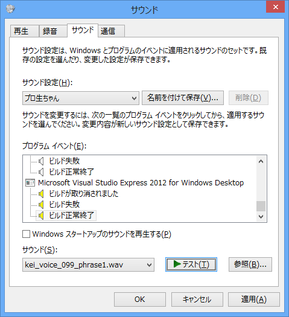
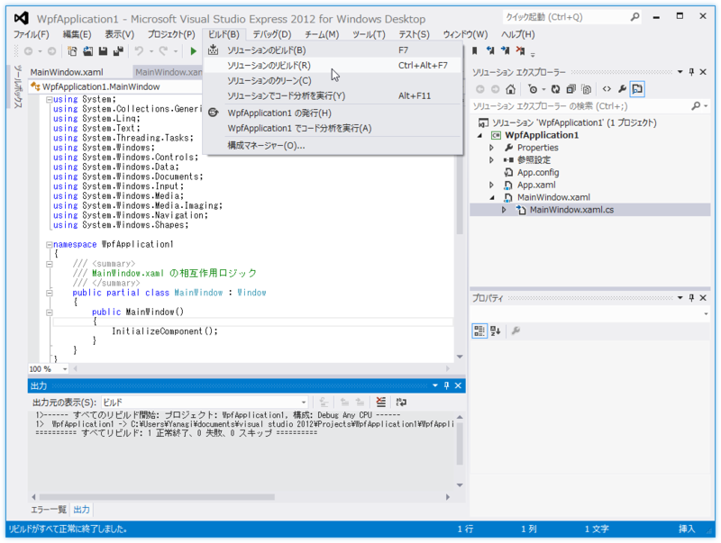

<blockquote cite="http://pronama.azurewebsites.net/2013/08/23/kurei-kei-voice/">

というわけで、この度、IT系コミュニティ「プログラミング生放送」のキャラクター、プロ生ちゃんこと暮井 慧（くれい けい）のシステムボイスを無償公開します！　PC やスマホの一般的なサウンド設定、そして Visual Studio など開発用ツールのサウンド設定としても使える内容です。

<cite><a href="http://pronama.azurewebsites.net/2013/08/23/kurei-kei-voice/">&#x30D7;&#x30ED;&#x751F;&#x3061;&#x3083;&#x3093;&#x3053;&#x3068;&#x66AE;&#x4E95; &#x6167;&#xFF08;CV &#x4E0A;&#x5742;&#x3059;&#x307F;&#x308C;&#xFF09;&#x306E;&#x30B7;&#x30B9;&#x30C6;&#x30E0;&#x30DC;&#x30A4;&#x30B9;&#x7121;&#x511F;&#x516C;&#x958B;&#x306E;&#x304A;&#x77E5;&#x3089;&#x305B;&#xFF01; | &#x30D7;&#x30ED;&#x30B0;&#x30E9;&#x30DF;&#x30F3;&#x30B0;&#x751F;&#x653E;&#x9001;</a></cite>
</blockquote>

プロ生ちゃん（CV: 上坂すみれ（<a href="https://twitter.com/Uesakasumire">https://twitter.com/Uesakasumire</a>）さん）のシステムボイスが公開されました！　個人的にちょっと面白いなぁと思ったのは、「Visual Studio」用のサウンドが用意されていること。これを使うと、プロ生ちゃんがビルド通知してくれるようになるっぽい。

<h3>使い方</h3>

「Visual Studio 2012」<a href="#f1" name="fn1" title="「Visual Studio 2008」まではおそらくないと思う。「Visual Studio 2010」は未検証">*1</a>がインストールされている環境で［サウンド］プロパティ画面の［サウンド］タブを開くと、“プログラム イベント”リストの下の方に Visual Studio のイベントが登録されているはず。

Express エディションでもいいみたい。ここにサウンド（WAVファイル）を割り当てるだけ。うちの環境では

<ul>
<li>ビルドが取り消されました</li>
<li>ビルド失敗</li>
<li>ビルド正常終了</li>
</ul>
という3つのイベントが登録されてた。これはエディションによって少し差異があるみたい。たとえば、上位エディションではブレークポイントでもイベントが発生する。

<h3>注意</h3>

配布されているシステムサウンドは長すぎるのかな？　うちの環境ではそのままでは使えなかった。なので“cut”フォルダに収められた短いセリフ（MP3形式）を「foober2000」で WAV 形式に変換して使っています（追記：現在は“cut”フォルダ内のサウンドも WAV 形式になっています）。

あと Visual Studio はシステムサウンドを設定した後に起動しなきゃいけないみたい。起動したままサウンド設定を行ったのだけど、ビルドしても音声が再生されず「なんでや」と思った次第。

<h3>最後に</h3>

WebMatrix にもプログラム イベントがほしい！

<ul>
<li><a href="http://www.forest.impress.co.jp/docs/news/20130823_612340.html">&#x4E0A;&#x5742;&#x3059;&#x307F;&#x308C;&#x304C;&#x58F0;&#x3092;&#x52D9;&#x3081;&#x308B;&ldquo;&#x30D7;&#x30ED;&#x751F;&#x3061;&#x3083;&#x3093;&rdquo;&#x306E;&#x30B7;&#x30B9;&#x30C6;&#x30E0;&#x30DC;&#x30A4;&#x30B9;&#x304C;&#x7121;&#x511F;&#x516C;&#x958B; - &#x7A93;&#x306E;&#x675C;</a></li>
</ul>

<a href="#fn1" name="f1" class="footnote-number">*1</a>:「Visual Studio 2008」まではおそらくないと思う。「Visual Studio 2010」は未検証

