
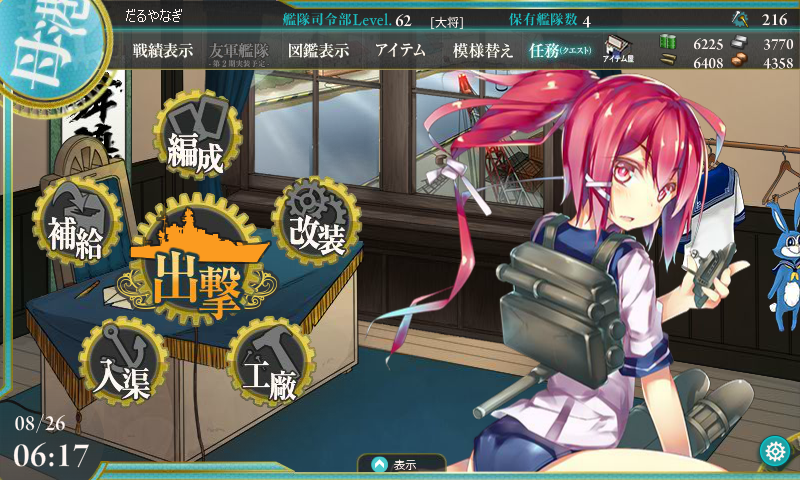

限定海域「警戒線を突破せよ！」（いわゆる“E-1”）はサクッとクリアして潜水艦「伊168」（通称: イムヤ）はゲットしたのだけど、正直ウチの戦力と資金力では「敵洋上戦力を排除せよ！」（いわゆる“E-2”）を突破できるかどうかってところかな。万遍なくみんなのレベルを上げるのが好きで、主力メンバーのレベルはそれほど高くないし。以前に一度、資源を 3k ずつ貯めて挑戦したけれど、ゲージを半分削ったところで資源が尽きた。

というわけで、今度は資源を各 5k 程度貯め込んで挑戦。ちょっと足りないけれど、イベント最終日なので泣いても笑ってもこれで終わり。ダメだったらあきらめよう。

      E-2 突撃なうなう

<a href="http://twitter.com/daruyanagi/status/371748401307590657" class="twitter-detail-info-permalink">2013-08-26 06:38:20</a> via <a href="http://www.metrotwit.com/" rel="nofollow">MetroTwit</a>

<h3>順調にゲージを削る</h3>

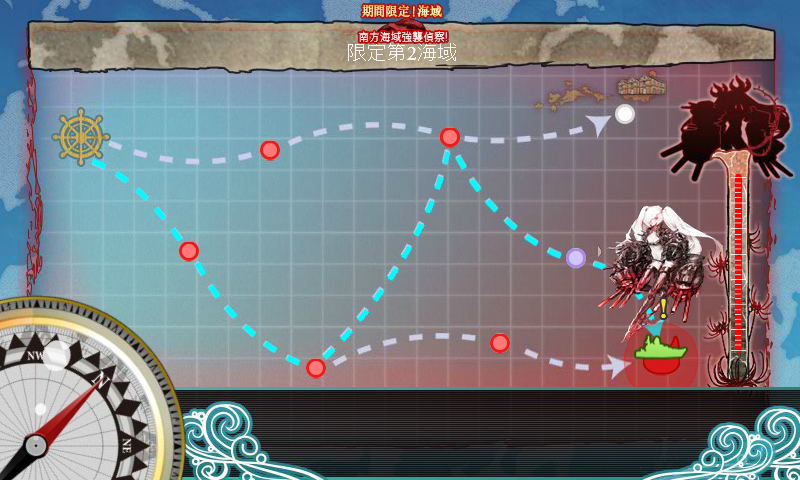

資源が少ないので、ひたすら羅針盤の運と途中でクリティカルを食らわないことを願う。

<ol>
<li>ボス到達 → 戦術的敗北C（「うー、なんもいえねえ……」）</li>
<li>ボス到達 → 完全勝利S</li>
<li>初戦で戦艦・陸奥がクリティカルを食らう → 潔く撤退</li>
<li>ボス未到達 → 山城「不幸だわ……」</li>
<li>敵フラグシップ戦艦のクリティカル砲撃で空母・加賀さんが損傷 → 空母にはダメコン積んでないので撤退</li>
<li>ボス到達 → 勝利A</li>
<li>ボス到達 → 完全勝利S（ほぼ無傷）</li>
<li>ボス到達 → 勝利A</li>
</ol>
4戦目までは旗艦をイムヤにしていたけれど、途中からハイパー北上さまに変更。

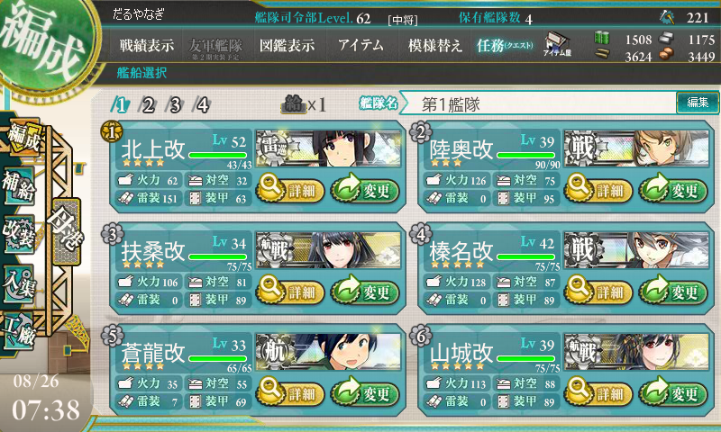

先制魚雷で敵を潰せる確率が上がったのでだいぶ安定するようになった。空母は気分で加賀・蒼龍を入れ替えて使ってたけど、戦艦連中はだいたいこれで固定。レア装備（？）は「彩雲」「三式弾」「強化型艦本式缶」「紫電改二」が各ひとつで、そんなにいいものは持っていない気がする。

で、とうとう残りゲージ2まで削るが……ここで資源が尽きる。原油と鋼鉄、弾丸はまだ余裕があるのだけれど、補修用の鋼鉄が足りない。

<h3>俺氏、とうとう課金アイテムに手を出す</h3>

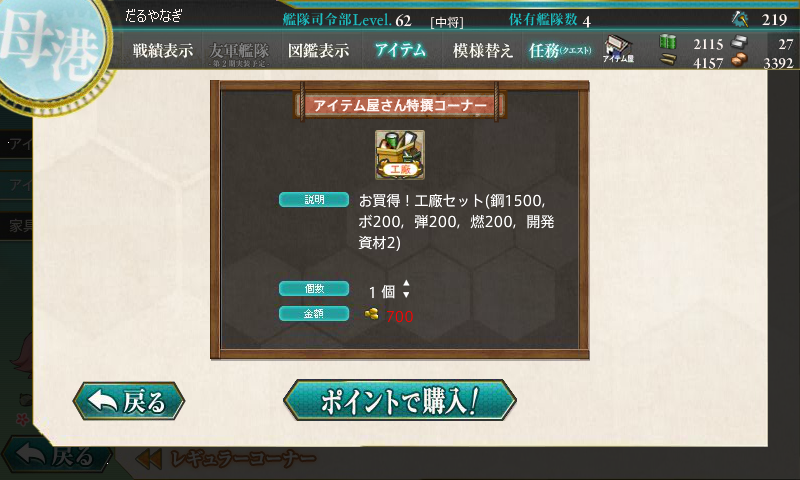

しょうがないので（？）、<b>700円で「工廠セット」を購入</b>。鋼鉄が 1.5k も手に入ったぞ！……一瞬で陸奥が食い尽くしたが。

<h3>悪夢の9戦目</h3>

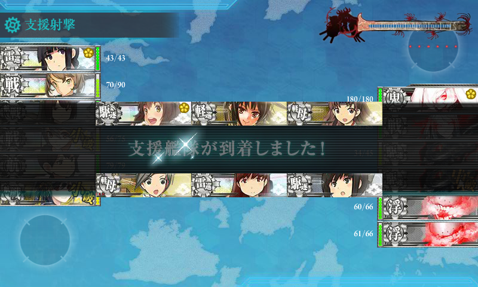

満を持して最終戦に挑む。羅針盤に嫌われることもなく、下ルートでボスへ到達。川内ちゃん<a href="#f1" name="fn1" title="一緒に夜戦したい！！">*1</a>を旗艦とする援護部隊（雪風、ちとちよ（航改）、大井っち、主人公さん）も繰り出すが……こっちはカスダメージしか通らず<a href="#f2" name="fn2" title="スクリーンショットは10戦目のもの">*2</a>。

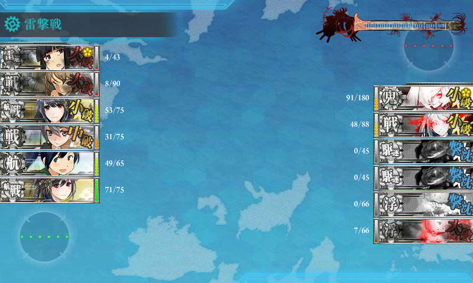

しかも、レギュラーメンバーにもあんまり運がなく、実力ほど相手が削れない。敵旗艦にダメージを与えてゲージは削り切ったものの、撃沈には至らない。

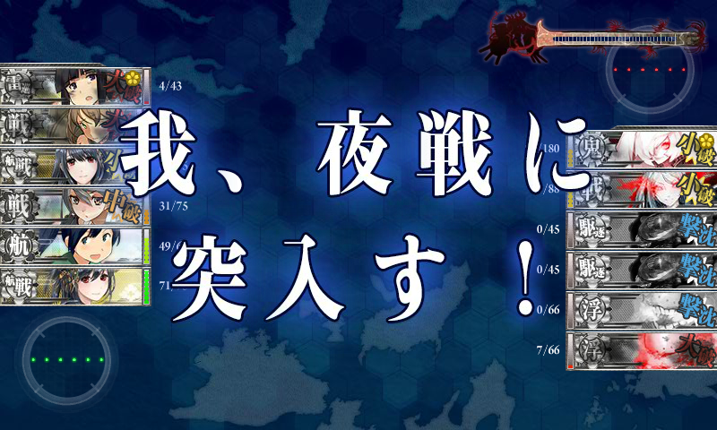

仕方なく夜戦に突入するも……

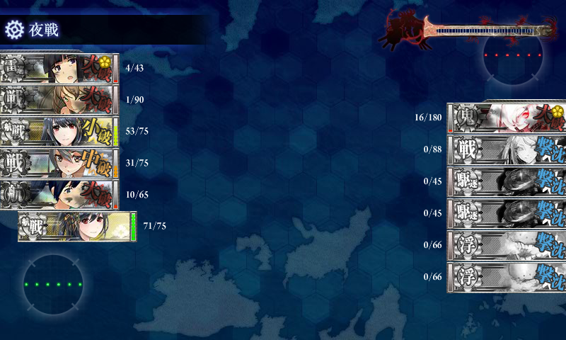

なんと、ここで打ち漏らしてしまう！　――最後に砲撃した山城氏が痛恨のミスぇ……。夜戦で蒼龍さんが大破ので、夜戦にしてかえって大赤字だった。

――しかも、10戦目もほとんど同じ経過でわずかの差で打ち漏らす。当然ここで資源が尽きたので、<b>再び700円で「工廠セット」を購入</b>。マジで次ダメだったらあきらめる。

<h3>運命の第11戦目！</h3>

11戦目も下ルートで無事ボスへ到達。今回は羅針盤運にだけは恵まれているようだ。ハイパー北上さまを入れたおかげで、途中にある潜水艦しか出てこないマップでも B 勝利が稼げる。

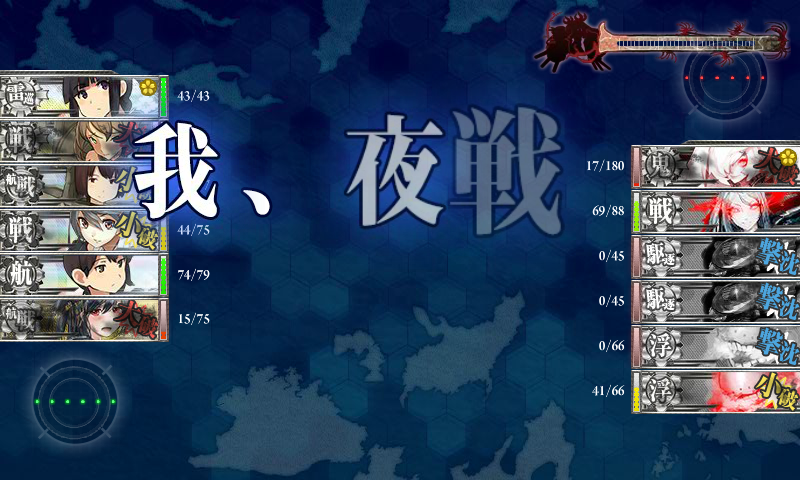

ボス戦は雑魚から屠りつつも旗艦に大ダメージを与える順調な展開。不幸型航空戦艦・山城さんが大破したのもかえって順調で縁起がいい。そもそも、不幸姉妹には運を期待していないのでダメコンが積んであり、何の問題もない。

しかし、昼戦では削り切らず。夜戦に突入。

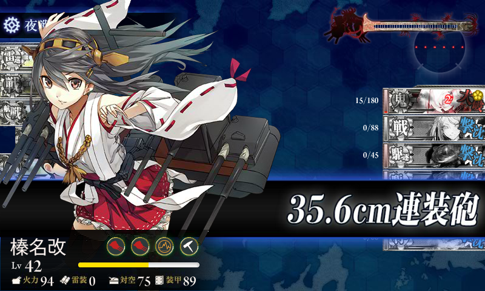

キメてくれたのはウチのエース、榛名さんでした<a href="#f3" name="fn3" title="マジで愛してる！">*3</a>。S 勝利で E-2 クリア！

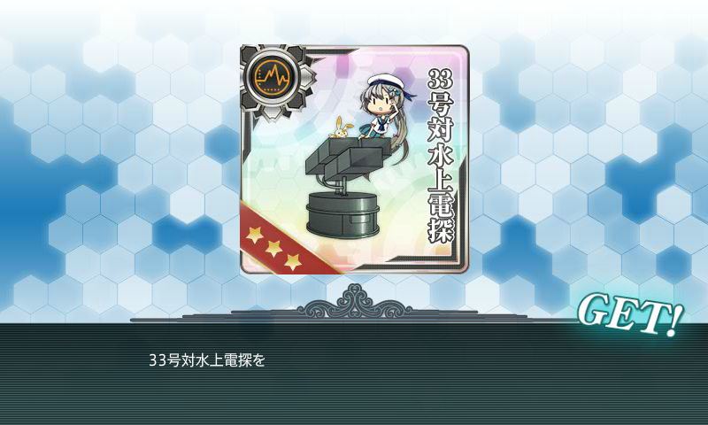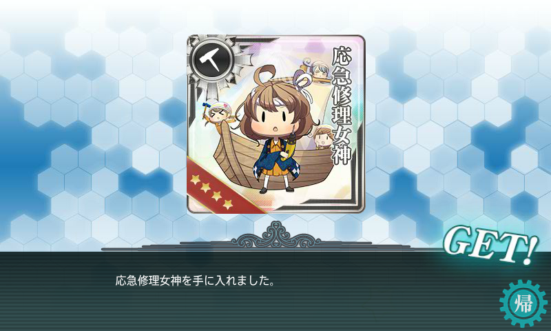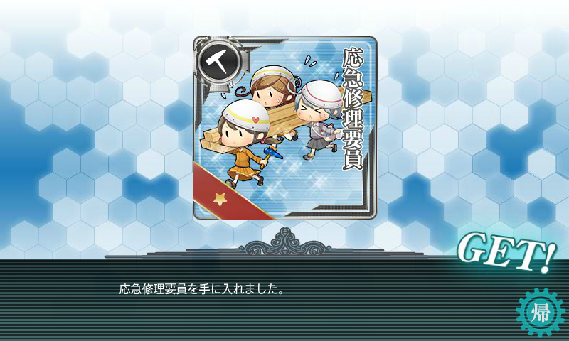

お土産たくさんいただきました。

<h3>まとめ</h3>

目標の E-2 がクリアできたけれど、ドロップは何もなかった。2,000円も課金してしまったのも、無課金主義者としては大敗北（でも、周りの人は万単位で注ぎこんだみたい――お前ら、ほんま手遅れだな！）

さて、そんなこんなでまる一か月ほど艦これにハマっていたのだけど、これからはちょっとペースを落とそうと思う。とりあえず時間が区切られた目標はなくなったし、資源がたまってないとウチのような日帝プレイヤーはいざというときにブーストが効かない。次のイベントに備えて遠征を回す日々を送ることにする。

<a href="#fn1" name="f1" class="footnote-number">*1</a>:一緒に夜戦したい！！

<a href="#fn2" name="f2" class="footnote-number">*2</a>:スクリーンショットは10戦目のもの

<a href="#fn3" name="f3" class="footnote-number">*3</a>:マジで愛してる！

