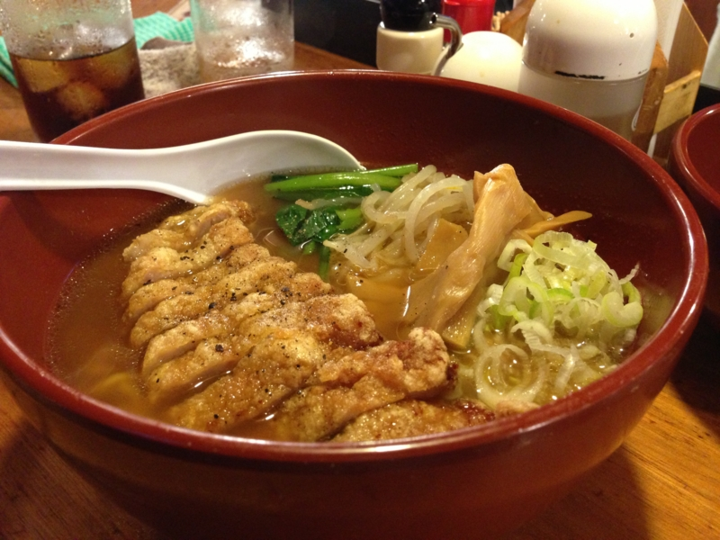
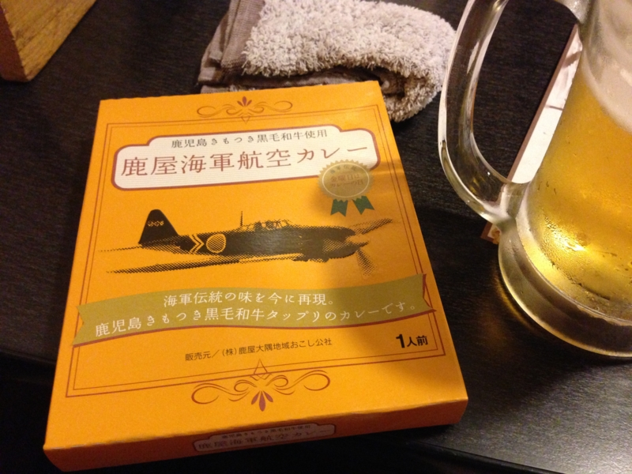

秋葉原に聳え立つ肉のテーマパーク・万世ビルで @shibayan とオフパコしてきた。オフパコというのは、某歌い手がやっていたアレでは断じてなく、オフラインで友達と一緒に排骨麺（パーコーメン）を食べることである。

      ああパコるってパーコー麺食べるって意味だったのか、オフパコってパーコー麺食べるオフ会か。そうだよねみんなそんな気軽にセッ久の話なんてネットでしないよね

<a href="http://twitter.com/DJWILDPARTY/status/334893347611222017" class="twitter-detail-info-permalink">2013-05-16 13:49:30</a> via <a href="http://twitter.com/download/iphone" rel="nofollow">Twitter for iPhone</a>

味は……実は、地下の「呉越同舟」で結構のんだあとだったのであまり覚えてない。ちょっと味が濃い目だったかな？　ビールには結構あう印象だけ覚えている。あと、麺が美味しかったような。今度はあまり飲み過ぎない状態で一杯、ひとりで完食したい。

あと、鹿児島のおみやげに海軍カレーとやらを貰った。鹿屋（かのや）ってなんか聞いたことあったのだけど、特攻隊の出撃基地だったんだね。いつか行ってみたい気もする。このカレーは金曜日までとっておくつもりだったけど、今晩の夕食にするつもり。冷蔵庫がからっぽなのだけど、明日・水曜日が冷凍食品の安売り日なので、今日は買い物に出たくないんだよね。

<ul>
<li><a href="http://www.mod.go.jp/msdf/kanoya/sryou/msdf-ks/">&#x9E7F;&#x5C4B;&#x822A;&#x7A7A;&#x57FA;&#x5730; &#x53F2;&#x6599;&#x9928;&#xFF34;&#xFF2F;&#xFF30;</a></li>
</ul>