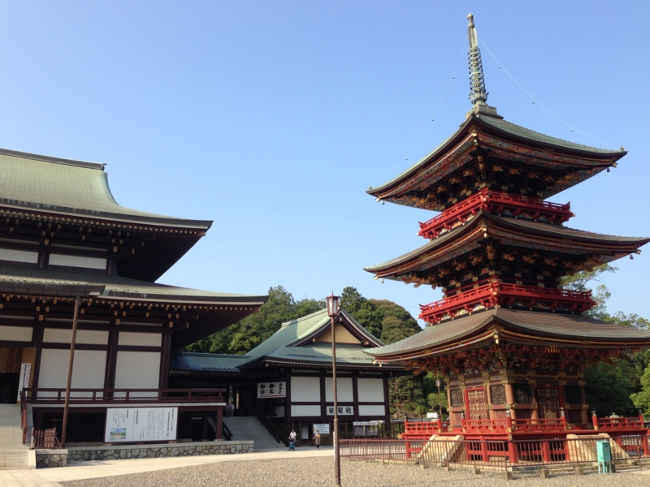

お盆シリーズの最終回。

<ul>
<li><a href="https://blog.daruyanagi.jp/entry/2013/08/17/214451">&#x8266;&#x3053;&#x308C;&#xFF1A;&#x5DE1;&#x6D0B;&#x8266;&#x30FB;&#x90A3;&#x73C2;&#x3061;&#x3083;&#x3093;&#x306E;&#x304A;&#x5893;&#x8A63;&#x308A;&#x3057;&#x3066;&#x304D;&#x305F; - &#x3060;&#x308B;&#x308D;&#x3050;</a></li>
<li><a href="https://blog.daruyanagi.jp/entry/2013/08/18/211848">&#x5927;&#x6D17;&#x306F;&#x30DE;&#x30B8;&#x3067;&#x300E;&#x30AC;&#x30EB;&#x30D1;&#x30F3;&#x300F;&#x4E00;&#x8272;&#x3060;&#x3063;&#x305F;&hellip;&hellip; - &#x3060;&#x308B;&#x308D;&#x3050;</a></li>
</ul>
最終日は @daisuke_nomura と別れて @jz5 と大洗で一泊したあとは、鹿島臨海鉄道で成田へ抜け、成田山新勝寺の近くでうなぎ食べたきたった。近年は鰻が獲れないとのことで、土用の丑の日も鰻を食べることを遠慮していたのだが（ざ…財政的問題なんかじゃないんだからねっ！）、まぁ、お盆は夏バテに注意しなくちゃいけないし、なんといっても成田といえば何故か鰻なわけで、食べないわけにもいかない。

<h3>鹿島臨海鉄道大洗鹿島線</h3>

まずは印籠弁当で腹ごしらえ。

ほかにも美味しそうな駅弁はあったのだけど、ちょっと量が多そうだった。この印籠弁当はその点、具材にバラエティがあるけれど、量的にはそれほど多くないのでちょうどよかった。ごちそうさま。

時刻表をあらかじめ確認していなかったこともあり、ここで約1時間の待ち。そのあと二両編成の小さなディーゼル車に乗って、鹿島神宮へ向かった。大洗からの所要時間はだいたい1時間で、途中に日本で一番名前の長居駅の一つ「長者ヶ浜潮騒はまなす公園前駅」がある（<a href="http://ja.wikipedia.org/wiki/%E9%95%B7%E8%80%85%E3%83%B6%E6%B5%9C%E6%BD%AE%E9%A8%92%E3%81%AF%E3%81%BE%E3%81%AA%E3%81%99%E5%85%AC%E5%9C%92%E5%89%8D%E9%A7%85">&#x9577;&#x8005;&#x30F6;&#x6D5C;&#x6F6E;&#x9A12;&#x306F;&#x307E;&#x306A;&#x3059;&#x516C;&#x5712;&#x524D;&#x99C5; - Wikipedia</a>）。本を読んだりぼーっとしてたりしていたので、どんな駅か見損なったが。

<h3>鹿島神宮駅～成田駅</h3>

ここらへんは電車不毛の地で、接続が異常に悪い。鹿島神宮駅では1時間以上待たされた。めちゃくちゃ暑くて、冷房の効いた総武線の列車にありつけたときはほんと、天国に感じた。

そういうこともあって、実は常磐線経由で我孫子から成田へ向かったほうが時間的には早い。まぁ、そっちはもう乗ったし、急ぐ旅でもない。

<h3>成田山新勝寺</h3>

10時に大洗を出て、成田についたのは2時半。あちこち歩きまわって、ようやく3時ごろにお昼ごはんにありつく。ごちそうさま。

そのあとは新勝寺をちょろっと回って、今回の旅は終わり。なんかくじを引いたら大吉が出たのだけど、「ふつうの人ではあまり良すぎて位負けするというほどの運勢」とか書かれてあって、若干ビビっているのでした。まぁ、あれから10日ぐらい経つけど、そんなにビックリするほど運がいいことは別に起こってない。強いて言えば、伯父さんになったことぐらいか。

