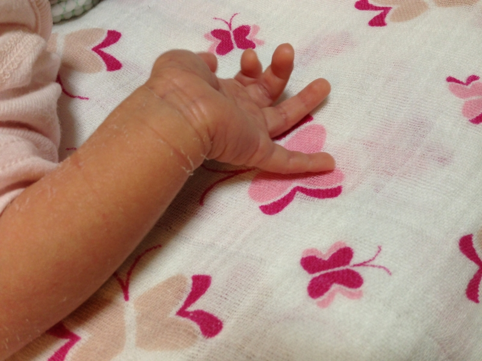

先日妹に女の子が生まれたので、顔を見に行きました<a href="#f1" name="fn1" title="肖像権尊重のため写真は手のみ掲載">*1</a>。ほんとに顔を見に行っただけ。妹には『赤ちゃんを抱いてくれ』って言われたけど、落とすのが怖いので丁重にお断り申し上げた。たぶん自分は子ども好きな方だと思うけれど、こんなに小さいと可愛さより、怖さが先立ってしまう。とりあえず、母子ともに健康そうで、それは安心した。

それにしても、齢33にしてとうとうオジさんか……。母や妹には早く結婚しろと言われるけれど、なんとなくこういうのを背負うのはちょっと自分には荷が重い気がする。自分がまっとうしたい責任に対して、自分の力がなさすぎるというか。まぁ、そういうのをやる前からぐじぐじ考えているのが、そもそもの間違いなのかもしれないけれど。しかしこればっかりは、頭でっかちに生まれてしまったのだからしょうがない。だいたい、そもそも相手いないし！　なんか課題山積でそういう気分にもなれないしな。弟と妹の間でかわされる恋愛談義にぼーっと耳を傾けながら、母の出してくれたビールのんで豚しゃぶをつついていた。

なんというか、できればこの子たちが困ったときに手を差し伸べてあげられるような、もう少しまともな人間になれるよう頑張りたいですね。

<a href="#fn1" name="f1" class="footnote-number">*1</a>:肖像権尊重のため写真は手のみ掲載

