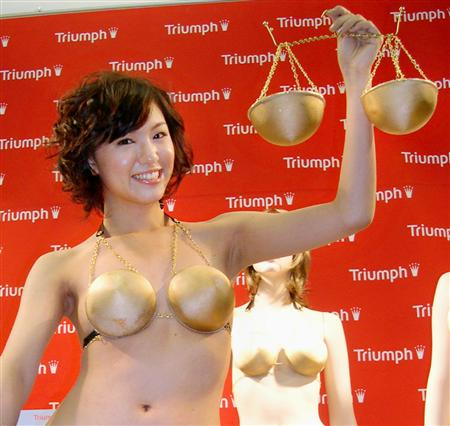

from: <a href="http://www.47news.jp/CN/200811/CN2008110501000472.html">http://www.47news.jp/CN/200811/CN2008110501000472.html</a> 

<blockquote cite="http://www.bengo4.com/topics/731/">

裁判員の精神的負担をめぐる問題で、愛媛県の松山地裁が、傷害致死事件の公判で「遺体の写真」を提示する予定があると裁判員候補者に説明したところ、2人が不安を訴えたため、辞退が認められていたことが明らかになった。

裁判員の精神的負担については、元裁判員の女性が今年5月、事件被害者の遺体写真を見たことで急性ストレス障害になったとして国賠訴訟を起こし、注目を集めた。7月には東京地裁が、裁判員選任手続きの際に遺体写真などの証拠について予告し、候補者が不安を訴えた場合には辞退を柔軟に認めることを申し合わせていた。

<cite><a href="http://www.bengo4.com/topics/731/">&#x300C;&#x907A;&#x4F53;&#x5199;&#x771F;&#x898B;&#x305F;&#x304F;&#x306A;&#x3044;&#x300D;&#x3067;&#x8F9E;&#x9000;&#x5BB9;&#x8A8D; &#x300C;&#x88C1;&#x5224;&#x54E1;&#x88C1;&#x5224;&#x300D;&#x306E;&#x6839;&#x5E79;&#x304C;&#x63FA;&#x3089;&#x3044;&#x3067;&#x3044;&#x308B;&#xFF1F; - &#x5F01;&#x8B77;&#x58EB;&#x30C9;&#x30C3;&#x30C8;&#x30B3;&#x30E0;</a></cite>
</blockquote>

僕と同じ年代ならば、国語の教科書で“血のソーセージ（ブルート・ブルスト）”を作る話を読んだことがあるかもしれない。豚の死体に手を突っ込んで「温かい」だのなんだの言うやつだ。あれはきっと“命の大切さ”を教えようという意図で教科書に採られたと思うのだけど、そんなことよりも想像した血の“生々しさ”だけが妙に記憶に残っている。そういえば、自分で“命”を捌いて口にした経験なんて、自分には殆どないかもしれない。いいところ釣った魚を捌いたことがある程度だ。

社会っていうのは、そういう“生々しさ”から僕らを隔離してくれている。逆に言えば、社会が高度になればなるほど、自然な“生々しさ”からは疎外されていく。

たまたま遭っただけの罪のない生き物を、恨みもないのに殺すこともない。今のような仕事をしていると、何年も前は炎天下、焼けた鉄板の上で泥の詰まったホースを担いで働いていたことですら、なんだか夢のように感じる。急に雨が降っても、キオスクには安い傘が売ってある。月末になるとお給料袋を手渡されるのではなく、口座の残高が増えている。酒を飲まず、人にも会わなければ、たぶんそのまま残高は増えていくんだろう。生憎、なかなか増えないが。

司法だの裁判だのっていうのも、そういう“生々しさ”から僕らを守ってくれる社会システムのひとつと言っていいと思う。

自分は裁判員制度に賛成だけれど、それは「遺体の写真」を見たいだとか、非日常を楽しみたいとか（それは少しはあるかもしれない）、裁判員がカッコいいだとか、司法への参加も国民の義務だとか、そういう理由だからじゃない。そういう“生々しさ”を体験する機会があるのはとてもいいことじゃないかと思うからだ。現にあまりに過保護だから、「遺体の写真」ごときで卒倒できるわけでしょう。毎日そういうものと取り組んでいるひとたちだっているってこと、たぶん想像すらしたことないんじゃないかな。無政府状態になったら、まっさきに死ぬで<a href="#f-de49d5d2" name="fn-de49d5d2" title="この事件が反裁判員制度派の茶番なのだとしたら、なかなかの厚顔無恥で、ゴキブリの如く生き残りそうだが">*1</a>。

まぁ、「専門知識と覚悟のあるプロフェッショナルに任せればいい、彼らはそれを自分で選んだんだから」という意見にも一理はあって、フツーはその方がうまくいくと思うのだけど、それを認めてしまえば「この司法の判断は誤っている、納得がいかない」と感じたときに、どの面下げて反発するのだろうね。プロに一任するというのなら、愚民はそれに従えばいいじゃないか。自分はそれはマズいと思うけれど。過度な専門化は、特権を産んでしまう。専門化たる本人たちにその気はなくても、そこに繋がるハブが細くなれば、そこを牛耳るエージェントたちが幅を利かせるだろう。組織には必ずいくつかの穴を開けて、風通しよくしておくべきだよ。取り調べの可視化なんかも、自分は賛成だな。

<h3>そのほかの論点について</h3>

<blockquote>

「積極的に裁判員になりたい層は、そもそも一部に過ぎないということです。大多数が辞退し、そういう人たちばかりが……たとえば『犯罪現場の写真を見たい人（見ても構わない人）』ばかりが裁判員になるという制度で、一般人の意見をくみ取るという目的は達成できるのでしょうか」

</blockquote>

それならば、辞退できないようにすべきだ。まぁ、「目的を達成できない」のならば「やめてしまいましょう」という論理にしたいのだろうけれど。「やめる」という自分の意見にばかり固執し過ぎて、「じゃぁ、辞退できないようにしましょう」という代替案が当然でるだろうことに想像がいっていないんだね。

「なりたくない人はならなくていい」という論もおかしい。たとえば僕は税金を払いたく「ない」のだけれど、だったら払わなくて「いい」ということになるのだろうか。それだったら大変ありがたいのだけど、それを認めてしまえば法律そのものが要らなくなるような。

<blockquote>

「刑事裁判に裁判員を関与させることに無理があったばかりでなく、国民的な合意もないまま、この制度を強引に始めたことが、このような矛盾を引き起こしたと言えます。」

</blockquote>

民主的手続きに則って設立された制度を“国民的な合意もないまま”“強引に”始めたと述べる根拠はいったい何なのか<a href="#f-c88b1b7d" name="fn-c88b1b7d" title="これで弁護士だというのだから呆れる">*2</a>。官庁やマスコミによる周知もあったし、国民には拒否できる機会が何度も与えられていた。

サイバンインコ（<a href="http://www.moj.go.jp/keiji1/saibanin_koho_inco.html">http://www.moj.go.jp/keiji1/saibanin_koho_inco.html</a>）だって頑張ってたじゃないか！！<a href="#f-b358d655" name="fn-b358d655" title="けれど、ほかにも裁判員制度関連のマスコットがいるのは知らなかった……orz">*3</a>

裁判員制度は実質的に強制的な“労役”、税金の一種だと言える。今さら“国民的な合意もないまま”“強引に”とか言うぐらいなら、制度ができる前に<i>「これは増税です！　租庸調の“庸”みたいなもんです！」</i>だのと反対キャンペーンを張れば、きっと裁判員制度は嫌われたろうに。みんな増税はイヤなんだからさ。

まぁ、なんというか、今の制度が完璧だなんて言わないけれど、せっかく作ったんだし、前向きに改善すればいいのにって思うけどね。

<ul>
<li><a href="https://blog.daruyanagi.jp/search?q=%E3%81%8F%E3%81%98%E5%BC%95%E3%81%8D">&#x304F;&#x3058;&#x5F15;&#x304D; &#x306E;&#x691C;&#x7D22;&#x7D50;&#x679C; - &#x3060;&#x308B;&#x308D;&#x3050;</a>（「くじ引き」の検索）</li>
</ul>

<a href="#fn-de49d5d2" name="f-de49d5d2" class="footnote-number">*1</a>:この事件が反裁判員制度派の茶番なのだとしたら、なかなかの厚顔無恥で、ゴキブリの如く生き残りそうだが

<a href="#fn-c88b1b7d" name="f-c88b1b7d" class="footnote-number">*2</a>:これで弁護士だというのだから呆れる

<a href="#fn-b358d655" name="f-b358d655" class="footnote-number">*3</a>:けれど、ほかにも裁判員制度関連のマスコットがいるのは知らなかった……orz

