
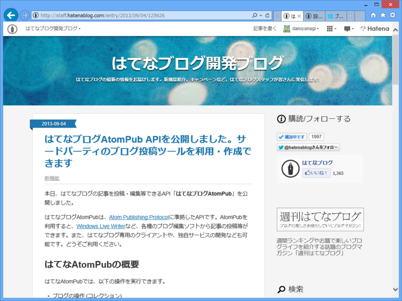

<blockquote cite="http://staff.hatenablog.com/entry/2013/09/04/125926">

本日、はてなブログの記事を投稿・編集等できるAPI「はてなブログAtomPub」を公開しました。

はてなブログAtomPubは、Atom Publishing Protocolに準拠したAPIです。AtomPubを利用すると、Windows Live Writerなど、各種のブログ編集ソフトから記事の投稿等ができます。また、はてなブログ専用のクライアントや、独自サービスの開発なども可能です。どうぞご利用ください。

<cite><a href="http://staff.hatenablog.com/entry/2013/09/04/125926">&#x306F;&#x3066;&#x306A;&#x30D6;&#x30ED;&#x30B0;AtomPub API&#x3092;&#x516C;&#x958B;&#x3057;&#x307E;&#x3057;&#x305F;&#x3002;&#x30B5;&#x30FC;&#x30C9;&#x30D1;&#x30FC;&#x30C6;&#x30A3;&#x306E;&#x30D6;&#x30ED;&#x30B0;&#x6295;&#x7A3F;&#x30C4;&#x30FC;&#x30EB;&#x3092;&#x5229;&#x7528;&#x30FB;&#x4F5C;&#x6210;&#x3067;&#x304D;&#x307E;&#x3059; - &#x306F;&#x3066;&#x306A;&#x30D6;&#x30ED;&#x30B0;&#x958B;&#x767A;&#x30D6;&#x30ED;&#x30B0;</a></cite>
</blockquote>

最近やる気満々やな！　ありがとねっ！（北上さん風に

「Windows Live Writer」もサポートされているみたいなので、さっそく AtomPub を叩いてブログを書いてみましょう。それにしても「Windows Live Writer」使うの久しぶりだわ。先代のブログは WordPress で構築していたので、「Windows Live Writer」にはだいぶお世話になったのだけど。実はいくつかプラグインも作っているぐらい、昔は好きだったんだけどね<a href="#f1" name="fn1" title="ソースコード残ってたら再公開してみようっかな">*1</a>。

<h3>ダウンロードとインストール</h3>

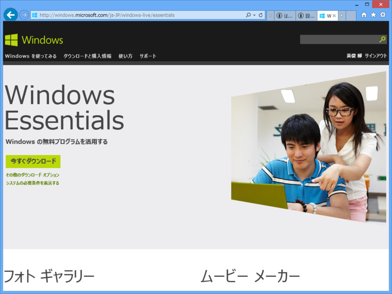

「Windows Live Writer」はソフトウェアパッケージ「Windows Essentials」の一部として配布されています。

<ul>
<li><a href="http://windows.microsoft.com/ja-JP/windows-live/essentials">Windows Essentials - Windows Live Essentials (&#x65E7;&#x540D;: &#x304A;&#x3059;&#x3059;&#x3081;&#x30D1;&#x30C3;&#x30AF;) &#x3092;&#x30C0;&#x30A6;&#x30F3;&#x30ED;&#x30FC;&#x30C9;&#x3059;&#x308B;</a></li>
</ul>
こいつを使うと、（今は亡き）“Windows Live”ブランドのアプリがインストール可能。

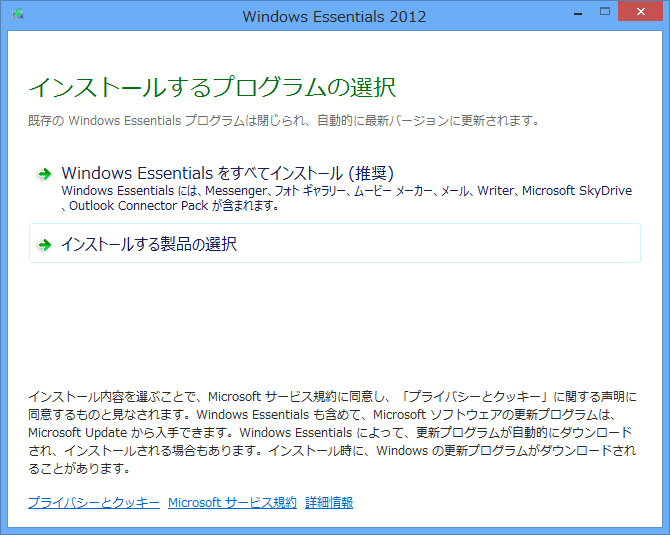

よくわかんなかったら推奨設定でいい。

<h3>ブログアカウントのセットアップ</h3>

初回利用時にブログアカウントのセットアップを行う。

<ul>
<li><a href="http://daru1.hatenablog.jp/">http://daru1.hatenablog.jp/</a></li>
</ul>
今回はウチのテストブログで説明する。

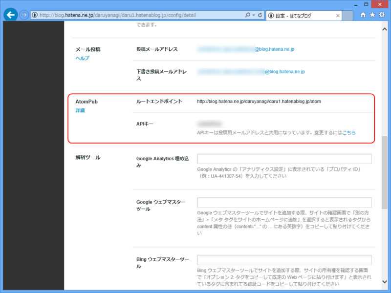

<a href="http://blog.hatena.ne.jp/my/config/detail">&#x30ED;&#x30B0;&#x30A4;&#x30F3; - &#x306F;&#x3066;&#x306A;</a> であらかじめ

<ul>
<li>ルートエンドポイント</li>
<li>APIキー</li>
</ul>
をメモしておくといいよ。

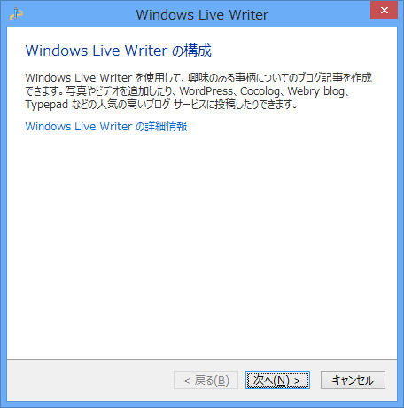

［次へ］。

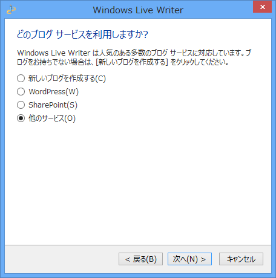

一番下の［他のサービス］を選択して［次へ］。

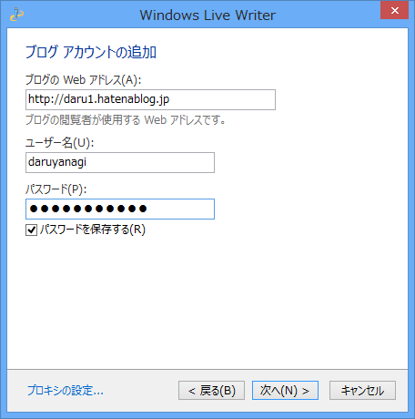

上から順に

<ul>
<li>ブログのURL（<a href="http://daru1.hatenablog.jp/">http://daru1.hatenablog.jp/</a>）</li>
<li>はてな ID（daruyanagi）</li>
<li>APIキー</li>
</ul>
を入力して［次へ］。

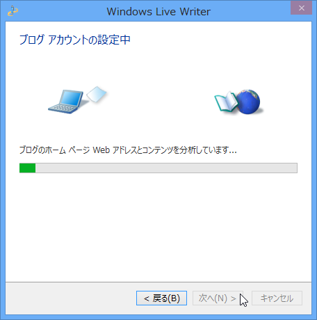

すると、ブログ投稿用の API （AtomPub 以外にもいろいろある）を自動判別しようとするが……

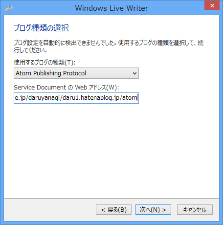

失敗するので手動で設定。上のプルダウンリストで“Atom Publishing Protocol”を選択し、下のテキストボックスにルートエンドポイントを入力する。［次へ］。

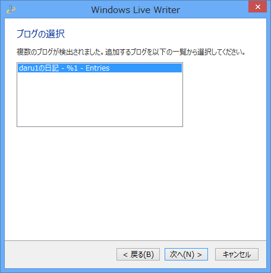

すると今度はちゃんと検出される。なんかブログ名がおかしいけど気にしない。［次へ］。

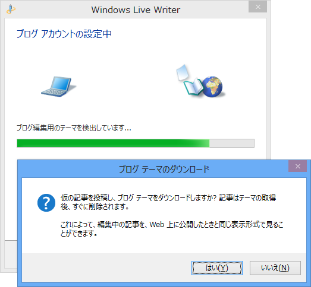

もろもろの最終チェック。ウチの環境ではテーマのダウンロードに失敗するので、テーマの自動検出はスキップ。

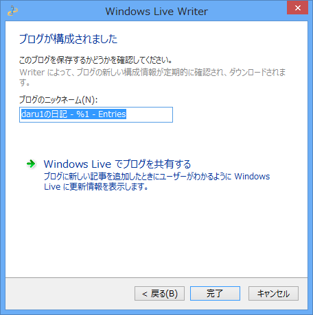

設定終了。［Windows Live でブログを共有する］ボタンは、肝心の“Windows Live”が終了しているので意味はない。「Windows Live Writer」は最近メンテナンスされていないので、こういう時代遅れな機能がいろいろ残っていたりする。

<h3>とりあえず書いてみる</h3>

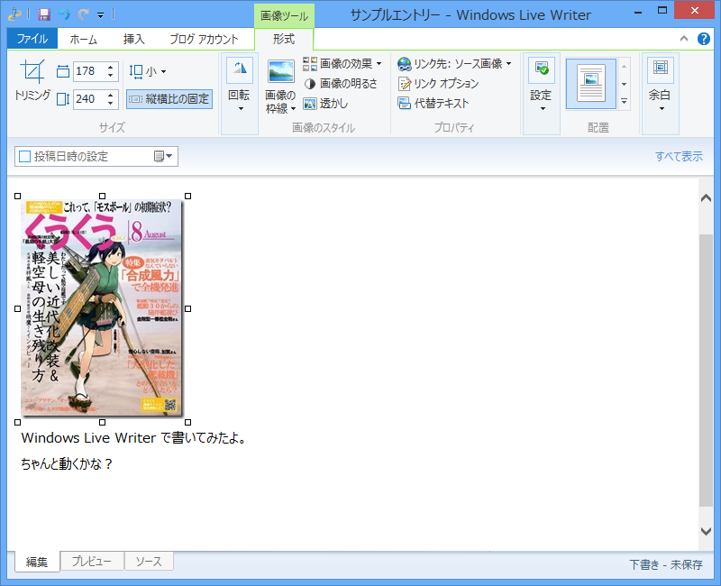

適当に書いてみる……が。

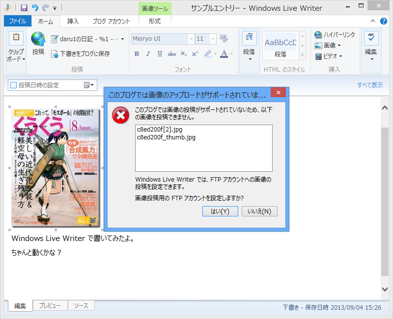

画像のアップロードには対応していない。もし公開 FTP サーバーをもっているなら、そこへアップロードするようにセットアップすることもできる。

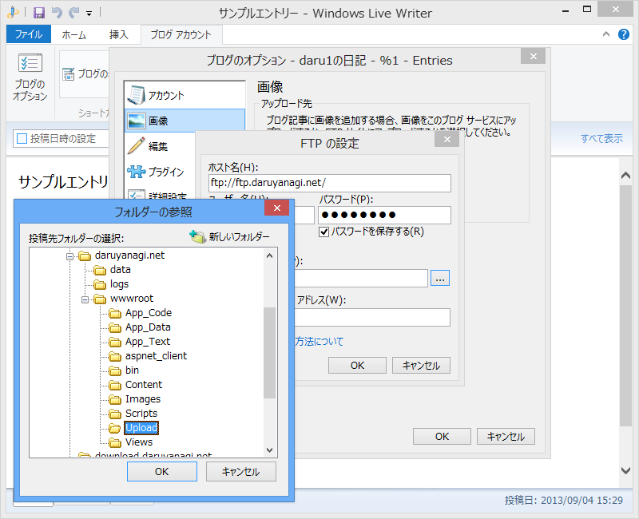

自前の FTP にアップロードして、ブログ記事からそれを参照するってわけだね。

あと、ブログを投稿したあとにブラウザーでプレビューを開くと……

ダッシュボードが開いてしまう。設定を間違ったのかなぁと思ったのだけど、アカウントのセットアップ時に正しくブログの URL を指定しても、AtomPub を検出するときにそれがダッシュボードの URL に書き換えられてしまうので、これは仕様としてあきらめるしかないみたい。

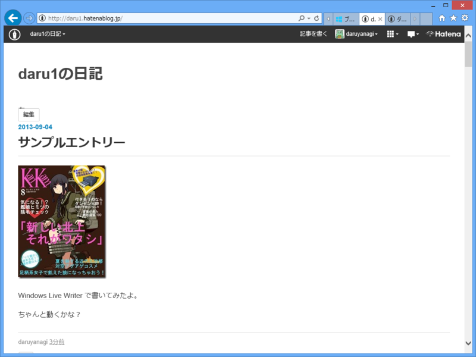

プレビューエンジンも公開してもらえれば、Windows 8 や Windows Phone 向けのクライアントもだれか作ってくれるかも。

<a href="#fn1" name="f1" class="footnote-number">*1</a>:ソースコード残ってたら再公開してみようっかな

