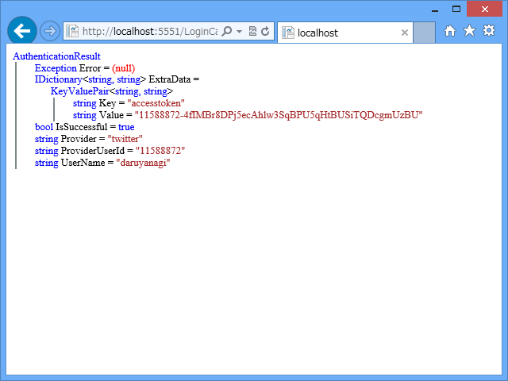

ちょっと Twitter と連携するアプリを作ってみたかったのだけど、“スターター サイト”テンプレートを使った例以外はあまり載っていなかったので、今回はそれを使わずに、“空のサイト”テンプレートから作ってみるよ。というのも、ググってたら自分のサイトが検索に引っかかって、<a href="https://blog.daruyanagi.jp/entry/2013/02/03/160915">WebMatrix 2&#xFF1A;OAuth &#x3067;&#x30ED;&#x30B0;&#x30A4;&#x30F3;&#x3059;&#x308B;&#xFF08;&#xFF12;&#xFF09; - &#x3060;&#x308B;&#x308D;&#x3050;</a> を放置することすでに半年経つことが判明したので……さすがにこの当時のことはあまりよく思い出せないのだけど、今回の記事がフォローアップのようなものになれば幸い。

<h3>下準備</h3>

まず NuGet で <a href="http://www.nuget.org/packages/Microsoft.AspNet.WebPages.OAuth/">NuGet Gallery | Microsoft.AspNet.WebPages.OAuth 3.2.7</a> をインストール。これで“スターター サイト”テンプレートでも使われている <a href="http://msdn.microsoft.com/ja-jp/library/microsoft.web.webpages.oauth.oauthwebsecurity(v=vs.111).aspx">OAuthWebSecurity Class (Microsoft.Web.WebPages.OAuth) | Microsoft Docs</a> が使えるようになる。

次に <a href="https://dev.twitter.com/apps/">https://dev.twitter.com/apps/</a> でアプリの登録を行っておく。登録祭の必須入力事項は以下のとおり。

<ul>
<li>Name: アプリの名前</li>
<li>Description: title</li>
<li>Website: <a href="http://127.0.0.1:****/">http://127.0.0.1:****/</a> （localhost は無効な URL として蹴られる）</li>
<li>Callback URL: <a href="http://127.0.0.1:****/">http://127.0.0.1:****/</a> （空っぽだと動かないっぽい）</li>
<li>Allow this application to be used to Sign in with Twitter: 無効化</li>
</ul>
アプリを登録したら、

<ul>
<li>Consumer key</li>
<li>Consumer secret</li>
</ul>
を取得し、~/_AppStart.cshtml で初期化を行う。

<pre class="code lang-cs" data-lang="cs" data-unlink>@{
// DB名: kenzo-memo.sdf
WebSecurity.InitializeDatabaseConnection(&quot;kenzou-memo&quot;, &quot;Users&quot;, &quot;UserId&quot;, &quot;Name&quot;, true);

OAuthWebSecurity.RegisterTwitterClient(
&quot;kFe1j**********LTcSizQ&quot;,
&quot;aKz6C**********Qzws06agyxRXImPk9sfETNQeg&quot;
);
}
</pre>
これで OAuthWebSecurity の twitter プロバイダーが利用できるようになる。このプロバイダーは OAuth 認証に必要な面倒事の一切を引き受けてくれる。

<h3>~/Default.cshtml</h3>

ログインしていない場合はログインボタンを、ログインしている場合はログオフのリンクを表示するだけの簡単なコード。

<pre class="code lang-cs" data-lang="cs" data-unlink>&lt;!DOCTYPE html&gt;

&lt;html lang=&quot;en&quot;&gt;
&lt;head&gt;
&lt;meta charset=&quot;utf-8&quot; /&gt;
&lt;title&gt;&lt;/title&gt;
&lt;/head&gt;
&lt;body&gt;
@if (User.Identity.IsAuthenticated)
{
&lt;p&gt;@User.Identity.Name&lt;/p&gt;
&lt;p&gt;&lt;a href=&quot;Logout.cshtml&quot;&gt;Logout&lt;/a&gt;&lt;/p&gt;
}
else
{
&lt;a href=&quot;~/Login.cshtml&quot;&gt;
&lt;img src=&quot;Twitter ボタンを用意する&quot; /&gt;
&lt;/a&gt;
}
&lt;/body&gt;
&lt;/html&gt;
</pre>
資格関連の情報は User.Identity （<a href="http://msdn.microsoft.com/ja-jp/library/system.web.httpcontext.user.aspx">HttpContext.User Property (System.Web) | Microsoft Docs</a>）でとれる。

<h3>~/Login.cshtml</h3>
<pre class="code lang-cs" data-lang="cs" data-unlink>@{
var returnUrl = Request.UrlReferrer.ToString();

OAuthWebSecurity.RequestAuthentication(
&quot;twitter&quot;, // プロバイダー名は文字列で指定
Href(&quot;~/LoginCallback&quot;, new { returnUrl })
);
}
</pre>
<b>OAuthWebSecurity.RequestAuthentication</b> で Twitter へリクエストを投げる。

おなじみのこの画面へ飛ばされる。

<h3>~/LoginCallback</h3>

Twitter で認証処理を行うと、~/LoginCallback にリダイレクトされてくるので、<b>OAuthWebSecurity.VerifyAuthentication</b> で検証し、成否を得る（今回で言えば result 変数）。Twitter でのログインが成功していたら、その資格情報（OAuth なのでパスワードはないけど）をデータベースに格納し（<b>OAuthWebSecurity.CreateOrUpdateAccount</b>）、アプリにログインさせる（<b>OAuthWebSecurity.Login</b>）。

<pre class="code lang-cs" data-lang="cs" data-unlink>@{
var returnUrl = Request[&quot;returnUrl&quot;];

// ログインの検証
var result = OAuthWebSecurity.VerifyAuthentication(
Href(&quot;LogonCallBack&quot;, new { ReturnUrl = returnUrl })
);

if (result.IsSuccessful)
{
// ログインが成功すると、
// - provider: twitter
// - ProviderUserId: twitter の ID
// - UserName: twitter のスクリーンネーム
// の3つが得られる。自動補完が効かないので変数に入れとく
var provider = result.Provider;
var providerUserId = result.ProviderUserId;
var userName = result.UserName;

// ユーザー名が Users テーブルに存在しない場合、
// あらかじめユーザー名を追加しておく。
// でないと CreateOrUpdateAccount() でコケる
using (var db = Database.Open(&quot;kenzou-memo&quot;))
{
const string SELECT = &quot;SELECT * FROM USERS WHERE Name=@0&quot;;
const string INSERT = &quot;INSERT INTO Users (Name) VALUES (@0)&quot;;

if (db.QuerySingle(SELECT, userName) == null)
{
db.Execute(INSERT, userName);
}
}

// CreateOrUpdate とか言ってるけど、
// やってることは Users テーブルと内部管理テーブルの紐づけ
OAuthWebSecurity.CreateOrUpdateAccount(
provider,
providerUserId,
userName);

// ログインチケットの発行
OAuthWebSecurity.Login(
provider,
providerUserId,
            createPersistentCookie: true);

Response.Redirect(returnUrl);
}
else
{
// ログインに失敗したときの処理
}
}
</pre>

成功するとこんなかんじにユーザーがデータベースに追加される。ちなみに result の中身はこんな感じ。

ObjectInfo.Print() はデバッグにとっても便利なヘルパーなのでぜひ覚えておいてね！

<h3>~/Logout.cshtml</h3>

最後にログアウトの処理も書いておく。

<pre class="code lang-cs" data-lang="cs" data-unlink>@{
var returnUrl = Request.UrlReferrer.ToString();

WebSecurity.Logout();

Response.Redirect(returnUrl);
}
</pre>
ログインの時はもっぱら <a href="http://msdn.microsoft.com/ja-jp/library/microsoft.web.webpages.oauth.oauthwebsecurity(v=vs.111).aspx">OAuthWebSecurity Class (Microsoft.Web.WebPages.OAuth) | Microsoft Docs</a> を使っていたけれど、ログアウトはいつもどおり <a href="http://msdn.microsoft.com/ja-jp/library/webmatrix.webdata.websecurity(v=vs.111).aspx">WebSecurity Class (WebMatrix.WebData) | Microsoft Docs</a> が使える。

<h3>まとめ</h3>

<ol>
<li>OAuthWebSecurity.RegisterTwitterClient で twitter プロバイダーを有効化</li>
<li>OAuthWebSecurity.RequestAuthentication で Twitter の認証画面へ飛ばす</li>
<li>OAuthWebSecurity.VerifyAuthentication で Twitter での認証がうまく言ったか確認</li>
<li>OAuthWebSecurity.CreateOrUpdateAccount でアプリのアカウントと紐付ける</li>
<li>OAuthWebSecurity.Login でアプリにログインする</li>
</ol>
“スターター サイト”テンプレートは手広い実装になっていて、その分複雑になっているけれど、アプリのアカウント＝ Twitter アカウントという運用でよいのならば、このように比較的簡単に実装できる。

