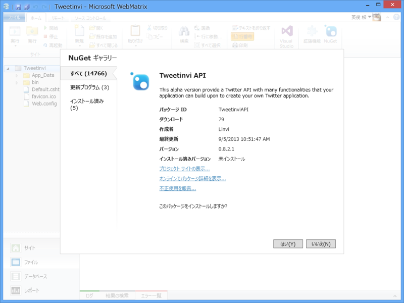
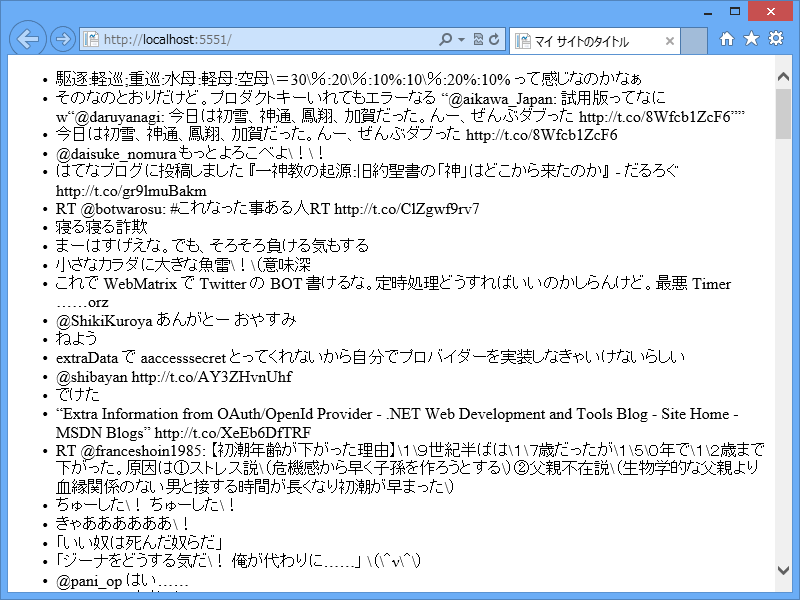

たまたま <a href="https://tweetinvi.codeplex.com/">Tweetinvi a friendly Twitter C# API - Home</a> というのをみかけたのだけど、割と便利だった。

<pre class="code lang-cs" data-lang="cs" data-unlink>@{
var token = new TwitterToken.Token(
&quot;*****************Pj5ecAhlw3SqBPU5qHtBUSiTQDcgmUzBU&quot;,
&quot;*****************RZSPVglcM0TfE7mPCFzm334rw&quot;,
&quot;*****************cSizQ&quot;,
&quot;*****************zws06agyxRXImPk9sfETNQeg&quot;);

if (IsPost)
{
var tweet = new Tweetinvi.Tweet(&quot;てすてす&quot;);
tweet.Publish(token);
}
}

&lt;!DOCTYPE html&gt;

&lt;html lang=&quot;ja&quot;&gt;
&lt;head&gt;
&lt;meta http-equiv=&quot;Content-Type&quot; content=&quot;text/html; charset=utf-8&quot;/&gt;
&lt;meta charset=&quot;utf-8&quot; /&gt;
&lt;title&gt;マイ サイトのタイトル&lt;/title&gt;
&lt;link href=&quot;~/favicon.ico&quot; rel=&quot;shortcut icon&quot; type=&quot;image/x-icon&quot; /&gt;
&lt;/head&gt;
&lt;body&gt;
&lt;ul&gt;
@foreach (var tweet in new Tweetinvi.User(&quot;daruyanagi&quot;, token).GetUserTimeline())
{
&lt;li&gt;@tweet.Text&lt;/li&gt;
}
&lt;/ul&gt;

&lt;form action=&quot;&quot; method=&quot;post&quot;&gt;
&lt;input type=&quot;submit&quot; /&gt;
&lt;/form&gt;
&lt;/body&gt;
&lt;/html&gt;
</pre>

GET でタイムラインを表示（なんかゴミ（\）が入ってるけど、バグかな。あとで報告しよう）。POST でツイート。

      てすてす

<a href="http://twitter.com/daruyanagi/status/376083703023157249" class="twitter-detail-info-permalink">2013-09-07 05:45:16</a> via <a href="http://127.0.0.1:5551/" rel="nofollow">建造メモ</a>

Twitter 系のライブラリってピンキリだけど、これは UserStreams も扱えるようで、悪くない感じかな。デスクトップアプリにも組み込める、というか、PIN の認証はあるけど Web アプリの認証は今のところ未実装みたいなので、どっちかっていうと今のところデスクトップアプリ向けって感じ。

<h3>不具合、直していただきました</h3>

<ul>
<li><a href="https://tweetinvi.codeplex.com/SourceControl/changeset/31484">Tweetinvi a friendly Twitter C# API - Source Code</a></li>
</ul>
レスポンス、ちょっぱや！　対応の早いところも推せますね、このライブラリ。ちなみに String.CleanString() という処理が入っているのが原因でした。

<blockquote>

If you want to store the Text in a database you can still use the extension method :  
String.CleanString() before the INSERT / UPDATE call. 

</blockquote>

String.CleanString() は String の拡張メソッドで、サニタイズだかエスケープだかをするのかな？　MySQL はぜんぜん知らない。

<pre class="code lang-cs" data-lang="cs" data-unlink>/// &lt;summary&gt;
/// Clean a string so that it can be used in a URL and
/// sent to Twitter
/// &lt;/summary&gt;
/// &lt;param name=&quot;s&quot;&gt;String to clean&lt;/param&gt;
/// &lt;returns&gt;Cleaned string&lt;/returns&gt;
public static string CleanString(this string s)
{
return s != null ? (s.HTMLDecode().MySQLClean().ReplaceNonPrintableCharacters('\\')) : null;
}
</pre>

