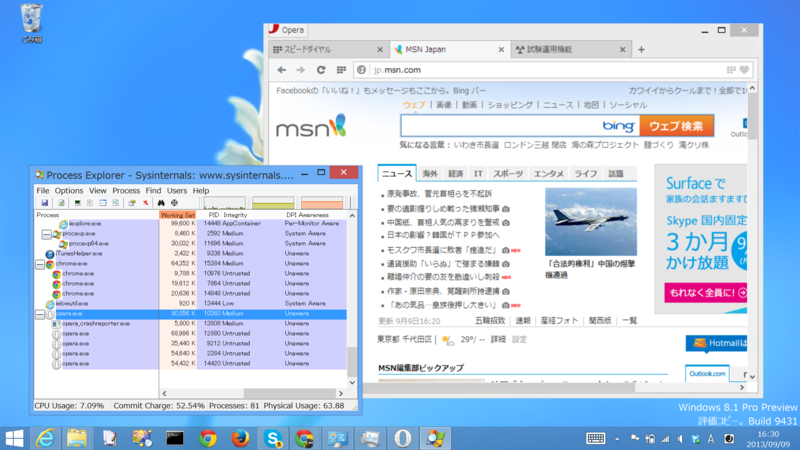
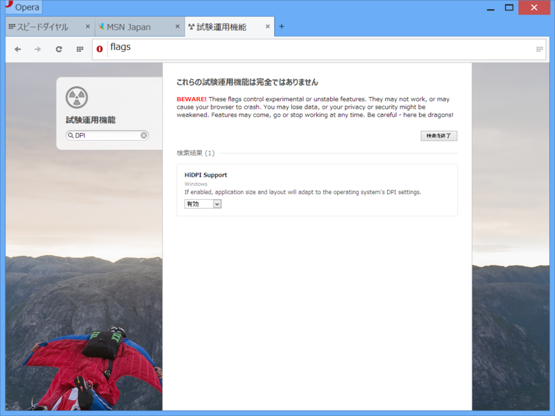
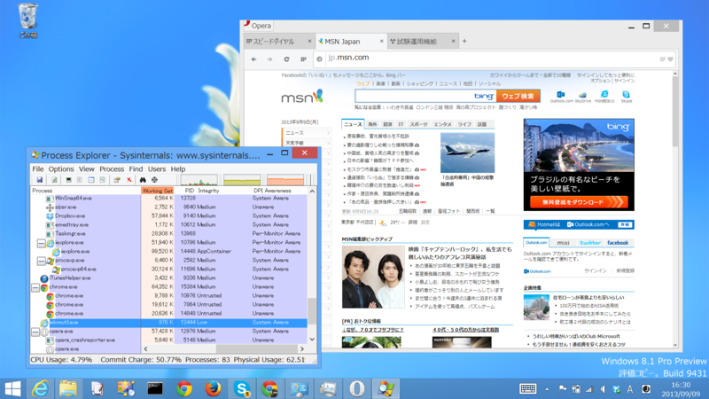
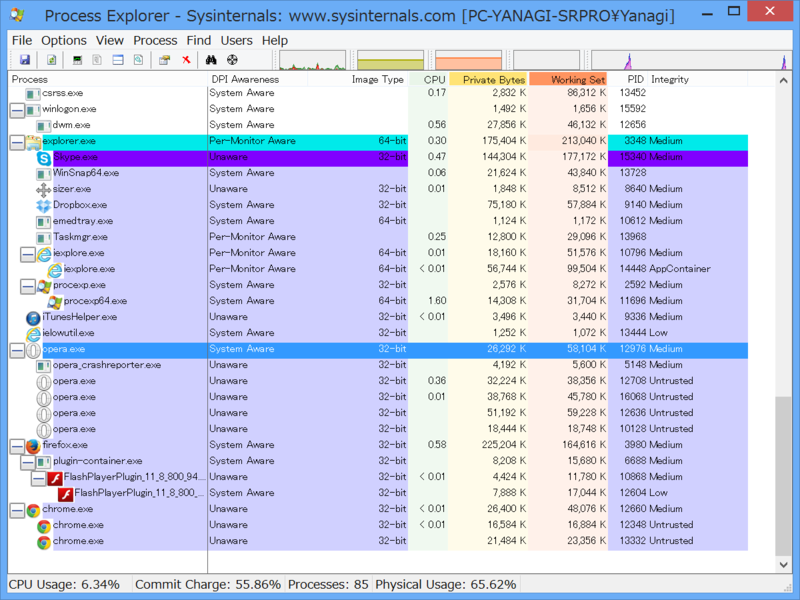

Windows 8.1 では“Per-Monitor DPI”がサポートされる。これはモニターごとに異なる DPI を設定したマルチモニター環境で、アプリがモニターの DPI 設定を認識し、自動でスケーリングするという機能だ。――まぁ、WM_DPICHANGED（0x02E0）メッセージが飛んでくるだけなので、アプリ側の対応が必須なのだけど。

<blockquote cite="http://my.opera.com/desktopteam/blog/2013/09/06/opera-17-next">

Besides bugfixes, the highlight of things of this Opera 17 Next release:

<ul>
<li>More settings and preferences, like startup handling options, manage search engines,</li>
<li>Pinned tabs,</li>
<li>DPI aware on Windows,</li>
<li>Enhanced extensions APIs and possibility to hide extensions buttons.</li>
</ul>
<cite><a href="http://my.opera.com/desktopteam/blog/2013/09/06/opera-17-next">Opera Desktop Team - Opera 17 Next</a></cite>
</blockquote>

「Opera 17 Next」（<a href="http://www.forest.impress.co.jp/docs/news/20130909_614656.html">Opera&#x3001;&#x300C;Opera 17&#x300D;&#x306E;&#x30D9;&#x30FC;&#x30BF;&#x7248;&#x300C;Opera 17 Next&#x300D;&#x3092;&#x516C;&#x958B; - &#x7A93;&#x306E;&#x675C;</a>）ではなんと“DPI aware on Windows”なのだそうで、これが“Per-Monitor DPI”なのかなぁ、と期待していたのだけど。

ちゃんとスケーリングせえへん。ただ拡大しているだけなので、表示がぼやけてる。

実はこれ“試験運用機能”として提供されていて、opera://flags で有効にして Opera を再起動しなきゃいけない。

とりあえず、できた。クッキリカッチリ、美しいレンダリングだ。

でもこれ、実は――

“System Aware”！　これは単に「システムの DPI 設定をアプリに反映させますよ」というだけのもので、モニターごとの DPI 設定を検知する“Per-Monitor Aware”ではない。とても残念だ。

ちなみに、4大（？）ブラウザーの対応状況を調べてみたところ、以下の通りになった。ちなみに、<a href="http://www.forest.impress.co.jp/docs/news/20130805_610426.html">Windows Sysinternals&#x3001;&#x9AD8;&#x6A5F;&#x80FD;&#x30BF;&#x30B9;&#x30AF;&#x30DE;&#x30CD;&#x30FC;&#x30B8;&#x30E3;&#x30FC;&#x300C;Process Explorer&#x300D;v15.4&#x3092;&#x516C;&#x958B; - &#x7A93;&#x306E;&#x675C;</a> を使うと簡単に調べられる（要 Windows 8.1）。

<table>
<tr>
<td></td>
<td>初期状態</td>
<td>拡張設定</td>
</tr>
<tr>
<td>Internet Explorer 11</td>
<td>Per-Monitor Aware</td>
<td>-</td>
</tr>
<tr>
<td>Google Chrome 29</td>
<td>Unaware</td>
<td>Unaware（項目はあるが動作しない）</td>
</tr>
<tr>
<td>Mozilla Firefox 23</td>
<td>System Aware</td>
<td>-</td>
</tr>
<tr>
<td>Opera 17</td>
<td>Unaware</td>
<td>System Aware</td>
</tr>
</table>
ブラウザーによって Stable だったり Beta だったりが不公平だけど、そこは勘弁して。とりあえずシステムにインストールされていたブラウザーで試しただけで……全部統一するのは面倒臭かったのデス。

それにしても、Google Chrome の未対応はとくに残念。Flag はあるのだけど、自分の環境では動作しなかった。Surface Pro の DPI 設定は初期状態で 150％ なので、最近アプリの High DPI 対応に敏感になっているのだよね。非対応アプリだと表示がボヤけてあかん。クロスプラットフォームなアプリはここらへんの対応が全体的に弱い印象。Windows Forms？　知らない子ですね……。

<ul>
<li>参考: <a href="http://www.slideshare.net/manatokameya/ss-23981128">&#x30C7;&#x30B9;&#x30AF;&#x30C8;&#x30C3;&#x30D7; &#x30A2;&#x30D7;&#x30EA;&#x304C;&#x3053;&#x306E;&#x5148;&#x751F;&#x304D;&#x306E;&#x3053;&#x308B;&#x306B;&#x306F;</a></li>
</ul>