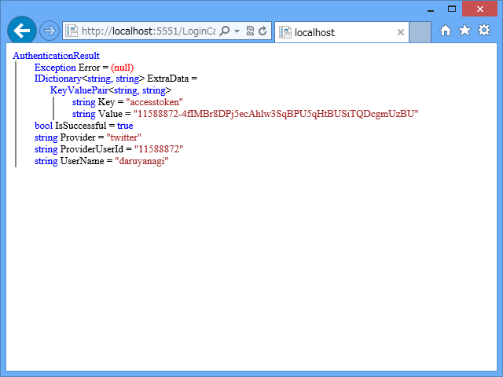
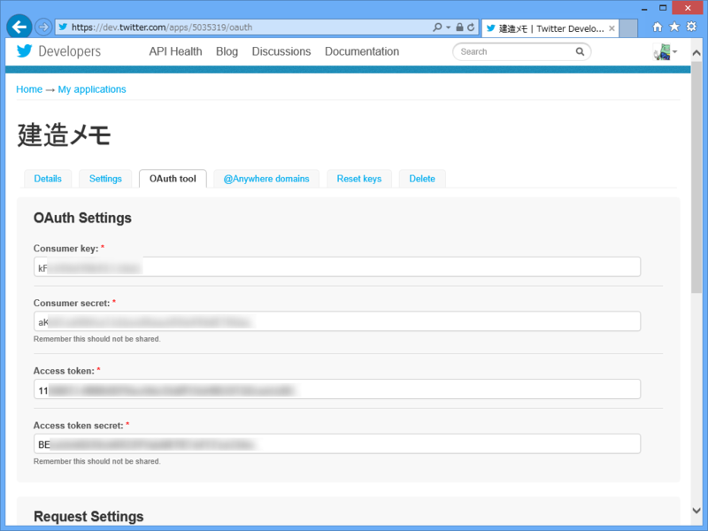
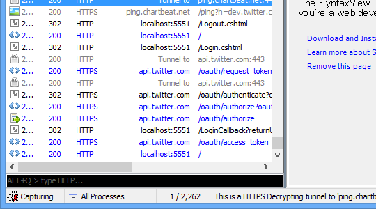
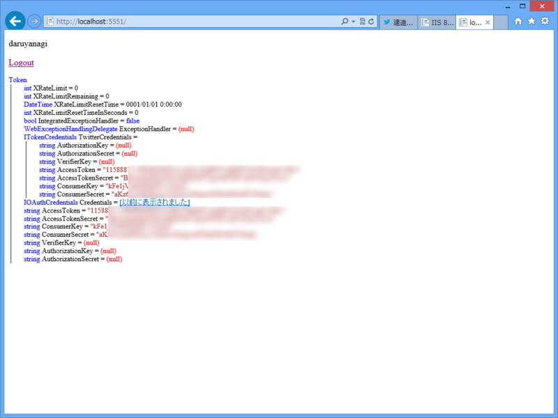

<a href="https://blog.daruyanagi.jp/entry/2013/09/05/070245">WebMatrix 3: Twitter &#x3067;&#x30ED;&#x30B0;&#x30A4;&#x30F3;&#x3059;&#x308B; - &#x3060;&#x308B;&#x308D;&#x3050;</a> でめでたく Twitter でのログインが実現できたのだけど、実はひとつ問題があった。

AccessTokenSecret が取れない。

自分もあんまりよくわかっていないのだけど、Twitter の API を利用するには以下の情報が必要であるみたい。

まず、これ。アプリが Twitter へアクセスするために必要。

<ul>
<li>ConsumerKey</li>
<li>ConsumerSecret</li>
</ul>
次に、これ。ユーザーに成り代わって Twitter の API を使うために必要。

<ul>
<li>AccessKey</li>
<li>AccessKeySecret</li>
</ul>
アプリの登録画面で取得できる AccessKey/AccessKeySecret はアプリを登録したユーザーのアクセスキー。このアプリにログインしたユーザーとして API を利用するには、そのユーザーに対して発行される AccessKey/AccessKeySecret が必要だ。

でも、OAuthWebSecurity では ExtraData から AccessKey をもらうことはできても、AccessKeySecret まではくれないみたい。

通信を Fiddler でみてみた。ちゃんと authorize したあとに access_token している（ここで AccessKey がもらえる）から、ついでに AccessKeySecret もとってきてくれてもよさそうなのだけど。なにか理由があるのかもしれないが、これではちょっと困る。 

これを解決するには、Twitter プロバイダーを自分で実装すればよいようだ。

<pre class="code lang-cs" data-lang="cs" data-unlink>// ~/App_Code/TwitterClient.cs

using DotNetOpenAuth.AspNet;
using DotNetOpenAuth.AspNet.Clients;
using DotNetOpenAuth.Messaging;
using DotNetOpenAuth.OAuth;
using DotNetOpenAuth.OAuth.ChannelElements;
using DotNetOpenAuth.OAuth.Messages;
using System.Collections.Generic;

// http://stackoverflow.com/questions/12198734/getting-twitter-access-secret-using-dotnetopenauth-in-mvc4

public class TwitterClient : OAuthClient
{
/// &lt;summary&gt;
/// The description of Twitter's OAuth protocol URIs for use with their &quot;Sign in with Twitter&quot; feature.
/// &lt;/summary&gt;
public static readonly ServiceProviderDescription TwitterServiceDescription = new ServiceProviderDescription
{
RequestTokenEndpoint =
new MessageReceivingEndpoint(
&quot;https://api.twitter.com/oauth/request_token&quot;,
HttpDeliveryMethods.GetRequest | HttpDeliveryMethods.AuthorizationHeaderRequest),
UserAuthorizationEndpoint =
new MessageReceivingEndpoint(
&quot;https://api.twitter.com/oauth/authenticate&quot;,
HttpDeliveryMethods.GetRequest | HttpDeliveryMethods.AuthorizationHeaderRequest),
AccessTokenEndpoint =
new MessageReceivingEndpoint(
&quot;https://api.twitter.com/oauth/access_token&quot;,
HttpDeliveryMethods.GetRequest | HttpDeliveryMethods.AuthorizationHeaderRequest),
TamperProtectionElements = new ITamperProtectionChannelBindingElement[] { new HmacSha1SigningBindingElement() },
};

public TwitterClient(string consumerKey, string consumerSecret) :
base(&quot;twitter&quot;, TwitterServiceDescription, consumerKey, consumerSecret) { }
protected override AuthenticationResult VerifyAuthenticationCore(AuthorizedTokenResponse response)
{
string accessToken = response.AccessToken;
string accessSecret = (response as ITokenSecretContainingMessage).TokenSecret;
string userId = response.ExtraData[&quot;user_id&quot;];
string userName = response.ExtraData[&quot;screen_name&quot;];

var extraData = new Dictionary&lt;string, string&gt;()
{
{&quot;accesstoken&quot;, accessToken},
{&quot;accesssecret&quot;, accessSecret}
};
return new AuthenticationResult(
            isSuccessful: true,
            provider: ProviderName,
            providerUserId: userId,
            userName: userName,
            extraData: extraData);
}
}
</pre>
結果はこんな感じ。いつもどおり ObjectInfo.Print() で中身を見てみたよ。

実装としてどうするのが理想的なのかはよくわからないけれど、とりあえずユーザーを管理するテーブルを拡張して、アクセスキーを保管しておくのとかどうでしょうか。

<pre class="code lang-cs" data-lang="cs" data-unlink>@{
var returnUrl = Request[&quot;returnUrl&quot;];

// ログインの検証
var result = OAuthWebSecurity.VerifyAuthentication(
Href(&quot;LogonCallBack&quot;, new { ReturnUrl = returnUrl })
);

if (result.IsSuccessful)
{
// ログインが成功すると、
// - provider: twitter
// - ProviderUserId: twitter の ID
// - UserName: twitter のスクリーンネーム
// の3つが得られる。自動補完が効かないので変数に入れとく
var provider = result.Provider;
var providerUserId = result.ProviderUserId;
var userName = result.UserName;
var accessToken = result.ExtraData[&quot;accesstoken&quot;];
var accessTokenSecret = result.ExtraData[&quot;accesssecret&quot;];

&lt;p&gt;@ObjectInfo.Print(result.ExtraData)&lt;/p&gt;

// ユーザー名が Users テーブルに存在しない場合、
// あらかじめユーザー名を追加しておく。
// でないと CreateOrUpdateAccount() でコケる
using (var db = Database.Open(&quot;kenzou-memo&quot;))
{
const string SELECT = &quot;SELECT * FROM USERS WHERE Name=@0&quot;;
const string INSERT = &quot;INSERT INTO Users (Name, AccessToken, AccessTokenSecret) VALUES (@0, @1, @2)&quot;;
const string UPDATE = &quot;UPDATE Users SET AccessToken=@1, AccessTokenSecret=@2 WHERE Name=@0&quot;;

if (db.QuerySingle(SELECT, userName) == null) // この処理を追加してみました
{
db.Execute(INSERT, userName, accessToken, accessTokenSecret);
}
else
{
db.Execute(UPDATE, userName, accessToken, accessTokenSecret);
}
}

// CreateOrUpdate とか言ってるけど、
// やってることは Users テーブルと内部管理テーブルの紐づけ
OAuthWebSecurity.CreateOrUpdateAccount(
provider,
providerUserId,
userName);

// ログインチケットの発行
OAuthWebSecurity.Login(
provider,
providerUserId,
            createPersistentCookie: true);

Response.Redirect(returnUrl);
}
else
{
// ログインに失敗したときの処理
}
}
</pre>
自分でプロバイダーを実装するのはそこはかとなくめんどくさいけれど、丸コピで動くのでまぁ、よし。プロバイダーをどうやって実装するのかも少し分かったし。練習として、ほかのサービスを実装してみるのもよいかもしれない。最近なんかだと GitHub なんかが需要ありそうだ。
 

