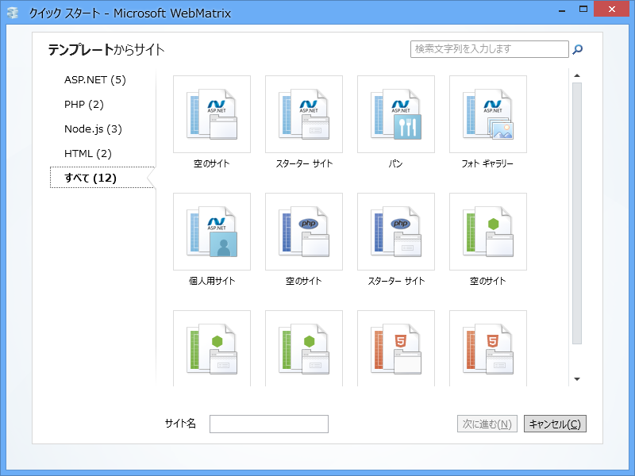
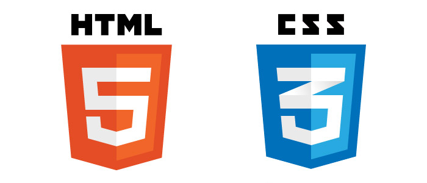
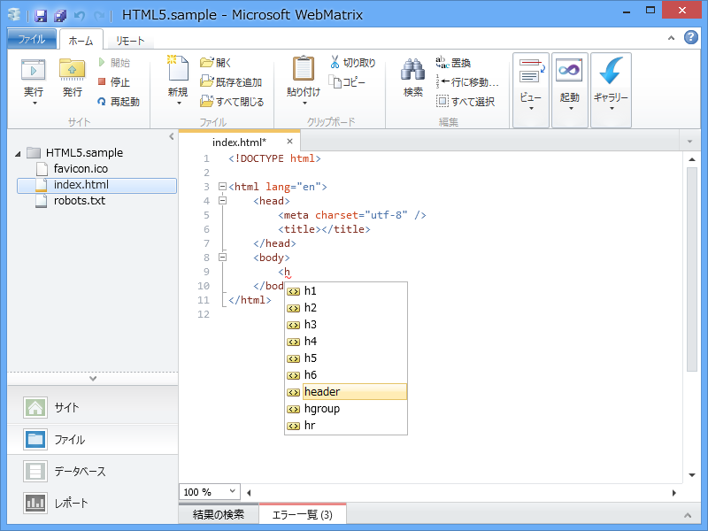

（289日前に書かれた下書きに加筆・修正を加えてみたけど公開レベルに達せず。でも、公開してみるなど）

「WebMatrix 2」を起動してみました。新しい Web サイトを作成するには、“テンプレート”か“アプリ ギャラリー”を選択します。今回は“テンプレート”を選択してみました。

「WebMatrix 2」では大きく分けて4つのテクノロジーが利用可能です。

<h3>静的な Web ページ</h3>

<h4>HTML（＋CSS）</h4>

Web ページを作るには、クライアントサイド（おもに Web ブラウザー）で表示するための HTML のソースコード（およびスタイルシート、スクリプト）を出力しなければなりません。「WebMatrix 2」では、HTML を記述するための便利な機能が豊富に備わっています。

後述する ASP.NET、PHP、Node.js も、要はサーバー側（サーバーサイド）で HTML を出力するためのものです。

<h3>動的な Web ページ（サーバーサイドで動的に出力）</h3>

内容が変わらない、“ペライチ”（<a href="http://kotonoha.cc/no/142458">&#x30B3;&#x30C8;&#x30CE;&#x30CF; - &ldquo;&#x30DA;&#x30E9;&#x3044;&#x3061;&rdquo;&#x306E;&#x610F;&#x5473;&#x304C;&#x5206;&#x304B;&#x308B;</a> あんまり使われない？）の Web ページを作るのならば HTML だけでもいいのですが、

<ul>
<li>データベースと連携した検索ページなど、内容を動的に変更させたい</li>
<li>テーマやサイドバー、ウィジェットなど、各 Web ページで共通の部分をひとまとめにしたい</li>
</ul>
といった場合には、サーバー側で動的に HTML を生成する仕組みがあると便利です。WebMatrix では、そのために以下の3つのテクノロジーがサポートされています。

<h4>ASP.NET</h4>

ASP.NET は、.NET 言語（C# や Visual Basic）を利用して HTML を出力できます。

ASP.NET にも色々あるのですけど、「WebMatrix 2」ではおもにその一部である“ASP.NET Web Page 2”が利用できます<a href="#f1" name="fn1" title="ほかの技術――ASP.NET MVC など――も扱えないことはないですが、そのような複雑な技術を利用する場合はツールによるサポートが充実した「Visual Studio」を利用するべきでしょう">*1</a>。

<h4>PHP</h4>

PHP: Hypertext Preprocessor は、HTML を出力するためのプログラミング言語です。ちまたにある Web アプリケーションの多くは PHP で記述されているので、知っておくと便利かも。

<h4>Node.js</h4>

Node.js は、クライアントサイドで使い慣れた JavaScript をサーバーサイドでも使ってしまえという、なんとも無謀で楽しそうなプロジェクトです。JavaScript が好きならば挑戦するのもありでしょう。

<a href="#fn1" name="f1" class="footnote-number">*1</a>:ほかの技術――ASP.NET MVC など――も扱えないことはないですが、そのような複雑な技術を利用する場合はツールによるサポートが充実した「Visual Studio」を利用するべきでしょう

