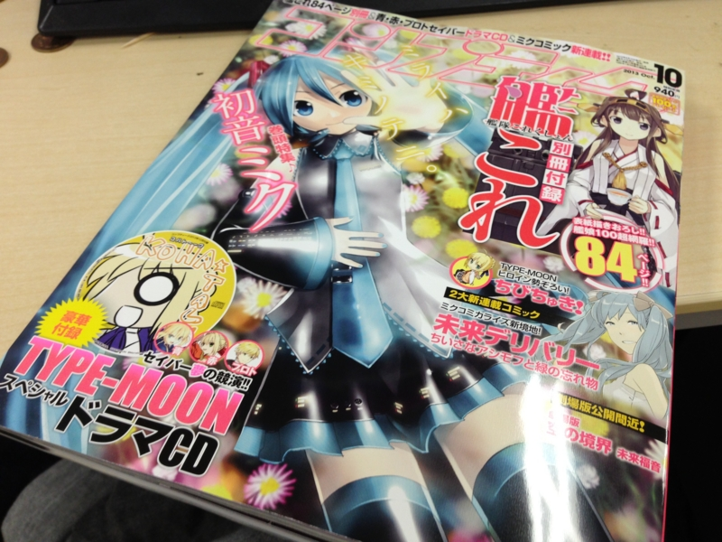

いまさらでなんですが、艦これ付録がつくという『コンプティーク2013年10月号』、自分も買ってみました。<b>Amazon で転売ヤーから</b>。まぁ、なんていうか探すのがめんどくさかったというのと、早く読みたかったというのと、重版がないらしいし（やるだろうけど）万が一手に入らなかったら嫌だなというのと、<b>艦これの資源セットを1個買ったと思えばいいじゃん</b>という訳のわからない理屈で、結局、定価の1,000円増しで購入しました。<i>あかん、龍驤ちゃんのイラストがかわいくてもう勘弁たまらん。</i>Lv 35 で放置している怠慢を恥じ、せめてちとちよ改ニ以上には育て上げようと決意を新たにした（現在、Lv 40）。

結局、最新技術てんこ盛りのコンドームもびっくりの品薄（<a href="http://www.j-cast.com/2013/09/09183405.html">&#x76F8;&#x6A21;&#x30B4;&#x30E0;&#x3084;&#x30AA;&#x30AB;&#x30E2;&#x30C8;&#x306B;&#x30B3;&#x30F3;&#x30C9;&#x30FC;&#x30E0;&#x300C;&#x4E94;&#x8F2A;&#x7279;&#x9700;&#x300D;&#xFF1F; &#x30ED;&#x30F3;&#x30C9;&#x30F3;&#x3067;&#x306F;15&#x4E07;&#x500B;&#x304C;&#x308F;&#x305A;&#x304B;5&#x65E5;&#x3067;&#x54C1;&#x8584;&#x306B; (1/2) : J-CAST&#x30CB;&#x30E5;&#x30FC;&#x30B9;</a>）を記録したこの『コンプティーク2013年10月号』、重版されるとの由。

<blockquote cite="http://prtimes.jp/main/html/rd/p/000000257.000007006.html">

平素は格別なご高配を賜り、厚く御礼申し上げます。角川書店発行のデジタルコンテンツ情報雑誌『コンプティーク』10月号が、９月10日の発売と同時に沢山のお客様にご購買いただき、各書店にて完売となっております。それに伴い、多数のお客様より「書店に置いていない」、「掲載マンガの続きが読めない」、「付録が手に入らない」などのお声を頂いており、ご迷惑をおかけしました。そこで角川書店は『コンプティーク』10月号の緊急重版を決定いたしました。９月下旬に再度発売を予定しております。本誌に多大なるご支援を頂いたことを改めて御礼申し上げます。

<cite><a href="http://prtimes.jp/main/html/rd/p/000000257.000007006.html">&#x30C7;&#x30B8;&#x30BF;&#x30EB;&#x30B3;&#x30F3;&#x30C6;&#x30F3;&#x30C4;&#x60C5;&#x5831;&#x8A8C;&#x300E;&#x30B3;&#x30F3;&#x30D7;&#x30C6;&#x30A3;&#x30FC;&#x30AF;&#x300F;10&#x6708;&#x53F7; &#x4E00;&#x90E8;&#x66F8;&#x5E97;&#x5B8C;&#x58F2;&#x306B;&#x3064;&#x304D;&#x3001;&#x7DCA;&#x6025;&#x91CD;&#x7248;&#x6C7A;&#x5B9A;&#x3002;&#xFF5C;&#x682A;&#x5F0F;&#x4F1A;&#x793E;KADOKAWA&#x306E;&#x30D7;&#x30EC;&#x30B9;&#x30EA;&#x30EA;&#x30FC;&#x30B9;</a></cite>
</blockquote>

このニュース、最近くらい話題しかなかった出版業界のみなさまはおおむね好意的に受け取っていたのようなのだけど……<i>お前ら、ちょっと反省した方がいい。</i>商売下手にも程があるだろ。

自分がこの雑誌を一冊でも多く売りたいと願う社長だったら、早い段階で「（確約が取れてなくても）重版します」って言うけどね。さすがにモノも確保せずに重版を確約するのは信義上問題があるというのだったら、「ご迷惑をお掛けしています。重版を検討中です（ダメだったらゴメンネ ☆（ゝω・）vｷｬﾋﾟ」とでも言えばイイ。それだけで買い占め＆転売騒ぎは抑えられ、転売ヤーの懐におさまるはずだったおカネはめでたく出版元のポッケにないないされるわけですよ。

そのチャンスをみすみす逃したわけだ。そんなことばっかりしてりゃ、そりゃ、業界も射陽にもなるだろうよ。どの面下げて経営してんだろう……まったく。自分が従業員だったら、ちょっと怒ってると思う。

あと、付録の緊急増産がムズかしくて重版が容易でないという観測も耳にしたけれど、売り上げを上げるために付けた付録が足を引っ張って売り上げを逃したというのならば、それもそれでマヌケな話だと思う。まぁ、付録がなかったら今回の火もつかなかったのだろうけど。

ともあれ、10年以上ぶりに買った『コンプティーク』だが、当時の面影もあまり感じられず。内容もほとんど読むべきところがなかった。結局、艦これの付録を舐めるように読んだだけで、ビックリマンチョコのシールだけ抜いてチョコを捨てるような真似をしてしまって、少し申し訳ない気分になっている。でも、まだコレが買えるっていうのは正直スゴいな。ちょっと尊敬する。

さてはて、『コンプティーク』といえば個人的にはアレなのだけど……ソッチのほうも今年はなにか動きがあるみたい。

<blockquote cite="http://www.kadokawa.co.jp/sp/lodosswar25th/">

2013年、スニーカー文庫は25周年を迎えます。その創刊当時、またたく間に当時の若者を虜にし、スニーカー文庫の名を広めたのが、日本ファンタジーの代表作『ロードス島戦記』です。

共に25周年を迎える本年、『ロードス島戦記　灰色の魔女』を新たな装いで世に送り出します！

<cite><a href="http://www.kadokawa.co.jp/sp/lodosswar25th/">&#x30ED;&#x30FC;&#x30C9;&#x30B9;&#x5CF6;&#x6226;&#x8A18;&#x751F;&#x8A95;25&#x5468;&#x5E74;&#xFF5C;web KADOKAWA</a></cite>
</blockquote>

ほんとに懐かしくて、だいぶ期待している。またむかしの友だちを集めてテーブルトークRPGとかやってみたいね。自分はマイリーの神官戦士（ドワーフ・♂）の役回りが好きだ。

