
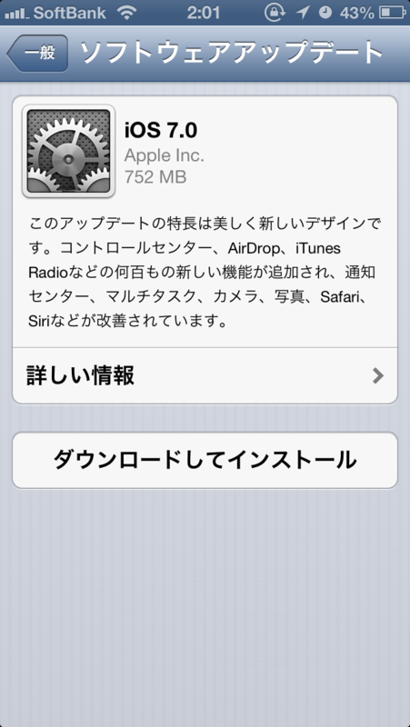 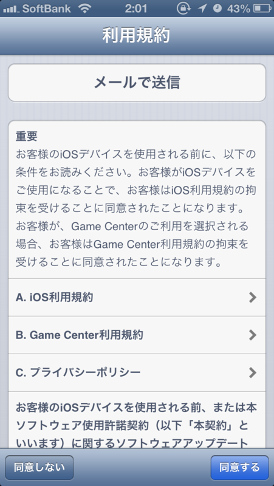 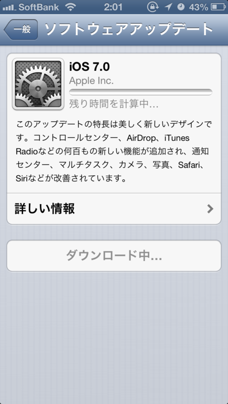 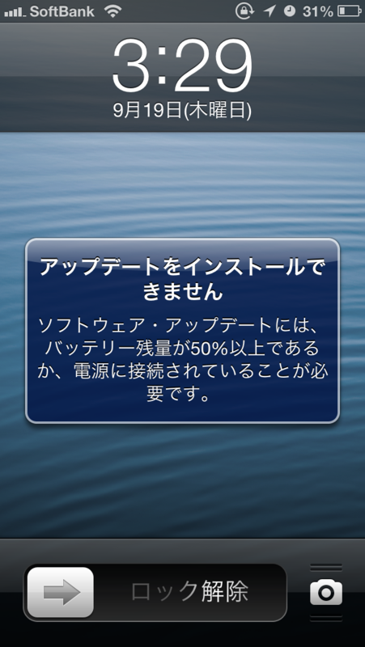

バッテリーが足りなくて失敗した！　ちゃんとケーブルを繋げてやり直し。

<h3>セットアップ</h3>

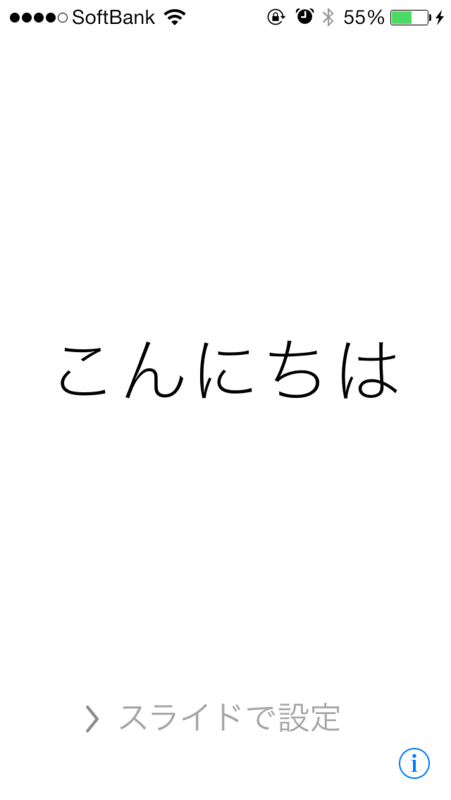 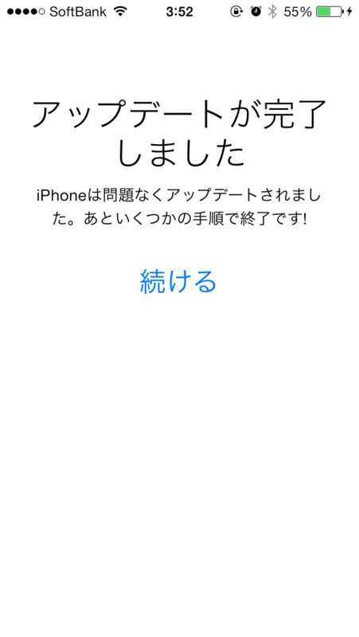 

しばらく放置したあとに見に行くと、アップデートが終わっていた。Windows Phone の時も少し思ったけど、白背景がちょっと眩しいな。

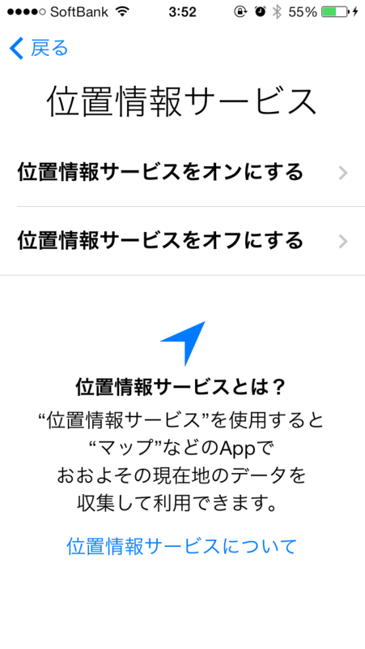 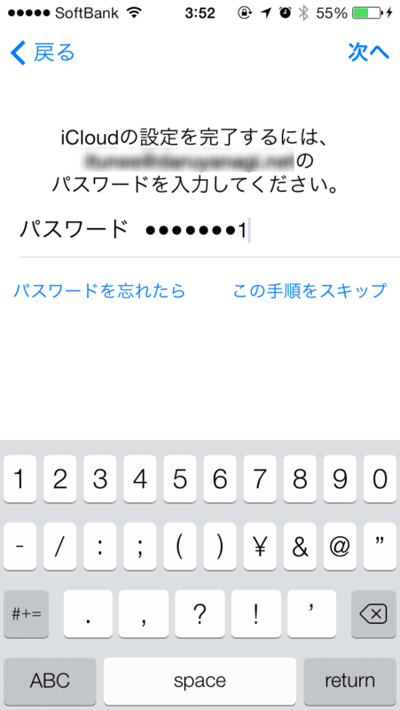 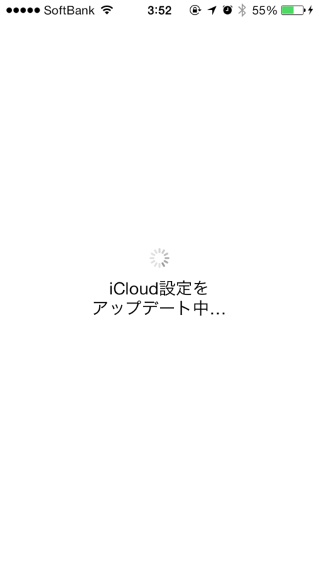 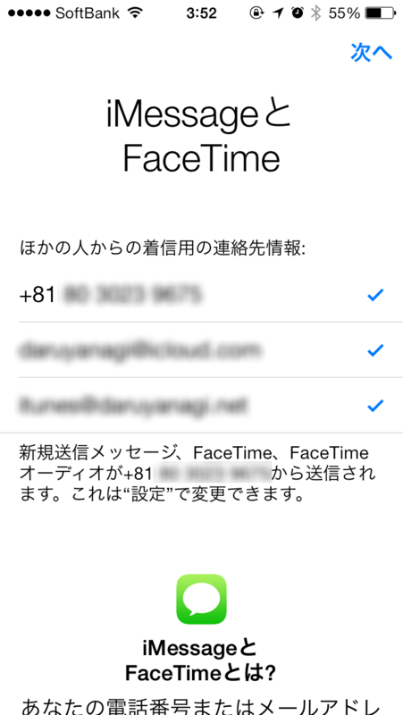 

位置情報サービスのON/OFF、iCloud のパスワード入力、iMessage および FaceTime の設定を行う。キーボードが新しくなってるけど、古いアプリはむかしのままみたい。

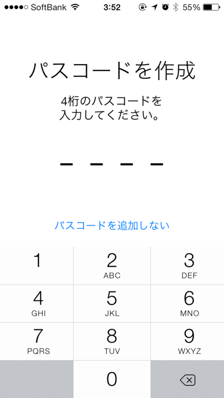 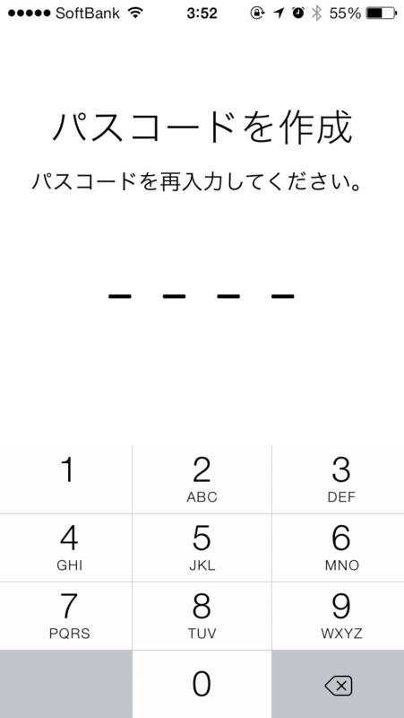

パスコードを二回入力。今まで設定してなかのだけど（めんどくさいじゃん？）、これを機に追加しておいた。これでネコが勝手に Twitter で変態ポストをしたりするといった事故が防げるはず。

 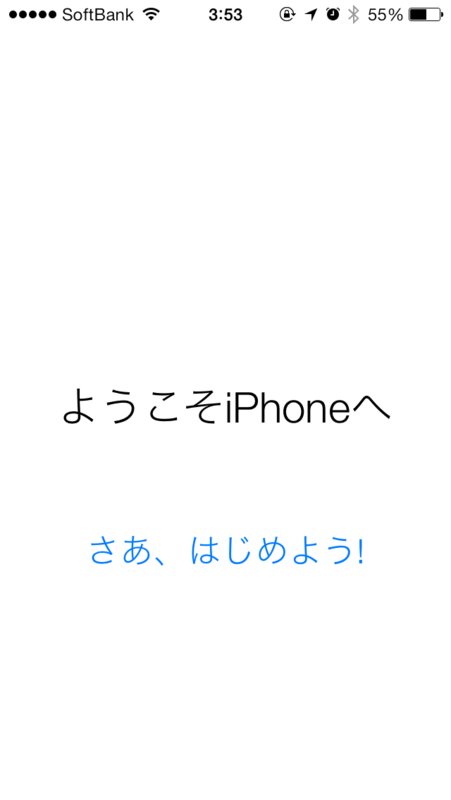

さいごにユーザー登録をして終わり。

<h3>チョビっと使ってみて思ったこと</h3>

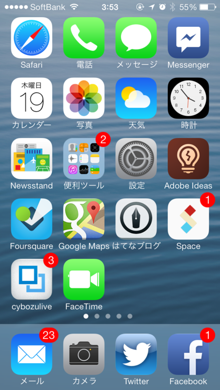 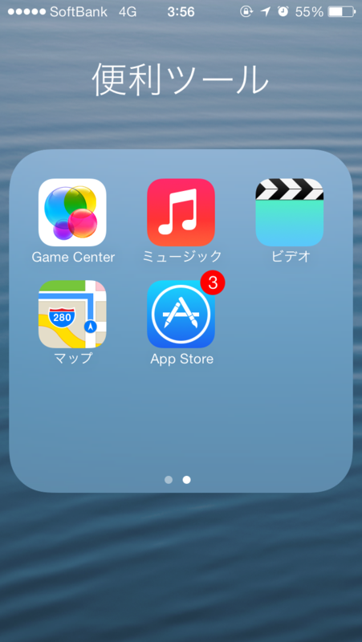 

割りと動作が重くて、スクリーンショットを撮影するときの効果音が遅れたり割れたりする。フォルダで一覧できるアプリアイコンが減って、スライダーがでるようになってしまった。

ホーム画面のアイコンはフラットになり、縁がなくなった。そのせいか、心持ち大きくみえる。

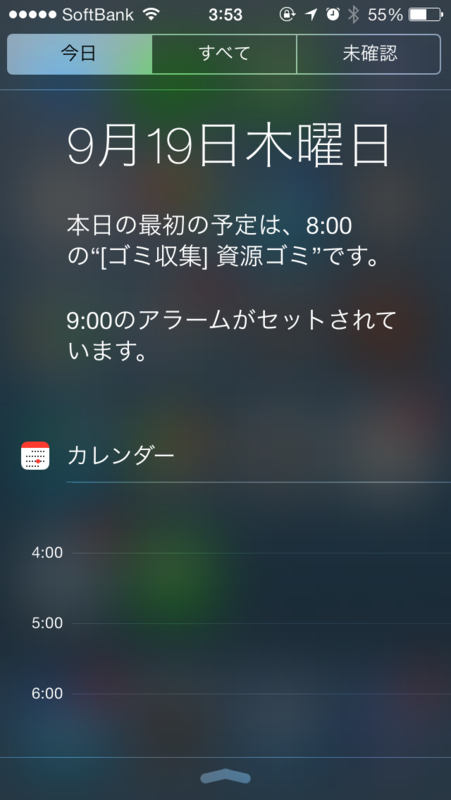 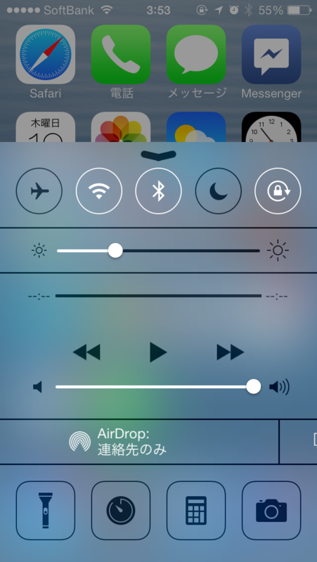 

画面上からのスワイプに加えて、画面下からのスワイプで色々パネルが出せるようになったけど、これは割りと便利だ。ただ、ちょっといろいろ突っ込みすぎかなと思わないでもない。このパネルはロック画面からでも呼び出せる。

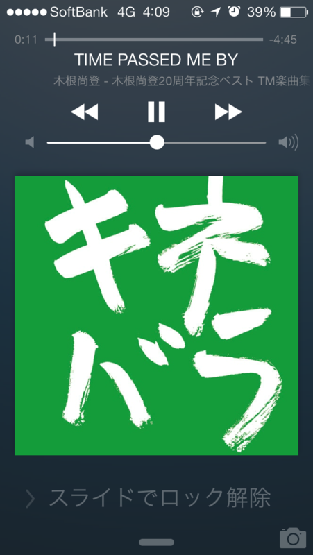 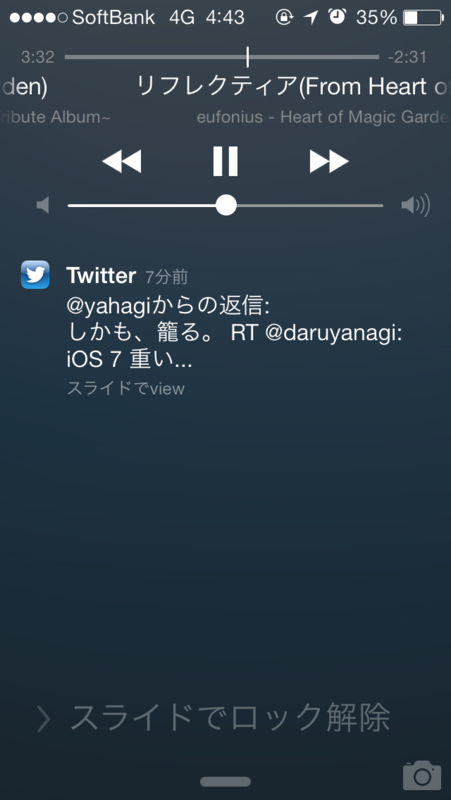

そのロック画面はこんな感じに（ミュージックの再生時）。通知がある場合はアルバムアートが省略される。

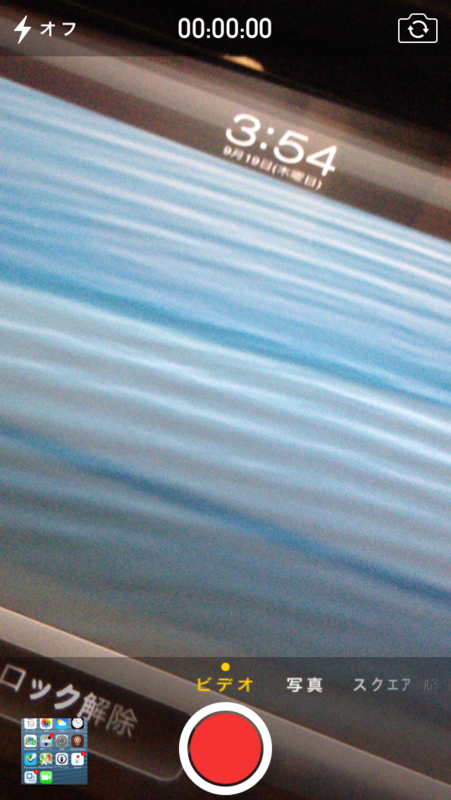 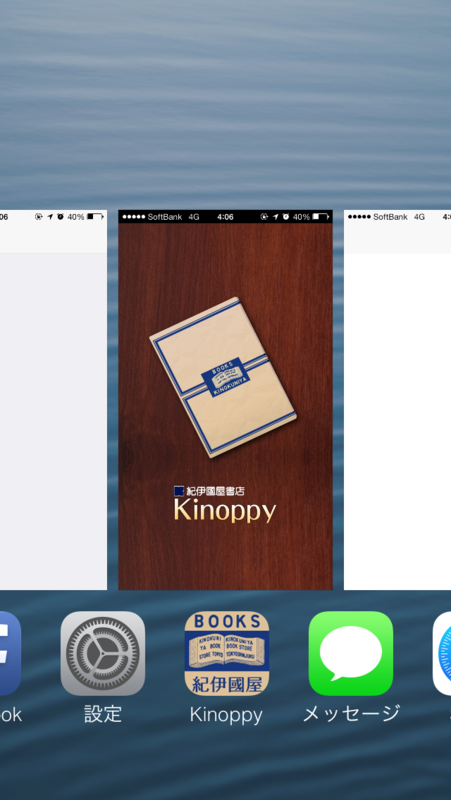

カメラとアプリスイッチャーはかなり気に入った。

カメラでは横スワイプでビデオやカメラといった撮影モードが切り替えられる。パノラマモードは使うかどうかしらんけど、まぁ、面白くはある。エフェクトも付けられるのな。

アプリスイッチャーはなぜ初めからこうじゃなかったのかと小一時間問いつめたい。少し Windows Phone 風になった感じ。

<h3>まとめになっていないまとめ</h3>

割りと便利になったところもあるけれど、ちょっと重い。これだったら iPhone 5C より iPhone 5S 狙いたくなるかも。

