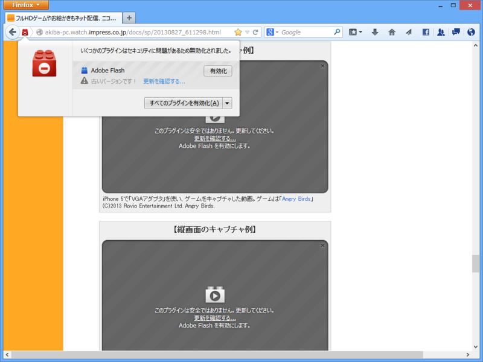
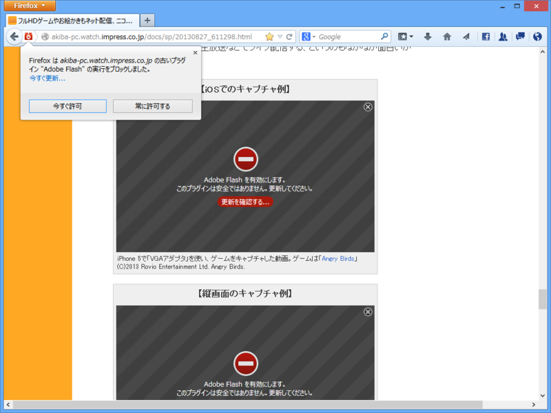
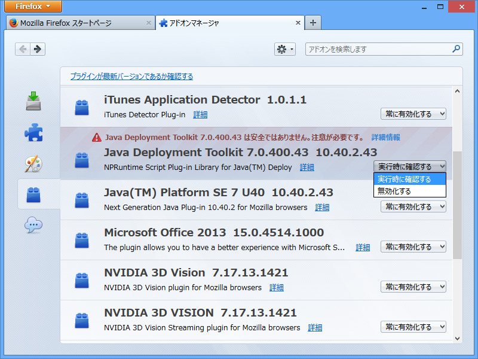
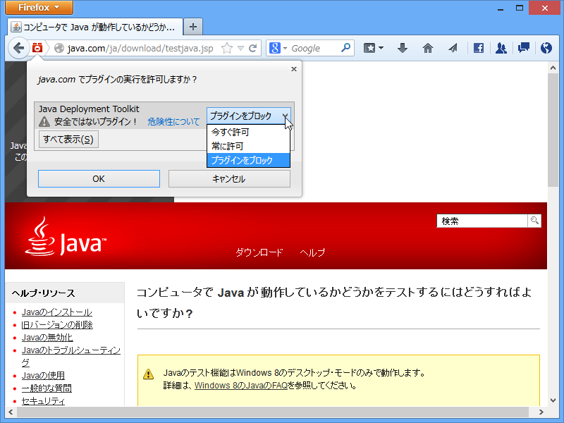

Firefox 23 以前。

Firefox 24 以降。

「Adobe Flash Player」の旧バージョンをインストールして試してみた。

<h3>Java Deployment Toolkit</h3>

<blockquote cite="http://www.java.com/ja/download/faq/deployment_toolkit.xml">

Java DT は、ユーザーのシステムに適したバージョンの Java の取得を管理するために、Java アプレットおよびアプリケーションにより使用される、非常に役に立つツールです。開発者は、JavaScript インタフェースも使用できます。このインタフェースは、Rich Internet Applications (RIA) の配備に必要な HTML コードを自動的に生成します。

<cite><a href="http://www.java.com/ja/download/faq/deployment_toolkit.xml">Java Deployment Toolkit &#x3068;&#x306F;</a></cite>
</blockquote>

Java DT はブラウザー単位で“常に有効化”できない（このバージョンからというわけではない。このブロックリストは外部で管理されているのかな？　よく知らないので今度調べてみる）。

ドメイン単位で有効化することはできる。今後はすべてのプラグインがこうなるのかもしれない。

<ul>
<li><a href="http://www.forest.impress.co.jp/docs/news/20130918_615773.html">Mozilla&#x3001;&#x300C;Firefox 24&#x300D;&#x3092;&#x6B63;&#x5F0F;&#x516C;&#x958B; - &#x7A93;&#x306E;&#x675C;</a></li>
</ul>

