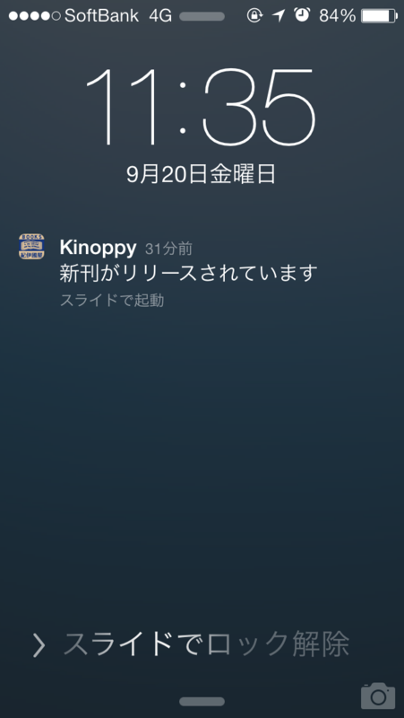

 

<blockquote cite="http://k-kinoppy.jp/updates.html">

<h5>2013-09-17 Ver.1.5.0</h5>

<ul>
<li>新刊通知機能の追加: 次のタイミングで通知が端末に届きます。
<ul>
<li>購入済み電子書籍の続刊が配信開始されたとき</li>
<li>ほしいものリストに登録された紙の書籍が電子化されたとき</li>
</ul></li>
<li>ストアの詳細検索で電子書籍のみ検索するオプションを追加</li>
<li>iOS7で発生する不具合の修正</li>
<li>EPUBレンダラの更新</li>
</ul>
※注意事項 
本アップデートにより端末の登録台数が増えることがございます。その際は、お手数ですが以下の操作を行って不要な端末の解除を行ってください。 
（端末の解除方法） 
設定 > ログイン/ログアウト > 端末リスト > 解除する端末をタップ

<cite><a href="http://k-kinoppy.jp/updates.html">Kinoppy for iPhone,iPad,Android,Windows,Mac&#xFF5C;&#x7D00;&#x4F0A;&#x570B;&#x5C4B;&#x66F8;&#x5E97;&#x306E;&#x96FB;&#x5B50;&#x66F8;&#x7C4D;&#x30D3;&#x30E5;&#x30FC;&#x30A2; (iOS&amp;Android&amp;Windows,Mac)</a></cite>
</blockquote>

ずっとほしかった機能なのでうれしい。やっぱ計算機でできることは計算機でしてほしいよねぇ。毎回手動で新刊チェックだなんてめんどくさい。まぁ、それはそれで新しい本との出会いの場でもあるのだけど。

あと、Sony Reader の登録を解除したいのだけど、iOS からはエラーがでて解除できないのが困る。今度サポートにお願いするか。

