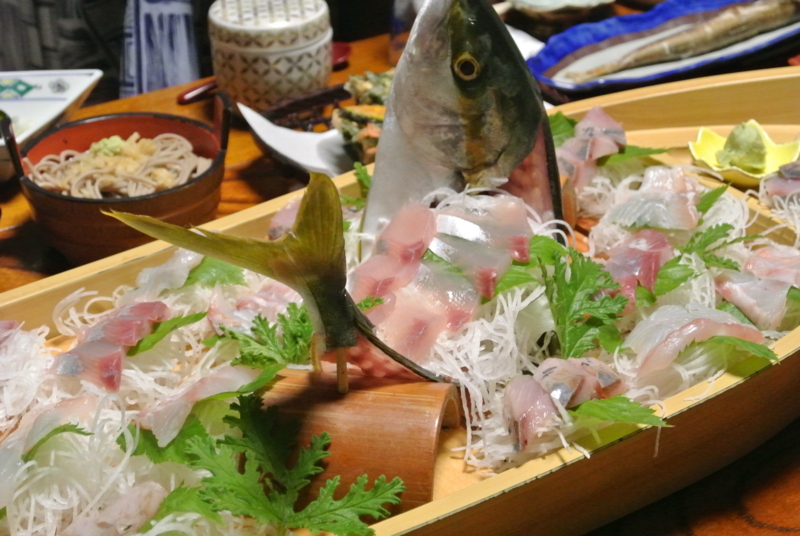
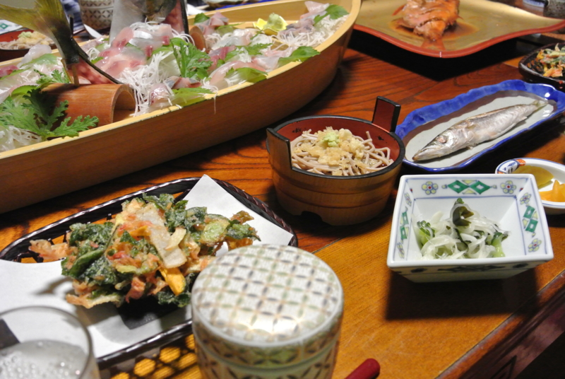
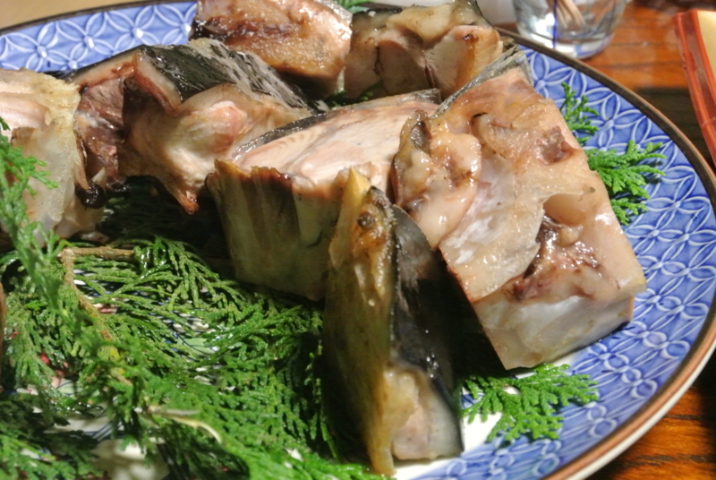
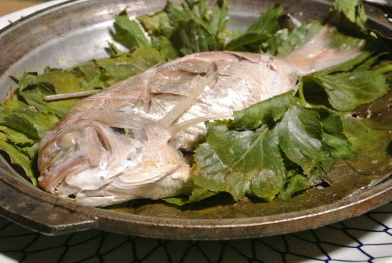
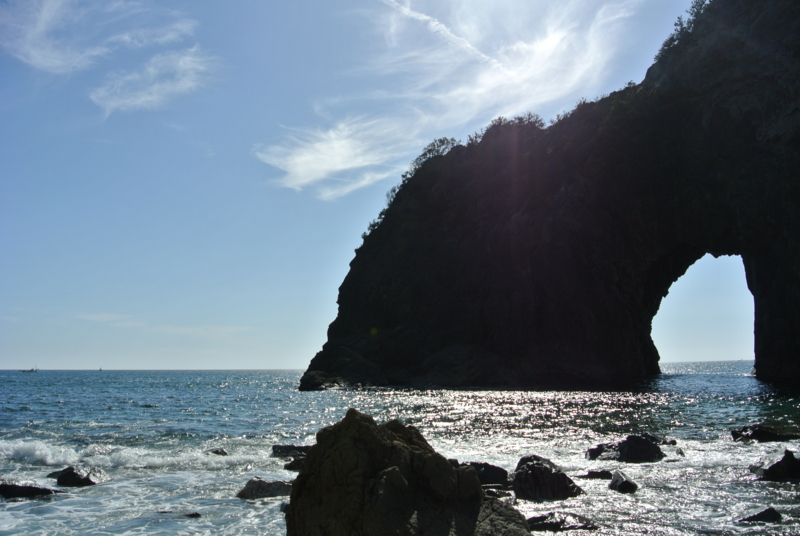
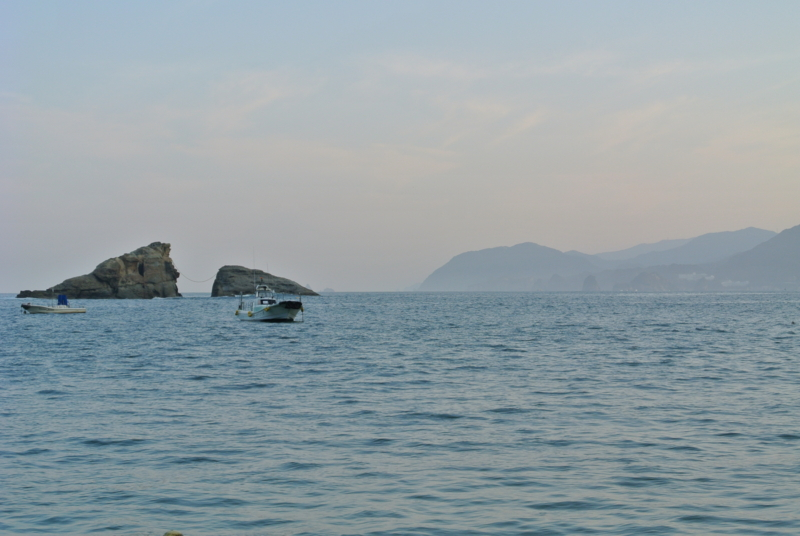
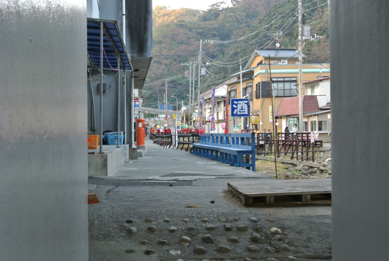
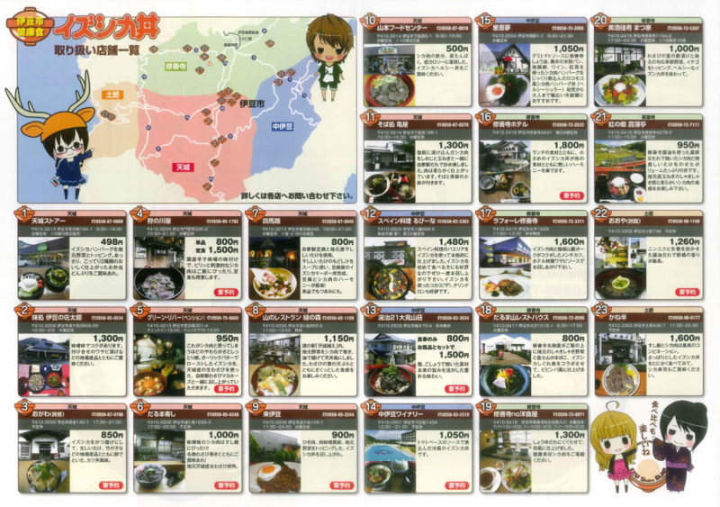

毎度恒例の西伊豆旅行。今回は『大漁』に泊まってきた。

<a href="http://www7.ocn.ne.jp/~tairyou/">http://www7.ocn.ne.jp/~tairyou/</a>

たぶんここに泊まるのは2回目だけど、相変わらずスゴい飯の量だった（ケチなご飯は嫌なので、毎回少し料金を上増ししているのだけど）。

最後に出てきたアシタバとタイの蒸し焼き？なのかな、これが一番おいしかった。ポン酢で食べるとあっさり。まぁ、出てくる頃にはもうおなかがいっぱいになってしまっていたのだけど！

千貫門でちょっと泳いだり<a href="#f-cc5e9429" name="fn-cc5e9429" title="まだぜんぜん暖かくて泳げる！">*1</a>――

朝の港を散歩したりした。

あと、修善寺に寄って食べた“伊豆鹿丼”というのが結構おいしかった。

<blockquote cite="http://kanko.city.izu.shizuoka.jp/form1.html?c1=10&c2=1&c3=1&pid=3542">

<h5>イズシカ丼誕生秘話</h5>

伊豆市にある豊富な温泉や豊かな自然。地場産品を活かし、伊豆市に住む人々や訪れる人々が癒され、楽しみながら健康になってもらおうという思いから計画が始まった伊豆市ヘルシーグルメ！！栄養豊富なヘルシー食材である「イズシカ」問屋があることから、「イズシカ」を使った様々なレシピを考案・試食し、はれて「イズシカ丼」の誕生となりました！！

市内各店舗で工夫を凝らしたイズシカ丼。漬け丼、カツ丼、天丼、ロコモコ丼・・・さまざまなシカ丼をお楽しみ下さい！！

<cite><a href="http://kanko.city.izu.shizuoka.jp/form1.html?c1=10&c2=1&c3=1&pid=3542">&#x4F0A;&#x8C46;&#x5E02; &#x89B3;&#x5149;&#x60C5;&#x5831; &#x7279;&#x8A2D;&#x30B5;&#x30A4;&#x30C8;</a></cite>
</blockquote>

最近は伊豆のあちこちでさまざまな鹿肉の丼が食べられるらしい。今回は“<a href="http://tabelog.com/shizuoka/A2205/A220504/22022539/">&#x4FEE;&#x5584;&#x5BFA; no &#x6D0B;&#x98DF;&#x5C4B; - &#x4FEE;&#x5584;&#x5BFA;/&#x30D1;&#x30B9;&#x30BF; [&#x98DF;&#x3079;&#x30ED;&#x30B0;]</a>”というところでいただいたが、盛り付けが結構おしゃれな感じ。

料理に添えられているナッツもろとも、しっかりかき混ぜて食べるとよいのだそうな。鹿肉は存外柔らかく、野味もあってなかなかイイ。“シカ肉は脂肪分が少なく、高タンパク・低カロリーで鉄分が豊富”とのことで、なんか食べるとパワーが出る感じですな。

<h3>過去の伊豆旅行</h3>

もう何回行ってんだって感じだけど、肩が凝りだしたら行き時ですな。飯食って宿でごろごろするだけでも楽しい。

<ul>
<li><a href="https://blog.daruyanagi.jp/entry/2012/06/24/174143">&#x304A;&#x3063;&#x3055;&#x3093;&#x4E8C;&#x4EBA;&#x3067;&#x897F;&#x4F0A;&#x8C46;&#x306B;&#x884C;&#x3063;&#x3066;&#x304D;&#x305F;&#x3002; - &#x3060;&#x308B;&#x308D;&#x3050;</a></li>
<li><a href="https://blog.daruyanagi.jp/entry/2012/06/24/183810">&#x9EC4;&#x91D1;&#x306E;&#x56FD;&#x30B8;&#x30D1;&#x30F3;&#x30B0;&#x304C;&#x8A87;&#x308B;&#x30A8;&#x30EB;&#x30FB;&#x30C9;&#x30E9;&#x30C9;&#x3001;&#x571F;&#x80A5;&#x91D1;&#x5C71;&#x3078;&#x6F5C;&#x5165;&#x3002;&#x305D;&#x3053;&#x3067;&#x76EE;&#x306B;&#x3057;&#x305F;&#x3082;&#x306E;&#x306F;&hellip;&hellip;&#xFF01; - &#x3060;&#x308B;&#x308D;&#x3050;</a></li>
<li><a href="https://blog.daruyanagi.jp/entry/2012/06/24/211414">&#x4E8C;&#x5EA6;&#x7F8E;&#x5473;&#x3057;&#x3044;&#x3002; - &#x3060;&#x308B;&#x308D;&#x3050;</a></li>
<li><a href="https://blog.daruyanagi.jp/entry/2012/06/25/032051">&#x9732;&#x5929;&#x98A8;&#x5442;&#x3068;&#x99D0;&#x5728;&#x3055;&#x3093;&#x3002; - &#x3060;&#x308B;&#x308D;&#x3050;</a></li>
<li><a href="https://blog.daruyanagi.jp/entry/2012/06/25/074624">&#x5BBF;&#x3067;&#x98DF;&#x3079;&#x3066;&#x5BDD;&#x308B;&#x3002; - &#x3060;&#x308B;&#x308D;&#x3050;</a></li>
</ul>

<a href="#fn-cc5e9429" name="f-cc5e9429" class="footnote-number">*1</a>:まだぜんぜん暖かくて泳げる！

