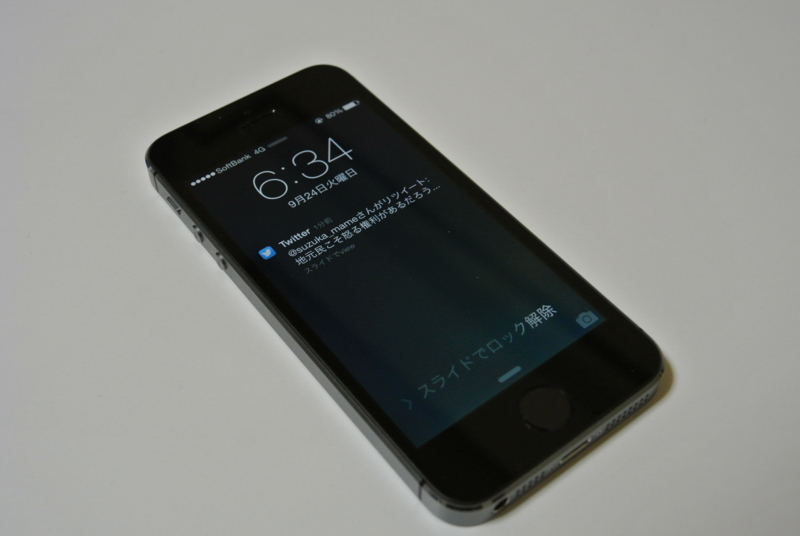
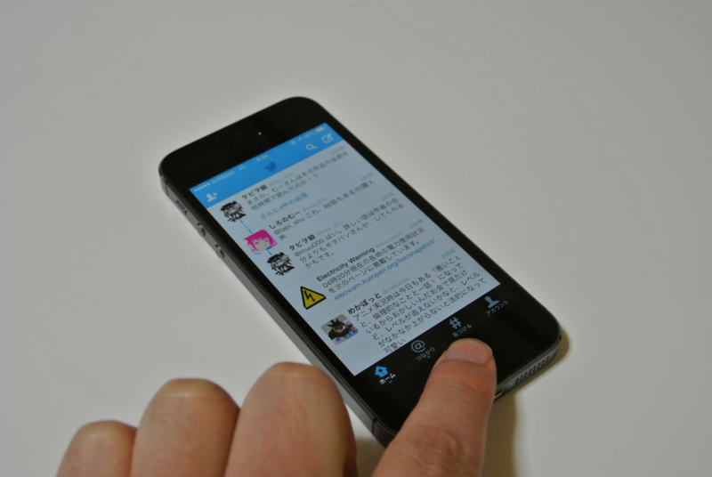

IS12T（au）の割賦がこの8月に終わったので、iPhone 5S に機種変更しようと金曜日（9月20日、発売日）に au ショップで予約してきた――のだけど、<a href="https://blog.daruyanagi.jp/entry/2013/09/24/065711">&#x897F;&#x4F0A;&#x8C46;&#x3067;&#x306E;&#x3093;&#x3073;&#x308A;&#x3057;&#x3066;&#x304D;&#x305F;&#x3002; - &#x3060;&#x308B;&#x308D;&#x3050;</a> で iPhone 5（SBM）を紛失するというアクシデントが発生。急遽、帰りに寄った大船のヤマダデンキで iPhone 5 → iPhone 5S への機種変更を敢行した。

IS12T の回線は解約料を支払って解約することになりそう。

在庫のあったスペースグレイ（16GB）モデルをチョイス。巷ではゴールドが人気で品薄らしいけれど、個人的にはあんまりああいう色が好きではない。失くした iPhone は白だったのだけど、アレはちょっと目新しいから選んだだけで、今はこの落ち着いた感じのグレイが気に入っている。

亡くしてから新しいのを手に入れるまでちょうど24時間。まさかこんな展開になるとは思わなかった／(^o^)＼

使ってみた感想は――正直、ここまで成熟してくると CPU が 64bit になってるだの、メモリが何 GB に増えただのはもうどうでもいいよね。 iOS 7 もすでに体験していたし、iPhone 5S そのものに対する印象はひどく薄かった。これまでのモデルを手にした時にはかならず感じられた、あのちょっとした高揚も今回はほとんど皆無。

ただ、指紋認証はイイな！

楽ちんすぎて笑いが止まらん。そのうちパスコードだの Apple ID のパスワードだのは、一切忘れてしまうのではないか。

まー、いろいろ意見はあると思うけど、めんどくさくて使われない強固なセキュリティなんてあっても仕方ない。確実性が低かったり、南京錠程度の信頼性しかないとしても、手軽で利用目的とその要求レベルに合致していれば、それで十分なんだよね。そりゃ、寝てる間に指でロックを解除させられることもあるだろうさ。でも、だからなに？　面倒なロック解除操作から開放されることを考えれば十分お釣りはくるし、そもそも信頼の置けないひとが寝室に入れるコト自体がセキュリティリスクなわけで！

指紋認証自体はこれまでもほかのメーカーが散々やってきたし、別段新しいものではない。けれど、ホームボタンに仕込んでしまうセンスっていうのはちょっと新しいし、イイなって思う。どこぞの日本企業よりも、目の付け所がシャープやな。

<h3>P.S.</h3>

これが Windows Phone じゃなかったのが残念だ。

