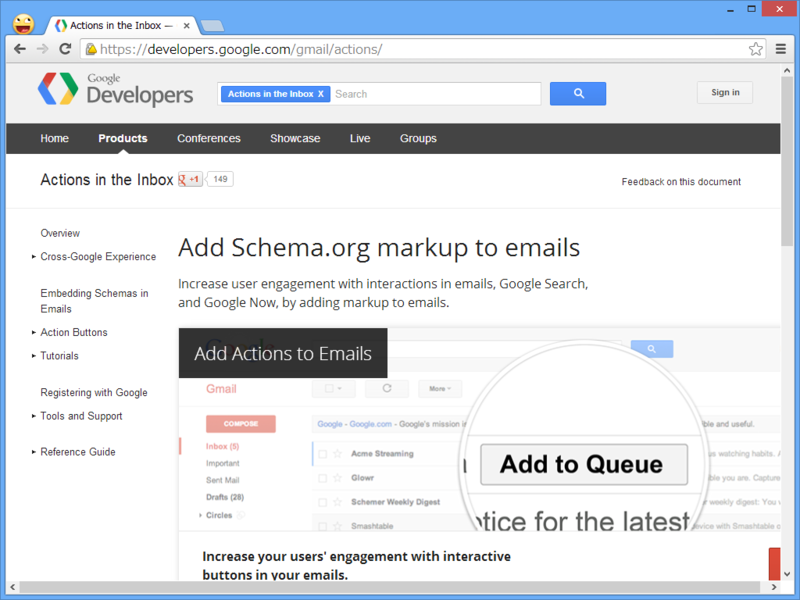

さきほど何気なく Gmail のチェックをしていたら、こんなボタンがついていることに気づいた。

これを押すと――

荷物の追跡が行える。

ちょっとびっくりしたけど、これはだいぶ前（先月ぐらい？）に追加された機能みたい。こちらでは Internet Explorer 10、Mozilla Firefox 24、Google Chrome 29での動作を確認している。

<ul>
<li><a href="http://d.hatena.ne.jp/manabu55/20130920/1379625005">GMail&#x3067;&#x30A2;&#x30DE;&#x30BE;&#x30F3;&#x306E;&#x767A;&#x9001;&#x901A;&#x77E5;&#x3067;&#x300C;&#x8377;&#x7269;&#x3092;&#x8FFD;&#x8DE1;&#x300D;&#x30DC;&#x30BF;&#x30F3;&#x304C;&#x8868;&#x793A;&#x3055;&#x308C;&#x308B;&#x3063;&#x3066;&#x8A71; - &#x6BB5;&#x30DC;&#x30FC;&#x30EB;&#x7BB1;&#x306E;&#x4E2D;&#x8EAB;</a></li>
<li><a href="https://plus.google.com/+takaoasayama/posts/Bw2UuwUoDry">&#x671D;&#x5C71;&#x8CB4;&#x751F; - Google+ - &#x3059;&#x3052;&#x3047;&#x3001;Gmail&#x306E;&#x30E1;&#x30FC;&#x30EB;&#x4E00;&#x89A7;&#x3067;Amazon&#x304B;&#x3089;&#x306E;&#x767A;&#x9001;&#x901A;&#x77E5;&#x30E1;&#x30FC;&#x30EB;&#x3092;&#x958B;&#x304B;&#x305A;&#x306B;&#x3001;&#x76F4;&#x63A5;&#x8377;&#x7269;&#x306E;&#x8FFD;&#x8DE1;&#x3078;&#x884C;&#x3051;&#x308B;&#x3088;&#x3046;&#x306B;&#x306A;&#x3063;&#x3066;&#x308B;&#x30FB;&#x30FB;&#x30FB;&hellip;</a></li>
</ul>
メールにマークアップを含めることで、受信トレイ内にアクションが追加できるとの吉。

<ul>
<li><a href="https://developers.google.com/gmail/actions/">Actions in the Inbox &mdash; Google Developers</a></li>
</ul>
ただ、最近は iPhone でチェックしてしまうから気が付かないんだよなぁ。

