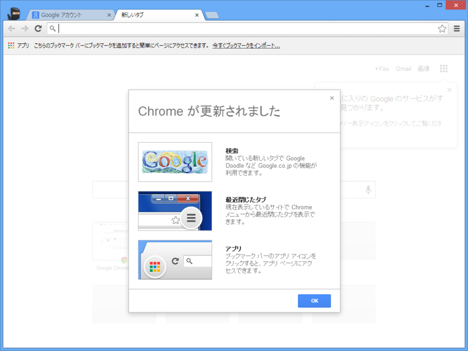
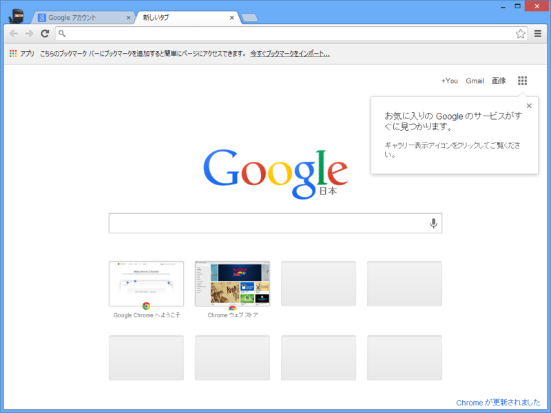
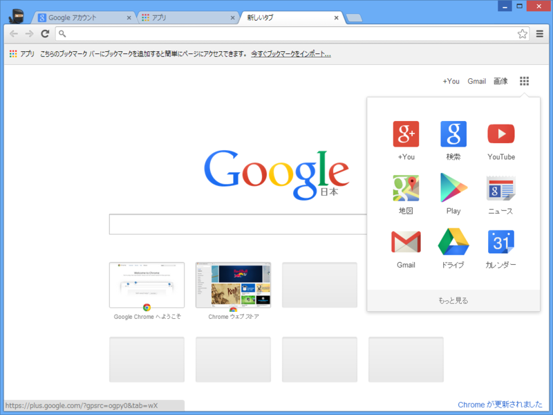

バージョンは 29.0.1547.76（Stable）で確認。更新日は 2013/09/18 だから、ブラウザー本体のアップデートというわけではないみたい。

<ul>
<li><a href="http://www.forest.impress.co.jp/docs/news/20130919_616006.html">&#x300C;Google Chrome&#x300D;&#x306E;&#x6700;&#x65B0;&#x5B89;&#x5B9A;&#x7248;v29.0.1547.76&#x304C;&#x516C;&#x958B; - &#x7A93;&#x306E;&#x675C;</a></li>
</ul>
chrome:newtab が外部から更新されたってことなのかな。もしかしたら Beta と Stable を行ったり来たりしていたせいもあるかもしれない。まぁ、いいや。

新しい chrome:newtab には Google 検索とよくアクセスするサイトのサムネイルが配置されている。

アプリへのアクセスも行える。Google アカウントでログインしていれば、Google+（ぐぐたす）や Gmail、YouTube との連携もできるのかな。Gmail 以外は使ってないので個人的には微妙なのだけど、まぁ、便利な人には便利かもしれない。

