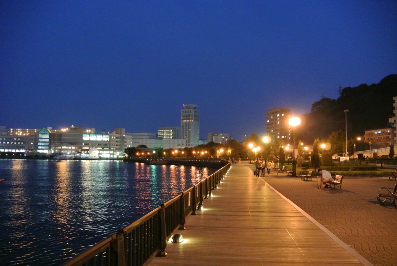
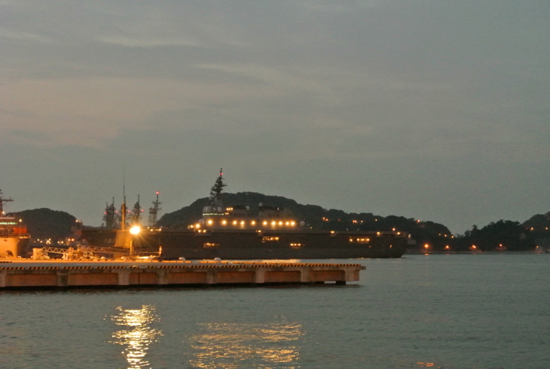
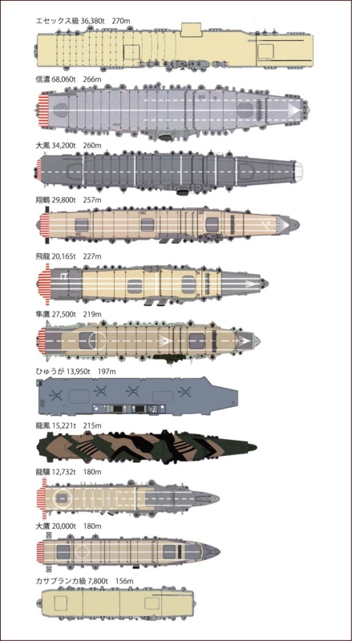
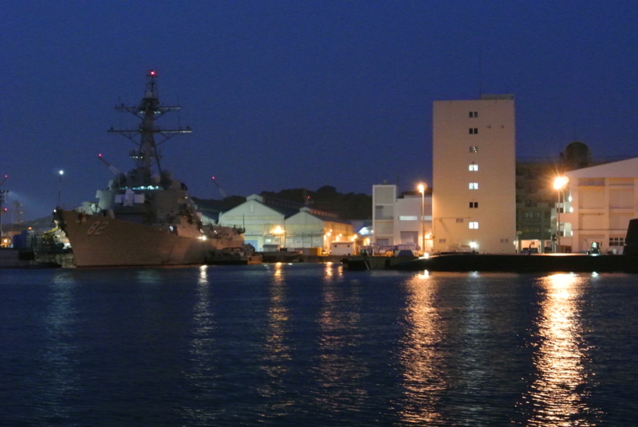
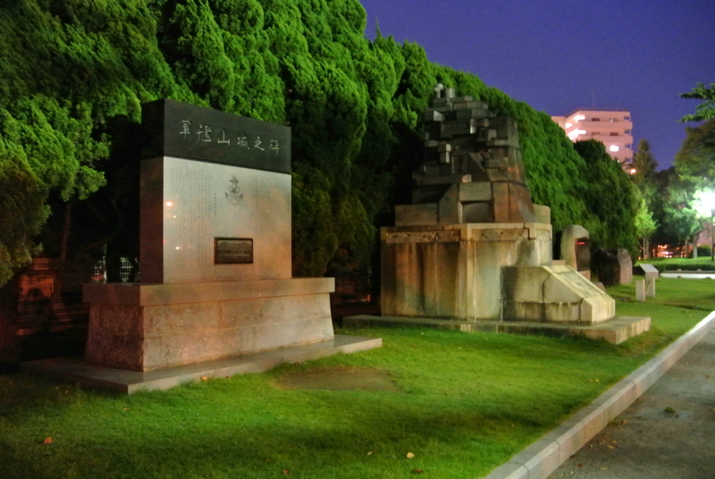
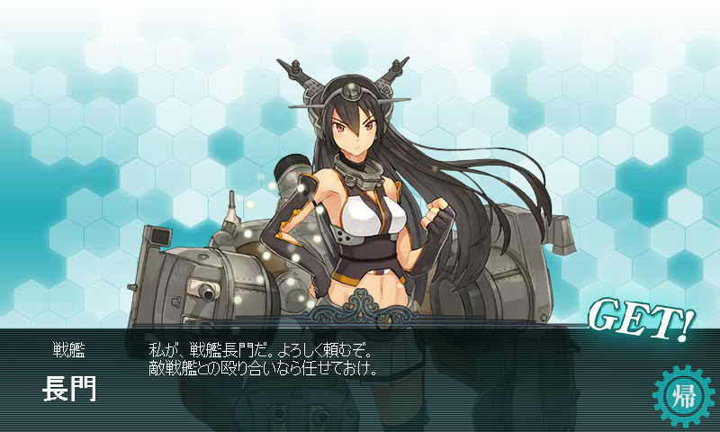
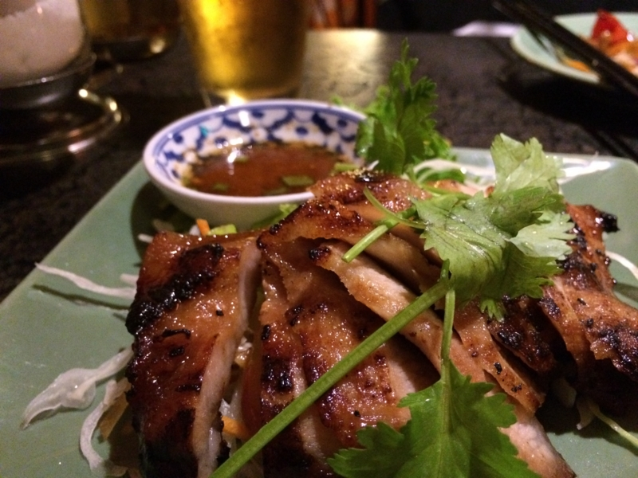
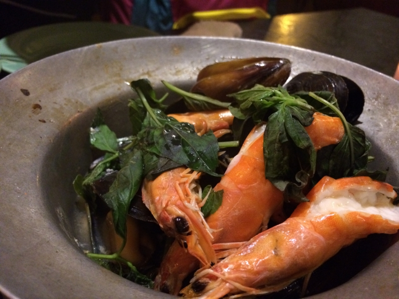

戦艦・比叡のお墓に参ろうと衣笠へ向かう途中の話。

<ul>
<li><a href="https://blog.daruyanagi.jp/entry/2013/09/25/120932">&#x8266;&#x3053;&#x308C;: &#x6226;&#x8266;&#x30FB;&#x6BD4;&#x53E1;&#x306E;&#x304A;&#x5893;&#x306B;&#x884C;&#x3063;&#x3066;&#x304D;&#x305F;&#x3063;&#x305F;&#x3002; - &#x3060;&#x308B;&#x308D;&#x3050;</a></li>
</ul>
買ったばっかりの iPhone 5S（<a href="https://blog.daruyanagi.jp/entry/2013/09/24/072910">iPhone 5S &#x8CB7;&#x3063;&#x305F;&#x3063;&#x305F;&#x3002; - &#x3060;&#x308B;&#x308D;&#x3050;</a>）の指紋登録なんかをチマチマやっていたら、Y 氏がやたら興奮してる。顔を上げると、横須賀線の車窓には鼠色の大きな船がビッシリ並んでいた。これは確かに壮観だな。横須賀には何回か行ったことがあったはずだけど、実は港は見たことがなかった。

すっかり盛り上がってしまったので、衣笠へ参った後に横須賀で降りてご飯を食べることに決めた。

<h3>ヴェルニー公園</h3>

横須賀駅に降り立つと、すでに日は暮れていた。割りと雰囲気のよいところで、Y 氏などではなく、かわいい女の子を連れてデートしたかった（募集中

左手の奥にやたら大きな船がある。目が悪くて暗いところは苦手なのだけど、艦首に「181」と書いてあるようだ。その場でググったら <a href="http://ja.wikipedia.org/wiki/%E3%81%B2%E3%82%85%E3%81%86%E3%81%8C_(%E8%AD%B7%E8%A1%9B%E8%89%A6)">&#x3072;&#x3085;&#x3046;&#x304C; (&#x8B77;&#x885B;&#x8266;) - Wikipedia</a> が引っかかったので、あれが強襲揚陸艦「ひゅうが」（JS Hyūga, DDH-181）ということになるのだろう。最近お披露目された「いずも」はもっとデカいんだよなぁ……どんだけなんだ。

この「ひゅうが」、第二次大戦で言えば軽空母並みの大きさなんだね（龍驤ちゃんかわいい！）。

潜水艦もいたみたい。左側の船はなんだろう？ 船首に 82 って書いてあるっぽいし、米軍所属の <a href="http://ja.wikipedia.org/wiki/%E3%83%A9%E3%83%83%E3%82%BB%E3%83%B3_(%E3%83%9F%E3%82%B5%E3%82%A4%E3%83%AB%E9%A7%86%E9%80%90%E8%89%A6)">&#x30E9;&#x30C3;&#x30BB;&#x30F3; (&#x30DF;&#x30B5;&#x30A4;&#x30EB;&#x99C6;&#x9010;&#x8266;) - Wikipedia</a> なのかもしれない。艦影は確かに割りとそれっぽいけど（日本にいるっぽいし）、自分は詳しくないから見分けがつかない。

<h3>軍艦碑</h3>

このヴェルニー公園の隅には、軍艦長門碑と軍艦山城之碑がある。

こっちが“航行する違法建築”“ドックにいる方が長い戦艦”こと<del>不幸</del>扶桑型戦艦姉妹の妹のほう、山城さん。

こっちが“ビッグ7”をつとめた当時の最強戦艦・長門さん。

どっちも逸話満載なのだけど、それは今度訪ねたときにしましょう。暗くて碑文も読めないわ。

<h3>アジア料理？</h3>

さいごに近所のアジア料理店で晩御飯を食べました。うまうま。

