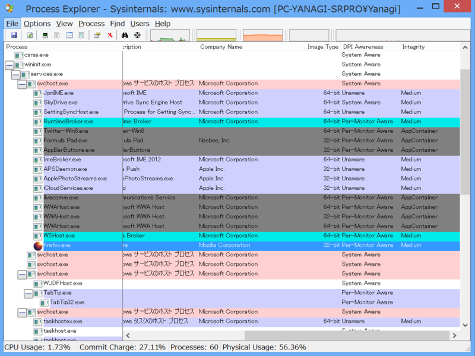

<blockquote cite="http://www.forest.impress.co.jp/docs/news/20130924_616600.html">

「Firefox 26」は、「Windows 8」から導入されている“Immersive”モードをサポート。このモードはタッチ操作に適した“タイル”や、余分なユーザーインターフェイス要素を極力廃したコンテンツ重視のデザインが特長で、ストアアプリが動作するサンドボックス環境“AppContainer”によるセキュリティの恩恵も受けられる。

<cite><a href="http://www.forest.impress.co.jp/docs/news/20130924_616600.html">Mozilla&#x3001;&#x300C;Windows 8&#x300D;&#x306E;&#x30BF;&#x30C3;&#x30C1;UI&#x306B;&#x6700;&#x9069;&#x5316;&#x3055;&#x308C;&#x305F;&#x300C;Firefox Aurora&#x300D;&#x3092;&#x516C;&#x958B; - &#x7A93;&#x306E;&#x675C;</a></cite>
</blockquote>

この後半がウソだという指摘を受けたので検証。結論的には――<i>間違ってた／(＾o＾)＼　</i>おそらくそのうち修正されると思う。

Mozilla Firefox の Immersive モードは AppContainer ではなく、整合性レベル Medium で動作する。

ちなみに Google Chrome も調べてみた。

整合性レベル Medium で動作する親プロセスの下に Untrusted な複数のプロセスがある。

しかし、これだったら Internet Explorer を使った方が安全なような気もする。また、仮に Microsoft のせいでサードパーティ製ブラウザーが Medium で動作することを強いられているならば、あんまりよい状況ではないと思う。

<h3>追記</h3>

<a class="twitter-tweet-url" href="http://t.co/m2ANqmBhyu" target="_top">URL</a> 整合性レベルMediumで動作する親プロセスと，サンドボックス内で動く子プロセスという構成はIEもChromeも今のところ同じですかね．OS上の制約は特になくて，提供したい機能から単にそういうデザインになる，という感じかと．

<a href="http://twitter.com/NyaRuRu/status/383995701056643072" class="twitter-detail-info-permalink">2013-09-29 01:44:44</a> via web

