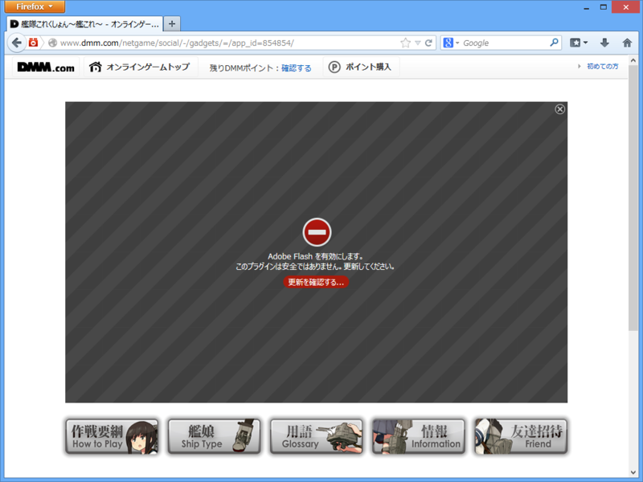
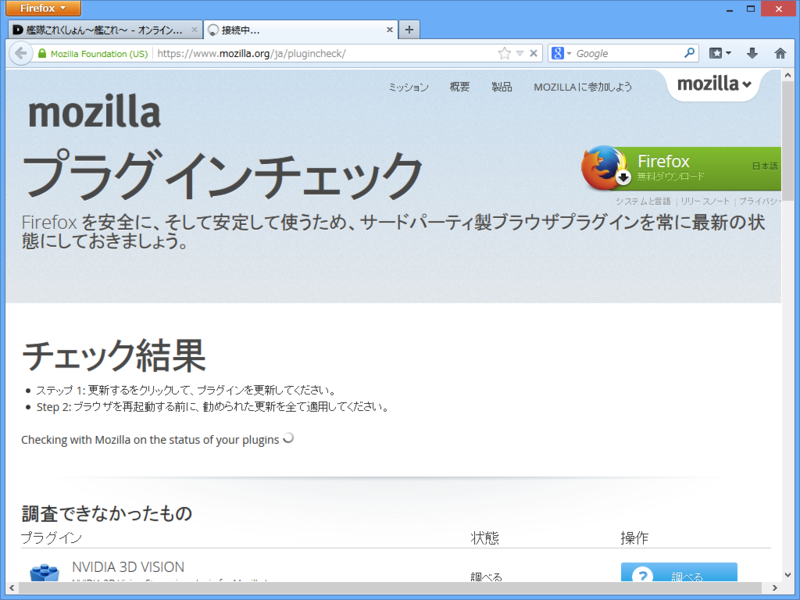
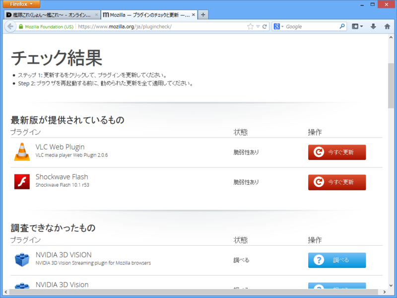

<blockquote cite="http://www.forest.impress.co.jp/docs/news/20130926_617005.html">

ただし、「Adobe Flash Player」プラグインのみは例外で、初期状態で有効化される。ただし、脆弱性のある古いバージョンの「Adobe Flash Player」は、ほかのプラグインと同様ブロックされ、最新版へのアップデートが案内される。

<cite><a href="http://www.forest.impress.co.jp/docs/news/20130926_617005.html">Mozilla&#x3001;&#x30D7;&#x30E9;&#x30B0;&#x30A4;&#x30F3;&#x3092;&#x539F;&#x5247;&#x30D6;&#x30ED;&#x30C3;&#x30AF;&#x3059;&#x308B;&#x65B9;&#x91DD;&#x3092;&#x660E;&#x3089;&#x304B;&#x306B;&#x3002;&#x300C;Firefox 26&#x300D;&#x3088;&#x308A;&#x5B9F;&#x65BD; - &#x7A93;&#x306E;&#x675C;</a></cite>
</blockquote>

古いバージョンの Flash Player プラグインを利用するとどうなるのかというと、

こうなる。Click-to-Play で有効化することもできる（アドレスバー左端のアイコンな！）けれど、素直に最新版へ更新したほうがいい。

ちなみに［後進を確認する］をクリックすると、プラグインチェックのページに飛ばされる。

まぁ、最近の Flash を使っているなら勝手にアップデートされるはずだけれども。

追記: 今気づいたけど、記事の文章、「ただし」がカブっててクソだな。

