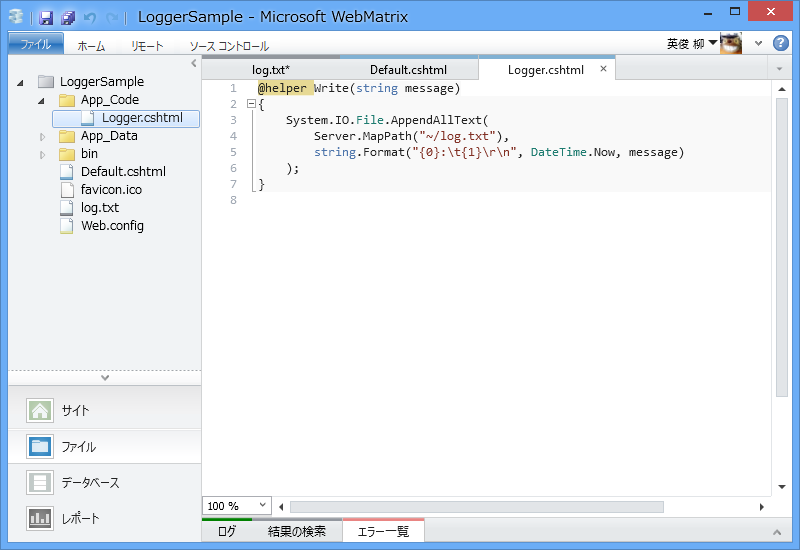
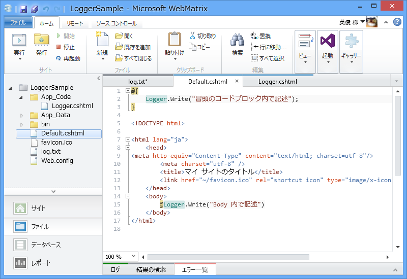
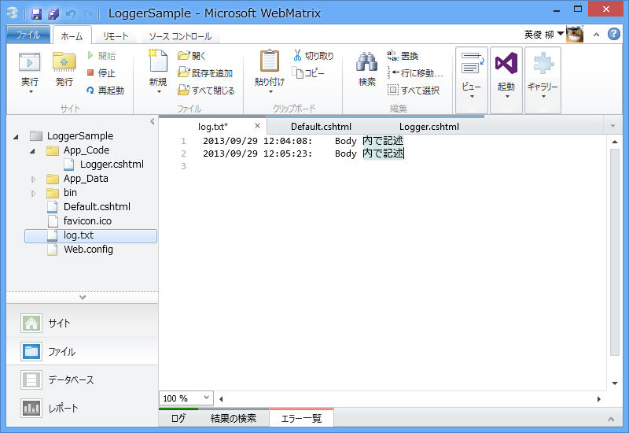

ちょいとログを外部ファイルに吐きたくなって、テキトーにこんなコードを書いてみた。

<pre class="code lang-cs" data-lang="cs" data-unlink>#App_Code/Logger.cshtml

@helper Write(string message)
{
System.IO.File.AppendAllText(
Server.MapPath(&quot;~/log.txt&quot;),
string.Format(&quot;{0}:\t{1}\r\n&quot;, DateTime.Now, message)
);
}
</pre>
これを Default.cshtml でテストしてみた。

<pre class="code lang-html" data-lang="html" data-unlink>@{
Logger.Write(&quot;冒頭のコードブロック内で記述&quot;);
}

&lt;!DOCTYPE html&gt;

&lt;html lang=&quot;ja&quot;&gt;
&lt;head&gt;
&lt;meta http-equiv=&quot;Content-Type&quot; content=&quot;text/html; charset=utf-8&quot;/&gt;
        &lt;meta charset=&quot;utf-8&quot; /&gt;
        &lt;title&gt;マイ サイトのタイトル&lt;/title&gt;
        &lt;link href=&quot;~/favicon.ico&quot; rel=&quot;shortcut icon&quot; type=&quot;image/x-icon&quot; /&gt;
    &lt;/head&gt;
&lt;body&gt;
@Logger.Write(&quot;Body 内で記述&quot;)
&lt;/body&gt;
&lt;/html&gt;
</pre>
結果はというと――

――冒頭のコードブロック内で記述したログは記録されない。「あれ、なんでだろう？」と思って、あちこちごちゃごちゃ弄ってみたのだけど、正解はコレだった。

<pre class="code lang-html" data-lang="html" data-unlink>@{
@Logger.Write(&quot;冒頭のコードブロック内で記述&quot;);
}
</pre>

Logger.Write() のまえに @ を足せば実行される。

<pre class="code lang-html" data-lang="html" data-unlink>@{
@(
Logger.Write(&quot;冒頭のコードブロック内で記述&quot;)
)
}
</pre>
でもいいのだけど。

しっかし、これ、なぜなんだろう。自分はまだまだ Razor がわかってないな。

