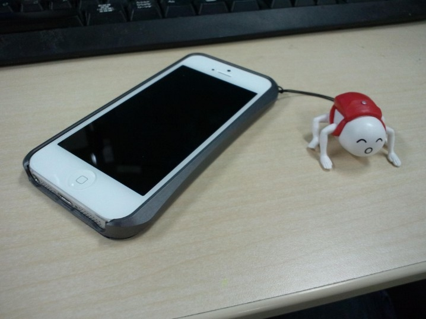
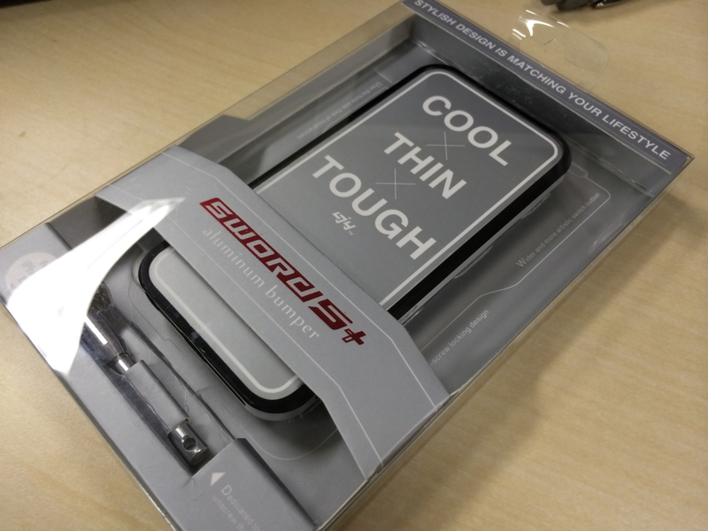
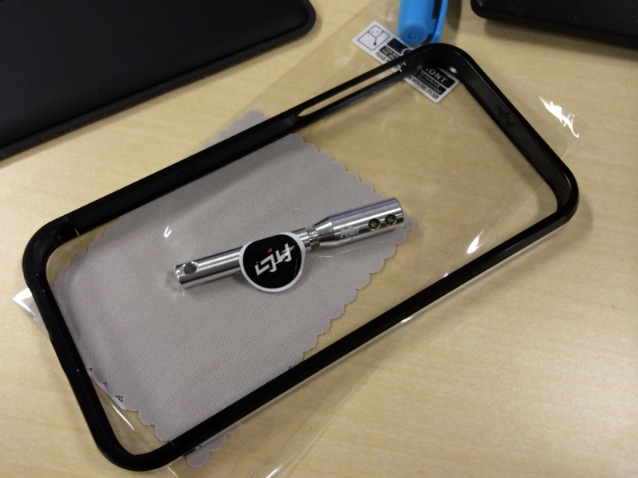
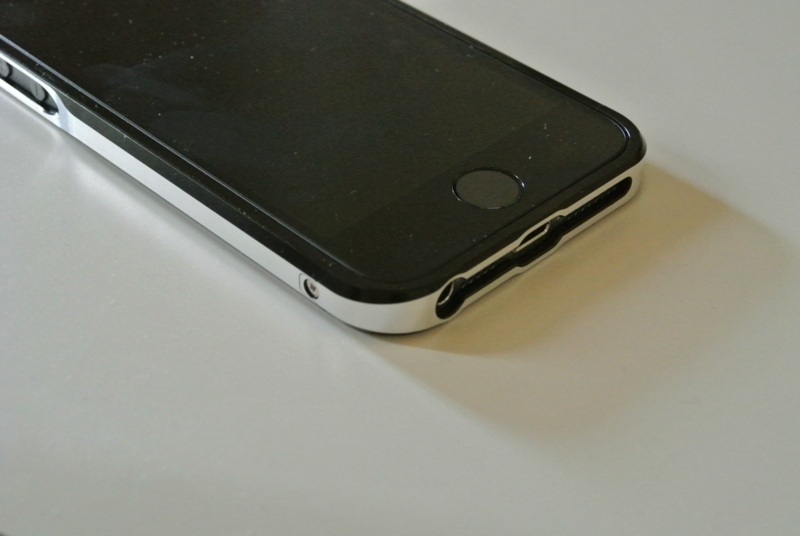

<a href="https://blog.daruyanagi.jp/entry/2013/09/24/072910">iPhone 5S &#x8CB7;&#x3063;&#x305F;&#x3063;&#x305F;&#x3002; - &#x3060;&#x308B;&#x308D;&#x3050;</a> のだけど、このままだとまたすぐに落として液晶を割るのが目に見えているので、さっそくケースも購入した。ちなみに iPhone 5S のケースは iPhone 5 と同じものが使えるのだそうな。

さて、iPhone のケースにはさまざまな素材が使われているが、独断と偏見によりテキトーに分類したところによると、以下のようなものが主流であるらしい。

<table>
<tr>
<td></td>
<td>外観</td>
<td>俺的感想</td>
</tr>
<tr>
<td>布</td>
<td>巾着系・カード入れタイプが多い？</td>
<td>出し入れがめんどい。出したときに落とすとアカンことなるし、落とすのは大抵出したときである。裸で使いたいけど、傷はイヤンな人向け</td>
</tr>
<tr>
<td>革</td>
<td>パンパー型だけでなく、ブックタイプも。</td>
<td>オシャレなケースが多くてそそられる。ただし、フィット感は期待できない。また、厚みがあり操作を妨げる場合がある</td>
</tr>
<tr>
<td>シリコンゴム</td>
<td>パンパー型が主流</td>
<td>滑りにくいが出しにくい。ゴミが付く。使うにつれて伸びてくる。防御力は高い。</td>
</tr>
<tr>
<td>プラスチック</td>
<td>パンパー型</td>
<td>カッチリしてるが、所詮プラスチック。落とすと割れる。割りと安いので、使い捨てとしてはあり。</td>
</tr>
<tr>
<td>金属（アルミ）</td>
<td>バンパー型</td>
<td>硬さはピカイチでフィット感もある。高価で重い。電波の入りが弱くなる</td>
</tr>
</table>
布・革なら一部プラスチック・金属製バンパーと組み合わせることもできる。あと、これはケース全般に言えることだが、一回り大きくなってしまうので手が小さいとちょっとつらい。ケースは頑丈さだけでなく、薄さも重視したいところですな。

自分は、シリコン → 布 → 革 → プラスチックと遍歴してきて、最終的にはアルミバンパーに落ち着いた。

<ul>
<li><a href="https://blog.daruyanagi.jp/entry/2013/03/09/083510">&#x300C;&#x4ECA;&#x3059;&#x3050;&#x88C5;&#x5099;&#x3057;&#x3066;&#x3044;&#x304F;&#x304B;&#x3044;&#xFF1F;&#x300D; - &#x3060;&#x308B;&#x308D;&#x3050;</a></li>
</ul>
やっぱり、カチッとしているところと、金属ならではの安心感がいい。高かったので、iPhone を失くしたときは少し悲しかったが……。金属製バンパーの弱点として「無線の受信感度が落ちるんじゃない？」と言われることが多いのだけれど、正直、自分ではよくわからない。ただ、電波の悪いことで有名な SBM を使っているが、それほど困ったことはない。

さて、今回は面倒なので Amazon でケースをチョイスしてみた。

<a href="http://www.amazon.co.jp/exec/obidos/ASIN/B00AT6KNZ2/bestylesnet-22/">【iPhone5　バンパー】【SWORD５＋正規品】 iPhone5専用　SWORD5＋　アルミバンパー　オフ・ブラック</a>
<ul><li>メディア: Automotive</li><li><a href="http://d.hatena.ne.jp/asin/B00AT6KNZ2/bestylesnet-22" target="_blank">この商品を含むブログを見る</a></li></ul>

色違いもあって、赤なんかは結構格好いいかもしれない。自分はヘタレなので、おとなしく黒を選んだ。

モノはすぐに到着。

内容物。今回こだわったのは“ネジ止め”式であること。前回のはスライド式だったので、激しく落としたときにバンパーが外れそうになるケースがあった。

お値段は 5,000 円弱とかなり値が張るが、作りは割とよい。前回使っていたものより一回り小さいのもうれしい。ただ、バンパーに高さがなく、液晶面とパンパーの面にそれほど差がない。平らな所に落としたのならともかく、デコボコのところへ、水平に落としたときは防御が期待できないかもしれない。――とはいえ、落とすときはだいたい角からと相場が決まっているので、あまり心配はしていない。角に対する装甲は、もちろんハーヴェイ・アーマー並み<a href="#f-3ba6fb90" name="fn-3ba6fb90" title="http://ja.wikipedia.org/wiki/%E6%95%B7%E5%B3%B6%E5%9E%8B%E6%88%A6%E8%89%A6">*1</a>である。

<h3>今気づいたが……</h3>

このケースにはストラップホールがない。

前のヤツにはついていたけど、ストラップのひもがすぐにすり切れてしまってあまり使い物にならなかったし、なくても……まぁ、いいかな。

<a href="#fn-3ba6fb90" name="f-3ba6fb90" class="footnote-number">*1</a>:<a href="http://ja.wikipedia.org/wiki/%E6%95%B7%E5%B3%B6%E5%9E%8B%E6%88%A6%E8%89%A6">http://ja.wikipedia.org/wiki/%E6%95%B7%E5%B3%B6%E5%9E%8B%E6%88%A6%E8%89%A6</a>

